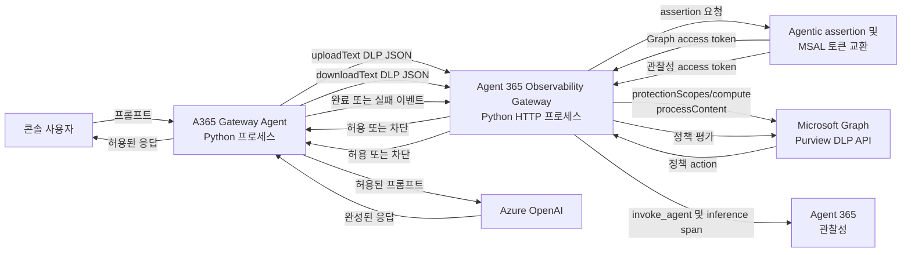
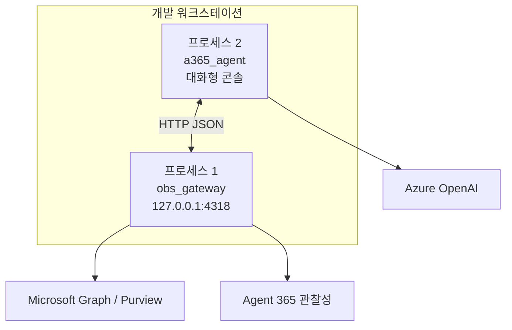
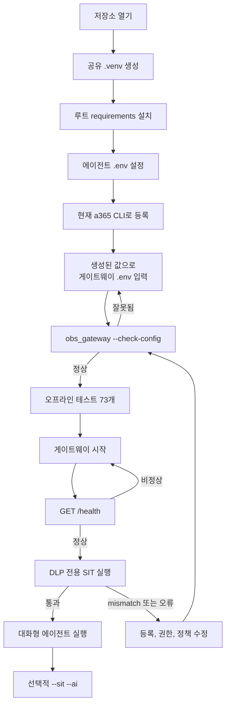
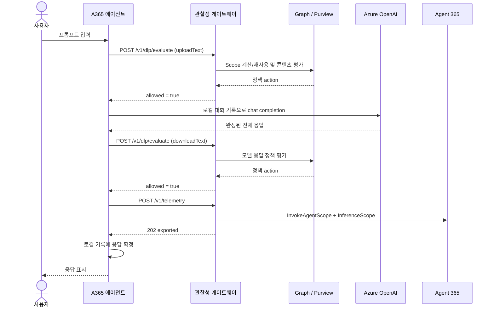
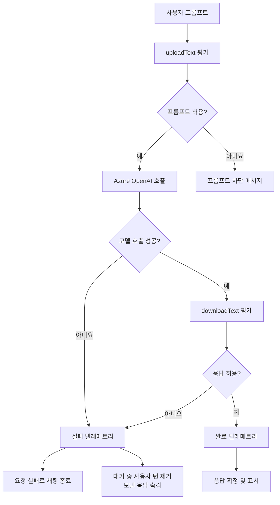
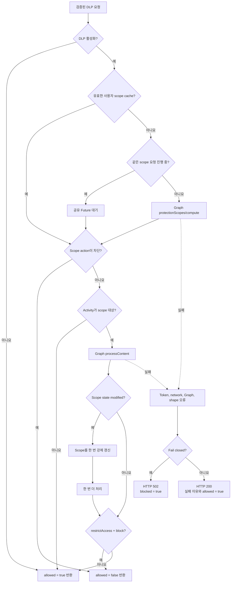
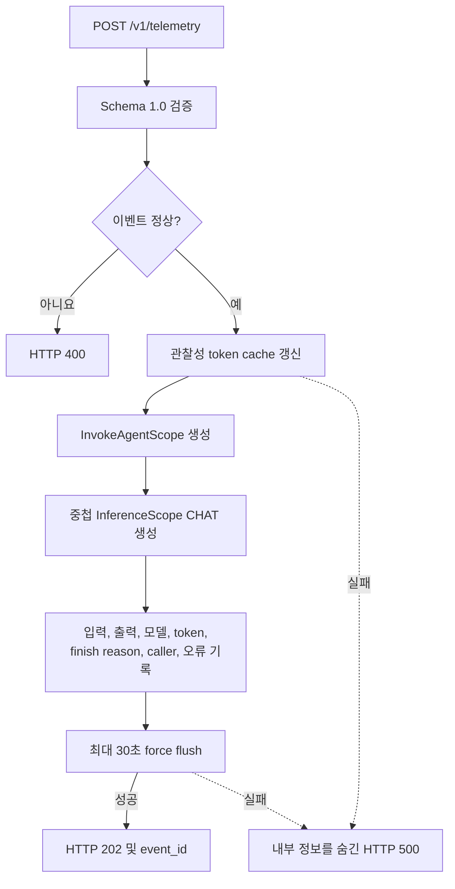
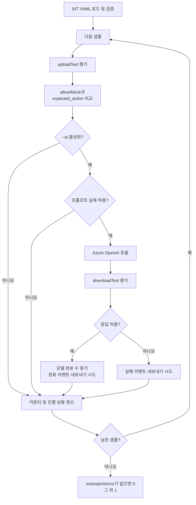
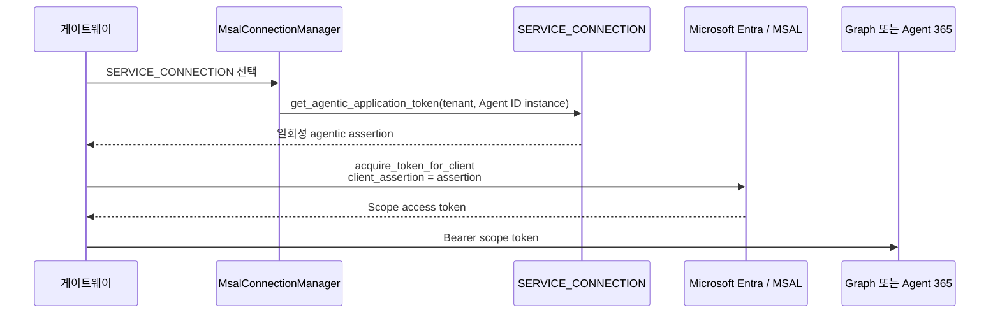

# Agent 365 게이트웨이 프로토타입

[English documentation](README.md)

이 저장소는 Azure OpenAI 채팅 에이전트를 Microsoft Purview DLP로 보호하고
Agent 365를 통해 관찰하기 위한 2개 프로세스 Python 프로토타입입니다.

- **`a365-gateway-agent`**는 콘솔 채팅, Azure OpenAI 추론, 프롬프트 및 응답
  DLP 순서, 텔레메트리 전송 순서를 담당합니다.
- **`a365-observability-gateway`**는 HTTP 계약 검증, Agent 365 agentic 토큰
  교환, Microsoft Graph Purview 호출, DLP 결정, Agent 365 OpenTelemetry
  내보내기를 담당합니다.

두 프로젝트는 저장소 루트의 하나의 가상 환경과 하나의 요구 사항 파일을
공유합니다. 하지만 서로 다른 ID와 보안 책임을 가지므로 `.env` 파일은 각각
별도로 관리합니다.

## 현재 상태

| 영역 | 상태 |
|---|---|
| 에이전트 패키지 및 CLI | 준비 완료, 오프라인 테스트 통과 |
| 게이트웨이 패키지 및 CLI | 준비 완료, 오프라인 테스트 통과 |
| 에이전트-게이트웨이 JSON 계약 | 양쪽 테스트로 검증 |
| 게이트웨이 설정 검사 | `python -m obs_gateway --check-config` 제공 |
| Agent 365 등록 | Non-M365 S2S 에이전트로 완료 |
| 실제 Purview API 연동 | App-only Agent ID token으로 검증 |
| 실제 Purview 차단 정책 | **현재 Agent ID를 대상으로 설정하지 않음** |
| 실제 Agent 365 텔레메트리 내보내기 | `202/exported`로 검증 |
| 로컬 2개 프로세스 배포 | 지원 |
| 운영 클라우드 배포 | 아직 준비되지 않음. IaC, container, `azure.yaml` 없음 |

현재 오프라인 테스트는 총 **76개**입니다.

- 에이전트 테스트 30개
- 게이트웨이 테스트 46개

게이트웨이는 등록되어 있으며 생성된 로컬 설정으로 시작할 수 있습니다. 그러나
등록과 Graph 권한은 Purview 호출 가능 여부만 보장하고 tenant DLP rule을 만들지는
않습니다. 차단 정책은 별도의 Purview 설정 단계입니다.

## 중요한 DLP 집행 주의 사항

게이트웨이는 `protectionScopes/compute`와 `processContent`를 정상 호출합니다.
그러나 tenant에는 **현재 Agent ID instance를 대상으로 하는 Application-plane
DLP 정책이 0개**입니다. 기존 차단 rule은 이전 application ID를 대상으로 합니다.
따라서 민감 정보처럼 보이는 콘텐츠도 Purview가 block action 없이 정상적인
`allowed=true`를 반환할 수 있습니다.

- **연동 성공:** Graph가 Agent ID token을 받아 정상 정책 응답을 반환합니다.
- **집행 성공:** 활성 정책이 정확한 `policyLocationApplication`을 대상으로 하고,
  상호작용의 `user_id`를 포함하며, SIT 조건과 해당 activity의 `RestrictAccess`를
  정의해야 합니다.
- 모델이 만든 경고 문구는 Purview 차단이 아닙니다. 실제 프롬프트 차단이면
  `Blocked by Microsoft Purview DLP policy.`가 출력되고 프롬프트는 Azure
  OpenAI에 전달되지 않습니다.

현재 게이트웨이는 의도적으로 **S2S/app-only**입니다. 실제 Graph token은
`idtyp=app`, application `roles`, delegated `scp` 없음으로 확인했습니다. Agent
ID는 사람이 아니라 Entra service principal입니다. DLP 요청의 `user_id`는 Graph
credential이 아니라 사용자 Purview 정책 컨텍스트를 선택합니다.

`authmode=both`는 향후 OBO 구현을 위한 delegated grant를 추가하지만, 현재
에이전트는 user access token을 전달하지 않고 게이트웨이도 OBO를 수행하지
않습니다. 등록을 `both`로 바꾸는 것만으로는 정책 대상이나 차단 문제가
해결되지 않습니다.

### Tenant 정책 수정

Security & Compliance PowerShell에서 Application-plane DLP 정책을 만듭니다.
Blueprint `AGENT_ID`가 아니라 Agent ID instance application ID
(`AGENT365OBSERVABILITY__AGENTID` 또는 생성된 `agenticAppId`)를 대상으로 하고,
정책 대상 사용자/tenant, SIT 조건, `UploadText=Block` 및 필요 시
`DownloadText=Block`의 `RestrictAccess`를 정의합니다.

정책 변경 후에는 Purview 전파 시간을 기다리고 게이트웨이를 재시작하여 기본
3600초의 사용자별 protection-scope cache를 지웁니다. 실제 카드가 아닌
[sits.yaml](a365-gateway-agent/sits.yaml)의 **Luhn-valid 합성** 카드 번호로
테스트하십시오. 임의의 16자리 숫자는 Credit Card Number detector와 일치하지
않을 수 있으며, 최초 수동 테스트 값은 필요한 checksum을 만족하지 않았습니다.

## 문서 안내

| 문서 | 목적 |
|---|---|
| [루트 영문 README](README.md) | 종단 간 설치, 구조, 실행 순서, 공통 설정, 운영 안내 |
| [루트 한글 README](README-KR.md) | 저장소 전체 한글 실행 안내서 |
| [에이전트 영문 README](a365-gateway-agent/README.md) | 채팅 상태, SIT 형식, payload 생성, 에이전트 내부 구조 |
| [에이전트 한글 README](a365-gateway-agent/README-KR.md) | 에이전트 한글 상세 문서 |
| [게이트웨이 영문 README](a365-gateway-prototype/README.md) | Token 교환, DLP 캐시, HTTP 검증, exporter 내부 구조 |
| [게이트웨이 한글 README](a365-gateway-prototype/README-KR.md) | 게이트웨이 한글 상세 문서 |

## 이 프로토타입이 검증하는 것

이 시스템은 애플리케이션이 직접 통제하는 다음 집행 순서를 구현합니다.

1. 사용자 프롬프트가 Azure OpenAI에 전달되기 전에 Purview 평가를 받습니다.
2. 허용된 프롬프트만 Azure OpenAI에 전달됩니다.
3. 모델 응답 전체를 메모리에 준비한 뒤 사용자에게 표시하기 전에 다시 Purview
   평가를 받습니다.
4. 차단된 모델 응답은 표시하지 않고 로컬 대화 상태에서도 제거합니다.
5. 성공 또는 실패한 모델 활동을 Agent 365 span으로 표현합니다.
6. 시스템 프롬프트, 이전 대화 기록, Azure bearer token은 게이트웨이
   텔레메트리 이벤트에 포함하지 않습니다.

이 프로젝트는 Azure OpenAI reverse proxy가 아닙니다. 에이전트가 Azure
OpenAI를 직접 호출하고 게이트웨이는 호출 전후 콘텐츠 정책 및 관찰성을
담당합니다.

## 전체 시스템 아키텍처



### 책임 경계

| 책임 | 에이전트 | 게이트웨이 | 외부 서비스 |
|---|:---:|:---:|:---:|
| 콘솔 입력 및 로컬 명령 | 예 | 아니요 | 아니요 |
| 메모리 기반 대화 기록 | 예 | 아니요 | 아니요 |
| Azure OpenAI 인증 및 호출 | 예 | 아니요 | Azure OpenAI |
| 프롬프트/응답 DLP 순서 | 예 | 요청받은 평가 집행 | Microsoft Purview |
| 게이트웨이 payload 생성 | 예 | 검증 | 아니요 |
| 게이트웨이 HTTP 인증 | API 키 전송 | API 키 검증 | 아니요 |
| Protection scope 캐시 | 아니요 | 예 | 아니요 |
| Microsoft Graph 전송 | 아니요 | 예 | Microsoft Graph |
| Agentic assertion 및 scope 토큰 교환 | 아니요 | 예 | Microsoft Entra / Agent 365 |
| Agent 365 span 생성 및 flush | 아니요 | 예 | Agent 365 |
| Agent 365 등록 | 아니요 | 아니요 | `a365` CLI 및 tenant |
| Purview 정책 작성 | 아니요 | 아니요 | Purview tenant 관리자 |

## 저장소 구조

```text
a365-gateway-prototype/
|-- .gitignore
|-- .venv/                         공유 로컬 가상 환경, Git에서 제외
|-- README.md                      종단 간 영문 실행 안내서
|-- README-KR.md                   종단 간 한글 실행 안내서
|-- requirements.txt               공유 의존성과 editable 설치
|
|-- a365-gateway-agent/
|   |-- .env                       에이전트 설정 및 비밀 값, Git에서 제외
|   |-- .env.example               Azure OpenAI 및 게이트웨이 템플릿
|   |-- README.md
|   |-- README-KR.md
|   |-- a365-agent.py              호환 런처
|   |-- pyproject.toml             `a365-gateway-agent` 패키지
|   |-- sits.yaml                  합성 DLP 테스트 샘플
|   |-- src/a365_agent/
|   |   |-- azure_openai.py        Azure OpenAI 클라이언트 생성
|   |   |-- chat.py                대화형 DLP 집행 흐름
|   |   |-- cli.py                 채팅/SIT 명령 분기
|   |   |-- config.py              에이전트 `.env` 로드
|   |   |-- gateway.py             DLP/텔레메트리 HTTP 클라이언트
|   |   |-- models.py              호출자 및 대화 값 객체
|   |   `-- sit.py                 SIT YAML 검증 및 배치 실행
|   `-- tests/                     오프라인 테스트 30개
|
`-- a365-gateway-prototype/
    |-- .env                       게이트웨이 설정 및 생성 값, Git에서 제외
    |-- .env.example               안전한 등록/설정 템플릿
    |-- README.md
    |-- README-KR.md
    |-- a365-gateway.py            호환 런처
    |-- pyproject.toml             `a365-observability-gateway` 패키지
    |-- src/obs_gateway/
    |   |-- application.py         의존성 조립과 종료 처리
    |   |-- cli.py                 시작 및 오프라인 설정 검사
    |   |-- config.py              타입이 지정된 게이트웨이 설정
    |   |-- auth/                  Agentic 및 scope 토큰 교환
    |   |-- http/                  라우팅, 요청 검증, 응답
    |   |-- purview/               Graph client, DLP service, scope cache
    |   |-- telemetry/             이벤트 검증 및 Agent 365 내보내기
    |   `-- shared/                오류 타입
    `-- tests/                     오프라인 테스트 46개
```

## 프로세스 배포 모델

현재 지원하는 배포는 한 컴퓨터에서 실행하는 2개 로컬 프로세스입니다.



게이트웨이를 먼저 시작하고 health를 확인한 다음 에이전트를 시작합니다.
게이트웨이를 사용할 수 없으면 에이전트는 보호된 턴을 완료할 수 없습니다.

## 종단 간 시작 순서



## 사전 요구 사항

### 로컬 소프트웨어

- Python 3.11 이상
- Git 또는 이에 준하는 소스 체크아웃 도구
- 로컬 에이전트 ID 흐름을 위한 Azure CLI (`az`)
- 등록 및 서비스 설정 생성을 위한 Agent 365 CLI (`a365`)

`az`와 `a365`는 서로 다른 도구입니다.

- `az login`은 에이전트의 `DefaultAzureCredential`이 사용할 로컬 Azure ID를
  제공합니다.
- `a365` 등록은 Agent 365 애플리케이션을 프로비저닝하고 게이트웨이에 필요한
  agentic 서비스 연결 및 관찰성 설정을 생성합니다.

### Azure 및 Microsoft 365 리소스

- Azure OpenAI 리소스와 채팅 배포
- 선택한 로컬 ID가 해당 배포를 호출할 권한
- 필요한 Agent 365 기능이 있는 Microsoft 365 tenant
- Purview API에 필요한 Microsoft Graph 권한 및 관리자 동의
- 설정한 application location 및 사용자를 대상으로 하는 Purview 정책

### 네트워크

에이전트는 Azure OpenAI 및 로컬 게이트웨이에 연결할 수 있어야 합니다.
게이트웨이는 Microsoft Entra, Microsoft Graph, Agent 365 텔레메트리에 연결할
수 있어야 합니다.

## 공유 Python 환경 설치

모든 루트 명령은 이 저장소 디렉터리에서 실행합니다.

### Windows PowerShell

```powershell
python -m venv .\.venv
.\.venv\Scripts\python.exe -m pip install --upgrade pip
.\.venv\Scripts\python.exe -m pip install -r .\requirements.txt
```

선택적 활성화:

```powershell
.\.venv\Scripts\Activate.ps1
```

### macOS 또는 Linux

```bash
python3 -m venv .venv
.venv/bin/python -m pip install --upgrade pip
.venv/bin/python -m pip install -r requirements.txt
```

선택적 활성화:

```bash
source .venv/bin/activate
```

루트 요구 사항은 두 프로젝트를 editable 모드로 설치합니다. 두 `src` 폴더 아래의
변경은 재설치 없이 바로 반영됩니다.

## 에이전트 설정

파일이 없을 때만 생성합니다.

### Windows PowerShell

```powershell
if (-not (Test-Path .\a365-gateway-agent\.env)) {
    Copy-Item .\a365-gateway-agent\.env.example `
        .\a365-gateway-agent\.env
}
```

### macOS 또는 Linux

```bash
test -f a365-gateway-agent/.env || \
  cp a365-gateway-agent/.env.example a365-gateway-agent/.env
```

에이전트 필수 설정:

| 변수 | 의미 |
|---|---|
| `AZURE_OPENAI_ENDPOINT` | Azure OpenAI 리소스 endpoint |
| `AZURE_OPENAI_DEPLOYMENT` | 기반 모델명과 다를 수 있는 배포 이름 |
| `AZURE_OPENAI_API_VERSION` | OpenAI SDK에 전달할 API 버전 |
| `AZURE_OPENAI_SCOPE` | 일반적으로 `https://cognitiveservices.azure.com/.default` |
| `AZURE_OPENAI_SYSTEM_PROMPT` | 채팅 및 SIT AI 호출의 로컬 시스템 메시지 |
| `OBS_GATEWAY_URL` | 일반적으로 `http://127.0.0.1:4318/v1/telemetry` |

DLP URL은 텔레메트리 URL에서 파생되지만 명시할 수도 있습니다.

```dotenv
OBS_GATEWAY_DLP_URL=http://127.0.0.1:4318/v1/dlp/evaluate
```

에이전트 로컬 Azure ID로 로그인합니다.

```powershell
az login
az account show
```

에이전트는 시작 시 Azure OpenAI scope token 하나를 획득해 호출자 메타데이터도
만듭니다. 토큰에 `oid` claim이 없으면 `CALLER_USER_ID`를 설정합니다.

## 게이트웨이 등록 및 설정

게이트웨이 `.env.example`에는 지원하는 35개 키가 모두 있습니다. 실제 `.env`도
같은 키를 가지고 있지만 Agent 365가 생성할 등록 값은 현재 비어 있습니다.

### 1. 외부 등록

설치된 `a365` CLI의 help와 해당 버전/tenant에 맞는 등록 절차를 사용합니다.
CLI 문법은 변경될 수 있으므로 이 문서에 특정 명령을 고정하지 않습니다. CLI가
생성한 ID, scope, handler type, tenant, connection map, secret을 원본 그대로
사용하십시오.

### 2. 게이트웨이 `.env` 입력

새 체크아웃에서 파일이 없을 때만 생성합니다.

```powershell
if (-not (Test-Path .\a365-gateway-prototype\.env)) {
    Copy-Item .\a365-gateway-prototype\.env.example `
        .\a365-gateway-prototype\.env
}
```

등록은 다음 그룹을 채워야 합니다.

```text
AGENT_ID
CONNECTIONS__SERVICE_CONNECTION__SETTINGS__*
AGENTAPPLICATION__USERAUTHORIZATION__HANDLERS__AGENTIC__SETTINGS__*
CONNECTIONSMAP__0__*
AGENT365OBSERVABILITY__*
```

`AGENT_ID`는 blueprint application ID입니다.
`AGENT365OBSERVABILITY__AGENTID`는 `fmi_path`, scope token 교환, 기본 Purview
application location에 사용하는 Agent ID instance입니다. 두 값은 서로 바꾸어
사용할 수 없습니다.

### 3. 네트워크 부작용 없이 검증

```powershell
.\.venv\Scripts\python.exe -m obs_gateway --check-config
```

이 명령은 token 획득, HTTP 시작, Graph 호출, span 내보내기를 수행하지 않습니다.

성공 출력 형태:

```text
Gateway configuration is valid.
HTTP listener: 127.0.0.1:4318
HTTP API key configured: False
Purview DLP enabled: True
Purview fail closed: True
Agent 365 observability enabled: True
Agent 365 remote export enabled: True
```

등록 전에는 종료 코드 `2`와 누락된 등록 변수 목록이 표시되는 것이 정상입니다.

## 두 프로젝트에서 일치해야 하는 설정

| 항목 | 에이전트 설정 | 게이트웨이 설정 | 규칙 |
|---|---|---|---|
| 텔레메트리 endpoint | `OBS_GATEWAY_URL` | `OBS_GATEWAY_HOST` + `OBS_GATEWAY_PORT` | 실행 중인 게이트웨이의 `/v1/telemetry`를 가리켜야 함 |
| DLP endpoint | `OBS_GATEWAY_DLP_URL` | `OBS_GATEWAY_HOST` + `OBS_GATEWAY_PORT` | `/v1/dlp/evaluate`를 가리켜야 함 |
| Bearer 인증 | `OBS_GATEWAY_API_KEY` | `OBS_GATEWAY_API_KEY` | 정확히 같은 값이어야 하며 `Bearer` 문자열은 넣지 않음 |
| 에이전트 대기 시간 | `OBS_GATEWAY_TIMEOUT_SECONDS` | `PURVIEW_TIMEOUT_SECONDS` | 여러 Graph 호출과 오버헤드의 합보다 커야 함 |
| 정책 application location | 없음 | `PURVIEW_APPLICATION_ID` 또는 Agent ID instance | Purview 정책 대상 애플리케이션과 정확히 일치해야 함 |
| 호출자 ID | `CALLER_USER_ID` 또는 token `oid` | DLP `user_id` | 의도한 Purview protection scope에 사용자가 포함되어야 함 |
| 이벤트 schema | 코드에 `1.0` | `1.0` 검증 | 미래 버전 변경 시 양쪽을 함께 수정해야 함 |

예제 설정:

```dotenv
# Agent
OBS_GATEWAY_TIMEOUT_SECONDS=60

# Gateway
PURVIEW_TIMEOUT_SECONDS=15
```

DLP 평가 하나가 scope 계산, 콘텐츠 평가, 한 번의 scope 갱신, 재평가를 수행할 수
있습니다. 60초는 시작값이지 모든 환경의 보장은 아닙니다. 실제 환경이 제한 시간에
가까워지면 에이전트 timeout을 늘리거나 Graph 요청별 timeout을 줄이십시오.

### 권장 로컬 보안 설정

```dotenv
# a365-gateway-prototype/.env
OBS_GATEWAY_HOST=127.0.0.1
PURVIEW_DLP_ENABLED=true
PURVIEW_DLP_FAIL_CLOSED=true
ENABLE_A365_OBSERVABILITY=true
ENABLE_A365_OBSERVABILITY_EXPORTER=true
A365_OBSERVABILITY_CONSOLE=false

# a365-gateway-agent/.env
OBS_GATEWAY_REQUIRED=true
```

`PURVIEW_DLP_FAIL_CLOSED=true`이면 token, Graph, network, timeout, policy 응답
오류가 발생했을 때 콘텐츠를 계속 허용하지 않고 activity를 차단합니다.
`OBS_GATEWAY_REQUIRED=true`이면 에이전트가 필수 텔레메트리 실패를 조용히
무시하지 않습니다. 이 기본값은 실패를 명확히 드러내고 의도한 집행 경계를
유지합니다.

## 로컬 배포 실행

서로 다른 터미널을 사용합니다.

### 터미널 1: 게이트웨이

```powershell
.\.venv\Scripts\a365-observability-gateway.exe
```

동일한 실행 방식:

```powershell
.\.venv\Scripts\python.exe -m obs_gateway
.\.venv\Scripts\python.exe .\a365-gateway-prototype\a365-gateway.py
```

예상 로그 형태:

```text
Agent 365 observability gateway listening on http://127.0.0.1:4318
Purview DLP enabled: True
DLP endpoint: POST /v1/dlp/evaluate
Telemetry endpoint: POST /v1/telemetry
```

### 터미널 2: Health 확인

```powershell
Invoke-RestMethod http://127.0.0.1:4318/health
```

예상 JSON:

```json
{
  "status": "ok",
  "purview_dlp_enabled": true
}
```

Health 응답은 HTTP listen 상태만 확인합니다. Graph token 교환, Purview 정책 접근,
Agent 365 내보내기가 정상이라는 뜻은 아닙니다.

### 터미널 2: DLP 전용 통합 검사

```powershell
.\.venv\Scripts\python.exe -m a365_agent --sit
```

이 모드는 실제 게이트웨이와 Purview를 호출하지만 Azure OpenAI 모델 추론은 하지
않습니다. 등록 후 가장 안전한 첫 통합 테스트입니다.

### 터미널 2: 대화형 채팅

```powershell
.\.venv\Scripts\a365-gateway-agent.exe
```

동일한 실행 방식:

```powershell
.\.venv\Scripts\python.exe -m a365_agent
.\.venv\Scripts\python.exe .\a365-gateway-agent\a365-agent.py
```

에이전트 명령:

| 명령 | 결과 |
|---|---|
| `/clear` | 로컬 기록, session ID, conversation ID, sequence 번호 초기화 |
| `/exit` 또는 `/quit` | 정상 종료 |
| 입력 대기 중 `Ctrl+C` | 정상 종료 |

### 선택적 전체 SIT 모드

```powershell
.\.venv\Scripts\python.exe -m a365_agent --sit --ai
```

프롬프트 DLP가 허용한 샘플은 비용이 발생하는 Azure OpenAI 호출을 만들 수
있습니다. DLP 전용 모드가 예상대로 동작한 뒤 실행하십시오.

## 정상 채팅 턴



텔레메트리는 기본적으로 필수입니다. 정상 응답은 텔레메트리 전달이 성공한 뒤에만
로컬 기록에 확정되고 화면에 표시됩니다.

## 프롬프트 및 응답 차단 흐름



주요 동작:

- 추론 전 차단된 프롬프트는 모델 텔레메트리 이벤트를 만들지 않습니다.
- 차단된 프롬프트도 로컬 sequence 번호 하나를 소비합니다.
- 차단된 모델 응답은 이미 추론이 발생했으므로 실패 이벤트를 만듭니다.
- 차단된 응답과 해당 사용자 프롬프트는 로컬 대화 기록에 남지 않습니다.
- 스트리밍하지 않으므로 응답 DLP 전에 일부 출력도 표시되지 않습니다.

## 게이트웨이 DLP 결정 흐름



Scope cache는 프로세스 내부에 있고 `user_id`를 key로 사용합니다. 같은 사용자의
동시 cache miss는 하나의 `Future`를 공유합니다. Graph I/O는 cache lock 밖에서
수행하므로 느린 네트워크 호출 중에 lock을 계속 보유하지 않습니다.

## 텔레메트리 내보내기 흐름



게이트웨이는 이미 완료된 모델 호출을 전달받으므로 OpenAI 자동 instrumentation을
비활성화합니다.

## SIT 배치 흐름



마지막 AI 요약은 모델 완료 수와 게이트웨이가 수락한 완료 텔레메트리 이벤트 수를
별도로 출력합니다. `OBS_GATEWAY_REQUIRED=false`에서 내보내기가 실패하면 경고를
출력하고 내보내기 수를 증가시키지 않으며, 그 외 문제가 없는 배치는 실패시키지
않습니다.

기본 샘플은 모두 합성 값입니다. 예상 action은 실제 tenant의 Purview policy,
application location, protection scope, confidence level, minimum count 조건에
따라 달라집니다.

## REST API 요약

로컬 기본 URL: `http://127.0.0.1:4318`

| 메서드 | 경로 | 인증 | 목적 | 성공 코드 |
|---|---|---|---|---:|
| `GET` | `/health` | 없음 | HTTP 프로세스 상태와 DLP 활성화 여부 | `200` |
| `POST` | `/v1/dlp/evaluate` | 설정된 경우 bearer key | `uploadText` 또는 `downloadText` Purview 평가 | `200` |
| `POST` | `/v1/telemetry` | 설정된 경우 bearer key | 한 모델 이벤트를 검증하고 Agent 365로 내보내기 | `202` |

알 수 없는 경로는 `404`를 반환합니다. 모든 JSON 응답에는
`Client-Request-Id`가 있습니다. 호출자가 보낸 요청 ID가 있으면 그대로 반환하고,
없으면 UUID를 생성합니다.

### 인증 헤더

`OBS_GATEWAY_API_KEY`가 비어 있지 않으면 다음 헤더가 필요합니다.

```http
Authorization: Bearer <OBS_GATEWAY_API_KEY>
```

에이전트가 자동으로 추가합니다. 환경 변수에는 `Bearer` 접두사 없이 secret만
저장합니다.

### DLP 요청

```http
POST /v1/dlp/evaluate
Content-Type: application/json
```

```json
{
  "user_id": "caller-object-id",
  "content": "평가할 텍스트",
  "activity": "uploadText",
  "conversation_id": "conversation-uuid",
  "sequence_number": 0,
  "client_ip": "127.0.0.1"
}
```

검증 규칙:

- `user_id`, `content`, `conversation_id`는 비어 있지 않은 필수 문자열입니다.
- `activity`는 정확히 `uploadText` 또는 `downloadText`입니다.
- `sequence_number`는 boolean이 아닌 0 이상의 정수입니다.
- `client_ip`는 문자열이며 기본값은 `127.0.0.1`입니다.
- 본문은 비어 있지 않은 JSON이고 설정한 크기 제한 이하여야 합니다.

허용 응답:

```json
{
  "allowed": true,
  "blocked": false,
  "activity": "uploadText",
  "policy_actions": [],
  "protection_scope_state": "notModified",
  "reason": "Purview policy evaluation allowed the activity"
}
```

차단 응답:

```json
{
  "allowed": false,
  "blocked": true,
  "activity": "uploadText",
  "policy_actions": [
    {
      "action": "restrictAccess",
      "restrictionAction": "block"
    }
  ],
  "protection_scope_state": "notModified",
  "reason": "Purview policy requires blocking"
}
```

DLP 상태 코드:

| 코드 | 의미 |
|---:|---|
| `200` | 의도적인 fail-open allow를 포함한 유효한 allow/block 결정 |
| `400` | 잘못된 content type, 본문, JSON, 필드 계약 |
| `401` | API 키 누락 또는 불일치 |
| `502` | Fail-closed 모드에서 정책 평가 실패, `blocked: true` 포함 |
| `500` | 예상하지 못한 내부 DLP 실패, 내부 정보 숨김 및 `blocked: true` 포함 |

### 텔레메트리 요청

```http
POST /v1/telemetry
Content-Type: application/json
```

정상 모델 이벤트:

```json
{
  "schema_version": "1.0",
  "event_id": "event-uuid",
  "session_id": "session-uuid",
  "conversation_id": "conversation-uuid",
  "channel": "console",
  "input": "현재 사용자 프롬프트",
  "output": "현재 모델 응답",
  "model": "azure-openai-deployment",
  "provider_name": "azure-openai",
  "inference_endpoint": {
    "hostname": "resource.openai.azure.com",
    "port": 443
  },
  "caller": {
    "id": "caller-object-id",
    "email": "user@example.com",
    "name": "Example User",
    "client_ip": "127.0.0.1"
  },
  "usage": {
    "input_tokens": 120,
    "output_tokens": 45
  },
  "finish_reason": "stop"
}
```

실패 이벤트에서 달라지는 필드:

```json
{
  "output": "",
  "usage": {
    "input_tokens": null,
    "output_tokens": null
  },
  "finish_reason": null,
  "error": {
    "type": "RuntimeError",
    "message": "Model response blocked by Purview DLP policy"
  }
}
```

실제 실패 이벤트에도 필수 ID, 모델, provider, endpoint, caller, input 필드는 모두
포함됩니다.

성공 응답:

```json
{
  "status": "exported",
  "event_id": "event-uuid"
}
```

텔레메트리 상태 코드:

| 코드 | 의미 |
|---:|---|
| `202` | 이벤트 검증, span 생성, provider force flush 수락 완료 |
| `400` | 잘못된 schema 또는 필드 계약 |
| `401` | API 키 누락 또는 불일치 |
| `500` | Token, exporter, span, flush 실패. 응답에서 내부 정보 숨김 |

필드별 자세한 내용은 [게이트웨이 API 문서](a365-gateway-prototype/README-KR.md#http-api)를
참조하십시오.

## 인증 및 토큰 흐름

### 에이전트에서 Azure OpenAI

에이전트는 `DefaultAzureCredential`과
`get_bearer_token_provider(AZURE_OPENAI_SCOPE)`를 사용합니다. 로컬에서는 보통
`az login`이 선택됩니다. 에이전트는 획득한 토큰 하나를 로컬에서 decode해 caller
claim을 얻지만 토큰 자체를 게이트웨이에 보내지 않습니다.

### 게이트웨이에서 Microsoft 서비스



게이트웨이가 요청하는 scope:

- Graph: `https://graph.microsoft.com/.default`
- Agent 365 관찰성:
  `api://9b975845-388f-4429-889e-eab1ef63949c/.default`

Token과 assertion은 로그 또는 HTTP 응답에 포함하지 않습니다.

## 보안 및 개인정보 모델

### 게이트웨이로 전송하는 데이터

- DLP 평가 대상인 현재 콘텐츠
- 완료 텔레메트리의 현재 프롬프트와 허용된 응답
- 실패 텔레메트리의 현재 프롬프트와 예외 정보
- 호출자 ID, 선택적 이메일/이름, 클라이언트 IP
- 모델 배포, provider, inference endpoint 메타데이터
- Token 사용량, finish reason, session/conversation/event ID

### 에이전트가 텔레메트리에 포함하지 않는 데이터

- Azure OpenAI bearer token
- 시스템 프롬프트
- 이전 대화 메시지
- 전체 token claim 집합
- JSON 본문 안의 게이트웨이 API 키

DLP endpoint는 평가해야 하는 현재 프롬프트 또는 응답 원문을 받습니다. Agent 365
span도 현재 입력과 출력을 포함합니다. 두 경로 모두 민감 데이터 경계로
취급하십시오.

### 로컬 HTTP 경계

- 게이트웨이 기본 listen 주소는 `127.0.0.1`입니다.
- Loopback이 아닌 주소는 API 키가 없으면 설정 단계에서 거부합니다.
- API 키는 `hmac.compare_digest`로 일정 시간 비교합니다.
- `/health`는 인증하지 않지만 비밀이나 콘텐츠를 반환하지 않습니다.
- 내장 서버는 TLS를 제공하지 않습니다.

원격 사용 시 신뢰할 수 있는 HTTPS 종료 계층 뒤에 게이트웨이를 배치하고, 강한
API 키, 제한된 ingress, 운영 secret store를 사용하십시오.

### 오류 동작

- 공개 `500` 응답은 내부 예외 상세를 숨깁니다.
- 운영 로그에는 request ID가 있지만 요청 본문이나 token은 없습니다.
- Purview fail-closed 오류는 `blocked: true`를 반환합니다.
- Console 텔레메트리는 콘텐츠를 출력할 수 있어 기본 비활성화입니다.

## 오프라인 테스트

오프라인 테스트는 mock, 가짜 transport, loopback 테스트 서버를 사용합니다.
Azure, Agent 365 등록, Microsoft Graph, Purview, 실제 게이트웨이 프로세스가
필요하지 않습니다.

### Windows PowerShell

```powershell
# Agent: 30 tests
.\.venv\Scripts\python.exe -B -m unittest discover `
    -s .\a365-gateway-agent\tests `
    -v

# Gateway: 46 tests
.\.venv\Scripts\python.exe -B -m unittest discover `
    -s .\a365-gateway-prototype\tests `
    -v

# 설치된 의존성 일관성
.\.venv\Scripts\python.exe -m pip check
```

### macOS 또는 Linux

```bash
.venv/bin/python -B -m unittest discover -s ./a365-gateway-agent/tests -v
.venv/bin/python -B -m unittest discover -s ./a365-gateway-prototype/tests -v
.venv/bin/python -m pip check
```

`-B`는 테스트 중 `__pycache__` 생성을 방지합니다.

추가 CLI 검사:

```powershell
.\.venv\Scripts\python.exe -B -m a365_agent --help
.\.venv\Scripts\python.exe -B -m obs_gateway --help
.\.venv\Scripts\a365-observability-gateway.exe --version
```

## 실제 연동 검증 단계

다음 의존성을 증명하는 가장 낮은 위험의 검사부터 진행합니다.

| 단계 | 명령 또는 작업 | 필요한 항목 | 모델 호출? |
|---:|---|---|:---:|
| 1 | 두 오프라인 테스트 suite 실행 | Python 의존성 | 아니요 |
| 2 | `python -m obs_gateway --check-config` | `.env` 등록 값 | 아니요 |
| 3 | 게이트웨이 시작 및 `/health` | 정상 시작 구조와 사용 가능한 포트 | 아니요 |
| 4 | `python -m a365_agent --sit` | Azure caller ID, 게이트웨이, Graph, Purview | 아니요 |
| 5 | 대화형 채팅 | Azure OpenAI와 이전 모든 의존성 | 예 |
| 6 | `python -m a365_agent --sit --ai` | 전체 연동 | 예, 여러 번 가능 |
| 7 | Agent 365 activity 확인 | 원격 export 및 tenant 접근 | 추가 호출 없음 |

바로 전체 SIT AI 모드로 넘어가지 마십시오. DLP 전용 모드는 추론 비용 없이 등록,
Graph 권한, 정책, 계약 문제를 분리합니다.

## 종료 코드

### 에이전트

| 코드 | 의미 |
|---:|---|
| `0` | 정상 채팅 종료 또는 mismatch/error 없는 SIT 배치 |
| `1` | SIT mismatch/수집된 샘플 error 또는 최상위 요청/처리 예외 |
| `2` | 명령 인자 오류 또는 설정, DLP, 필수 텔레메트리 실패와 같은 예상된 최상위 운영 `RuntimeError` |

### 게이트웨이

| 코드 | 의미 |
|---:|---|
| `0` | 설정 검사 성공 또는 서버 정상 종료 |
| `1` | Token 설정, exporter 설정, 포트 bind와 같은 런타임 시작 실패 |
| `2` | 등록 전 값을 포함한 잘못되거나 불완전한 설정 |

## 로컬 배포와 운영 배포의 차이

### 현재 지원: 로컬 2개 프로세스 배포

위 명령은 테스트된 현재 배포 방식입니다.

- 공유 Python 환경 하나
- Loopback HTTP 게이트웨이 프로세스 하나
- 대화형 콘솔 에이전트 프로세스 하나
- Git에서 제외된 로컬 `.env` 두 개

개발, tenant 연동 테스트, DLP 정책 검증, Agent 365 관찰성 실험에 적합합니다.

### 아직 미지원: 운영 클라우드 배포

현재 저장소에는 다음 항목이 없습니다.

- `azure.yaml` 또는 Azure Developer CLI 배포 계획
- Bicep, ARM, Terraform, Pulumi 인프라
- Dockerfile 또는 container health/readiness 설정
- 관리형 secret store 연동
- 운영 TLS 또는 ingress 설정
- Service supervisor 또는 autoscaling 설정
- 에이전트 stdin/stdout 콘솔을 대체하는 hosted UI

따라서 현재 체크아웃에 `azd up`, `terraform apply`, container deploy 명령을
직접 적용할 수 없습니다.

### 운영 준비 체크리스트

게이트웨이를 hosted service로 만들기 전:

1. 지원할 compute target을 선택하고 IaC를 정의합니다.
2. HTTPS 및 인증되고 제한된 ingress 뒤에서 실행합니다.
3. 등록 secret을 관리형 secret store에 저장합니다.
4. 여러 replica가 필요하면 process-local scope cache 및 텔레메트리 전달 방식을
   재검토합니다.
5. 민감한 진단 정보를 노출하지 않는 readiness 검사를 추가합니다.
6. Rate limit, resource limit, 구조화 로그 수집, alert를 추가합니다.
7. 모든 텔레메트리 요청의 force flush가 지연 목표에 맞는지 확인하고 필요하면
   영구 비동기 전달을 설계합니다.
8. 선택한 호스팅 환경에서 Agent 365 및 Purview 네트워크, 권한, ID를 검증합니다.

에이전트를 hosted service로 만들기 전:

1. 대화형 콘솔을 명시적인 서비스 또는 channel host로 교체합니다.
2. 최종 사용자 ID가 `CALLER_USER_ID`, 이메일, 이름, IP에 어떻게 전달되는지
   정의합니다.
3. 대화 상태를 영구 저장하거나 의도적으로 범위를 제한합니다.
4. 인증, 권한, 동시성, session 격리를 정의합니다.
5. 추론 전 프롬프트 DLP와 표시 전 응답 DLP 경계를 유지합니다.

Agent 365 등록은 실제 연동에 필수이지만 등록만으로 운영 배포가 완료되는 것은
아닙니다.

## 일반 운영 작업

### 패키지 버전 확인

```powershell
.\.venv\Scripts\a365-observability-gateway.exe --version
.\.venv\Scripts\python.exe -c "import a365_agent; print(a365_agent.__version__)"
```

### 다른 게이트웨이 설정 파일 사용

```powershell
.\.venv\Scripts\python.exe -m obs_gateway `
    --check-config `
    --env-file .\path\to\gateway.env
```

검증 후 실제 시작하려면 `--check-config`를 제거합니다.

### 로컬 포트 변경

1. 게이트웨이 `.env`의 `OBS_GATEWAY_PORT`를 변경합니다.
2. 에이전트의 두 게이트웨이 URL을 같은 host/port로 변경합니다.
3. 두 프로세스를 다시 시작합니다.
4. 새 포트의 `/health`를 확인합니다.

### Loopback에서도 API 키 활성화

두 `.env`에 같은 강한 값을 넣습니다.

```dotenv
OBS_GATEWAY_API_KEY=replace-with-a-random-secret
```

Loopback에서는 API 키가 필수는 아니지만 설정하면 정상적으로 인증을 요구합니다.

## 문제 해결

### 민감 정보처럼 보이는 콘텐츠를 Purview가 허용함

Azure OpenAI가 경고 문구를 생성했다면 Purview는 프롬프트를 허용한 것입니다.
DLP JSON 응답과 protection scope를 직접 확인하십시오. 이 환경은 등록되어 있지만
현재 Agent ID instance를 대상으로 하는 Application-plane 정책이 없습니다.
Policy location과 사용자 포함 범위를 수정하고, 전파를 기다린 뒤 게이트웨이를
재시작하여 cache를 지우고, 유효한 합성 SIT 값으로 테스트하십시오.

### `No module named 'a365_agent'` 또는 `No module named 'obs_gateway'`

저장소 루트에서 설치합니다.

```powershell
.\.venv\Scripts\python.exe -m pip install -r .\requirements.txt
```

### 에이전트 Azure credential 오류

```powershell
az login
az account show
```

Tenant, 구독, Azure OpenAI 권한, endpoint, scope, deployment를 확인합니다. 선택한
credential token에 `oid`가 없으면 `CALLER_USER_ID`를 설정합니다.

### 게이트웨이 `address already in use`

다른 프로세스가 4318 포트를 사용하고 있습니다. 해당 프로세스를 종료하거나 다른
포트를 선택하고 에이전트의 두 URL도 변경하십시오.

### 에이전트 `cannot reach gateway`

게이트웨이를 먼저 시작하고 `/health`를 확인합니다. 에이전트의 두 URL, 포트,
proxy, 로컬 firewall을 점검합니다.

### HTTP `401`

게이트웨이와 에이전트 API 키가 다릅니다. 각 환경 변수에는 `Bearer` 접두사 없이
secret만 저장합니다.

### HTTP `400`

요청이 엄격한 JSON 또는 타입 검증에 실패했습니다. 응답 오류와
`Client-Request-Id`로 요청을 연결합니다. 한쪽 계약만 변경되지 않았는지 두
오프라인 suite를 실행합니다.

### HTTP `502` 및 `blocked: true`

Purview를 안전하게 평가할 수 없어 fail-closed가 정상 작동했습니다. 게이트웨이
로그의 request ID로 등록, 관리자 동의, Graph 권한, 네트워크, timeout, 잘못된
응답을 조사합니다.

### 텔레메트리 HTTP `500`

게이트웨이 로그에서 request ID를 찾습니다. 일반적인 원인은 agentic assertion,
scope token 교환, exporter 설정, force flush 실패입니다. 클라이언트 응답은 내부
정보를 의도적으로 숨깁니다.

### DLP 요청 timeout

한 평가가 여러 Graph 호출을 만들 수 있습니다. 적절한 정책 결정 시간을
유지하면서 에이전트의 게이트웨이 timeout을 늘리거나 게이트웨이의 Graph 요청별
timeout을 줄입니다.

### SIT 예상 action과 실제 action이 다름

게이트웨이는 로컬 민감 정보 정규식 매칭을 하지 않습니다. 실제 Purview policy
location, target application ID, caller protection scope, rule, SIT, confidence
level, minimum count를 확인하십시오.

### 프롬프트는 차단됐는데 텔레메트리가 없음

추론 전에 프롬프트 DLP가 차단한 경우 의도된 동작입니다. 모델 호출이 없었습니다.
모델 응답 차단은 이미 추론이 발생했으므로 실패 텔레메트리 이벤트를 생성합니다.

## 알려진 제한 사항

- 텍스트 및 콘솔 전용 에이전트
- 동기식 HTTP, Graph, 모델, 텔레메트리 호출
- 모델 응답 스트리밍 없음
- Graph 재시도 또는 backoff 없음
- Process-local 대화 상태 및 scope cache
- 영구 텔레메트리 큐 없음
- 게이트웨이 POST 경로가 하나의 전역 요청 크기 제한 공유
- 두 agent-to-gateway POST 경로가 하나의 timeout 공유
- Gateway health가 Graph 또는 Agent 365 readiness를 확인하지 않음
- 내장 게이트웨이 서버에 TLS 및 rate limiting 없음
- 텔레메트리 force flush가 최대 30초 지연을 추가할 수 있음
- 등록 완료 전 실제 Agent 365, Purview 정책, 원격 export는 검증되지 않음
- 운영 클라우드 배포 파일이 아직 없음

이 제약은 프로토타입 범위를 명확하게 유지합니다. Hosted system으로 확장할 때도
두 DLP 집행 경계와 해당 회귀 테스트를 유지하십시오.