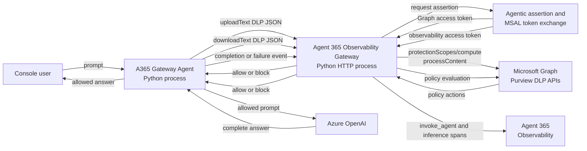
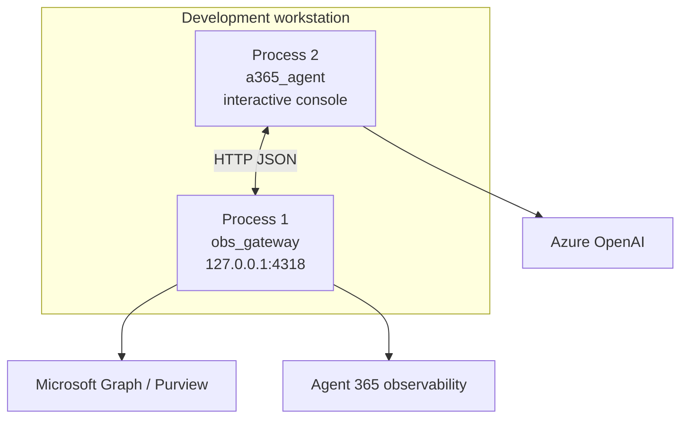
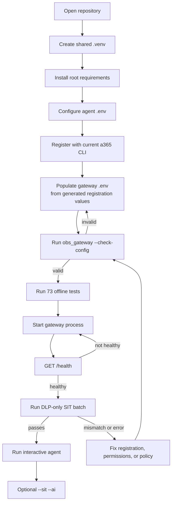
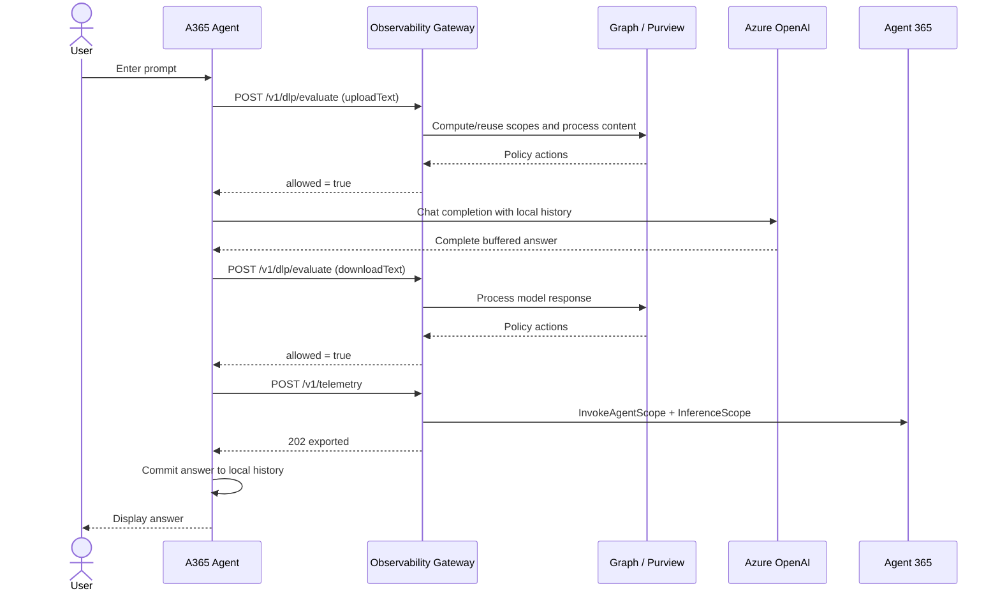
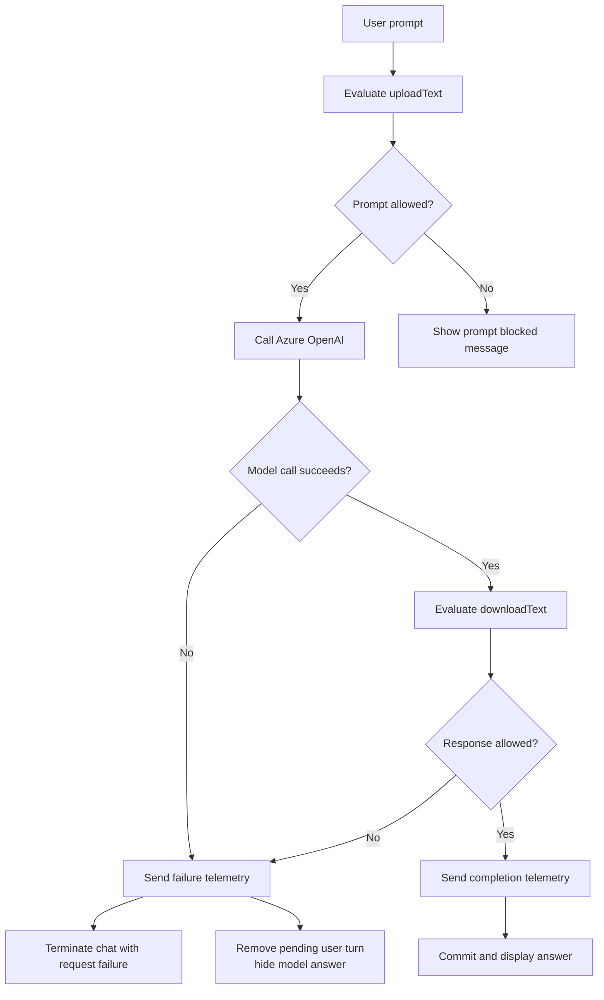
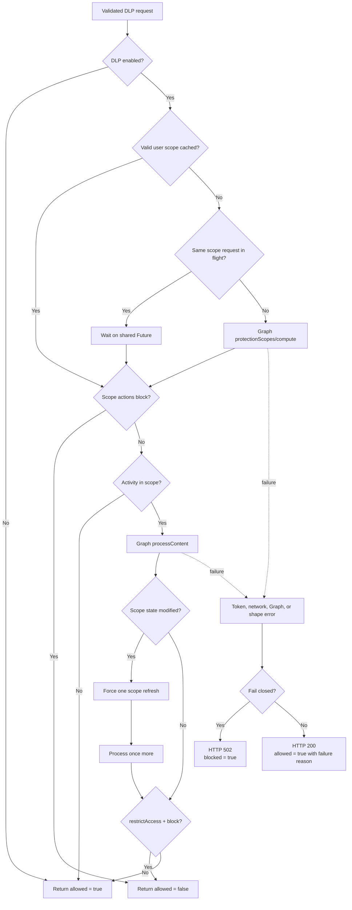
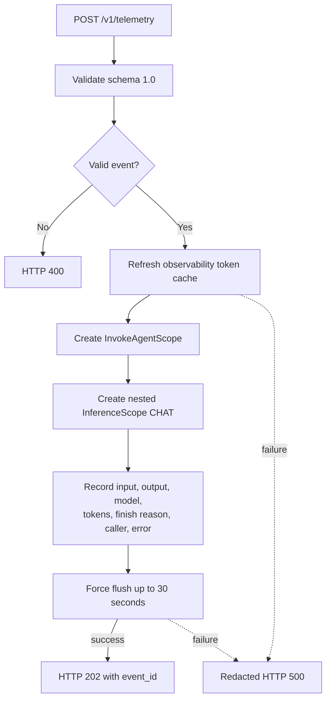
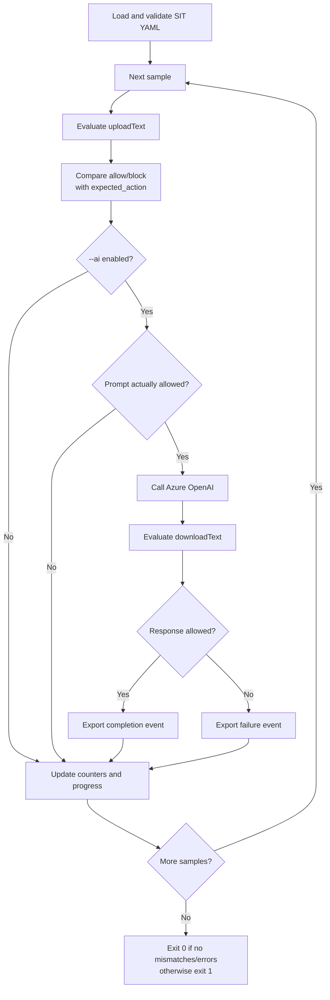
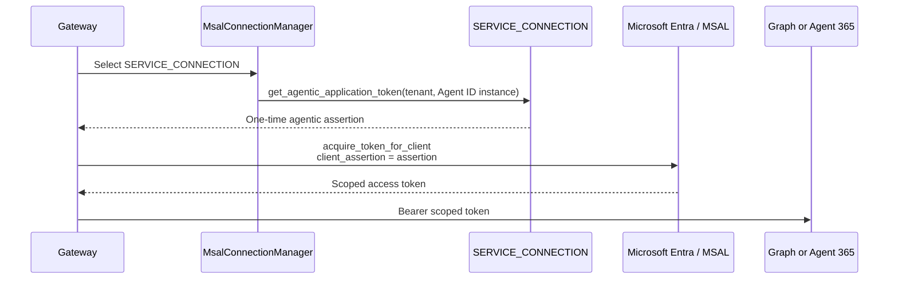

# Agent 365 Gateway Prototype

[한국어 문서](README-KR.md)

This repository is a two-process Python prototype for an Azure OpenAI chat
agent protected by Microsoft Purview DLP and observed through Agent 365.

- **`a365-gateway-agent`** owns console chat, Azure OpenAI inference, and the
	order in which prompts, responses, and telemetry cross the policy boundary.
- **`a365-observability-gateway`** owns HTTP validation, Agent 365 agentic token
	exchange, Microsoft Graph Purview calls, DLP decisions, and Agent 365
	OpenTelemetry export.

The projects share one root virtual environment and one root dependency file,
but they keep separate `.env` files because they have different identities and
security responsibilities.

## Current Status

| Area | Status |
|---|---|
| Agent package and CLI | Ready; offline tests pass |
| Gateway package and CLI | Ready; offline tests pass |
| Agent-to-gateway JSON contracts | Covered by tests on both sides |
| Gateway configuration check | Ready through `python -m obs_gateway --check-config` |
| Agent 365 registration | Completed as a non-M365 S2S agent |
| Live Purview API integration | Verified with app-only Agent ID tokens |
| Live Purview blocking policy | **Not configured for the current Agent ID** |
| Live Agent 365 telemetry export | Verified with `202/exported` |
| Local two-process deployment | Supported |
| Production cloud deployment | Not yet prepared; no IaC, container, or `azure.yaml` exists |

The repository currently has **73 passing offline tests**:

- 27 agent tests
- 46 gateway tests

The gateway is registered and starts with its generated local configuration.
Registration and Graph permissions prove that it can call Purview, but they do
not create a tenant DLP rule. Blocking is a separate Purview policy step.

## Critical DLP Enforcement Caveat

The gateway calls `protectionScopes/compute` and `processContent` correctly.
However, the tenant currently has **zero Application-plane DLP policies that
target this Agent ID instance**. Existing block rules target older application
IDs. Purview can therefore return a valid `allowed=true` response with no block
actions even for content that resembles sensitive data.

- **Integration works** when Graph accepts the Agent ID token and returns a
	valid policy response.
- **Enforcement works** only when an enabled policy targets the exact
	`policyLocationApplication`, includes the interaction's `user_id`, matches a
	sensitive-information condition, and specifies `RestrictAccess` for the
	relevant activity.
- A model-generated warning is not a Purview block. A real prompt block prints
	`Blocked by Microsoft Purview DLP policy.` and the prompt never reaches Azure
	OpenAI.

The current gateway is intentionally **S2S/app-only**. Its live Graph token has
`idtyp=app`, application `roles`, and no delegated `scp`. The Agent ID is an
Entra service principal, not a human user. The request's `user_id` selects the
user's Purview policy context; it is not the Graph credential.

Registering with `authmode=both` would add grants for a future OBO path, but the
current agent does not forward a user access token and the gateway does not
perform OBO. Changing registration to `both` alone would not make a policy
target this Agent ID and would not fix blocking.

### Tenant policy fix

Create an Application-plane DLP policy through Security & Compliance
PowerShell. Target the Agent ID instance application ID
(`AGENT365OBSERVABILITY__AGENTID` / generated `agenticAppId`), not the blueprint
`AGENT_ID`. Include the intended policy-subject user or tenant, add the desired
SIT condition, and set `RestrictAccess` to `UploadText=Block` and, when needed,
`DownloadText=Block`.

After a policy change, allow propagation time and restart the gateway to clear
its per-user protection-scope cache (default: 3600 seconds). Test with a
**Luhn-valid synthetic** card number from
[sits.yaml](a365-gateway-agent/sits.yaml), never a real card. An arbitrary
16-digit number might not match the Credit Card Number detector; the original
manual test value did not satisfy its checksum.

## Documentation Map

| Document | Purpose |
|---|---|
| [Root README](README.md) | End-to-end setup, architecture, deployment order, shared configuration, and operations |
| [Root Korean README](README-KR.md) | Korean version of the repository runbook |
| [Agent README](a365-gateway-agent/README.md) | Agent internals, chat state, SIT format, telemetry payload production, and agent troubleshooting |
| [Agent Korean README](a365-gateway-agent/README-KR.md) | Korean agent reference |
| [Gateway README](a365-gateway-prototype/README.md) | Gateway internals, configuration, token exchange, DLP cache, HTTP validation, and exporter behavior |
| [Gateway Korean README](a365-gateway-prototype/README-KR.md) | Korean gateway reference |

## What the Prototype Demonstrates

This prototype proves an application-controlled enforcement sequence:

1. A prompt is evaluated by Purview before Azure OpenAI receives it.
2. Only an allowed prompt reaches Azure OpenAI.
3. The complete model answer is buffered and evaluated by Purview before it is
	 displayed.
4. A blocked model answer is hidden and removed from local conversation state.
5. Successful and failed model activity is represented as Agent 365 spans.
6. The system prompt, prior conversation history, and Azure bearer token stay
	 outside the gateway telemetry event.

This is not a general-purpose reverse proxy. The agent still calls Azure OpenAI
directly; the gateway protects content and exports observability around that
call.

## System Architecture



### Ownership Boundary

| Responsibility | Agent | Gateway | External service |
|---|:---:|:---:|:---:|
| Console input and commands | Yes | No | No |
| In-memory conversation history | Yes | No | No |
| Azure OpenAI authentication and invocation | Yes | No | Azure OpenAI |
| Prompt and response DLP ordering | Yes | Enforces requested evaluation | Microsoft Purview |
| Agent-to-gateway payload creation | Yes | Validates | No |
| Gateway HTTP authentication | Sends key | Validates key | No |
| Protection-scope cache | No | Yes | No |
| Microsoft Graph transport | No | Yes | Microsoft Graph |
| Agentic assertion and scoped token exchange | No | Yes | Microsoft Entra / Agent 365 |
| Agent 365 span construction and flush | No | Yes | Agent 365 |
| Agent 365 registration | No | No | `a365` CLI and tenant |
| Purview policy authoring | No | No | Microsoft Purview tenant administration |

## Repository Structure

```text
a365-gateway-prototype/
|-- .gitignore
|-- .venv/                         Shared local virtual environment, ignored
|-- README.md                      End-to-end English runbook
|-- README-KR.md                   End-to-end Korean runbook
|-- requirements.txt               Shared dependencies and editable installs
|
|-- a365-gateway-agent/
|   |-- .env                       Agent settings and local secrets, ignored
|   |-- .env.example               Azure OpenAI and gateway template
|   |-- README.md
|   |-- README-KR.md
|   |-- a365-agent.py              Compatibility launcher
|   |-- pyproject.toml             `a365-gateway-agent` package
|   |-- sits.yaml                  Synthetic DLP test samples
|   |-- src/a365_agent/
|   |   |-- azure_openai.py        Azure OpenAI client construction
|   |   |-- chat.py                Interactive enforcement workflow
|   |   |-- cli.py                 Chat/SIT command dispatch
|   |   |-- config.py              Agent-local `.env` loading
|   |   |-- gateway.py             Gateway DLP and telemetry HTTP client
|   |   |-- models.py              Caller and conversation values
|   |   `-- sit.py                 SIT YAML validation and batch runner
|   `-- tests/                     27 offline tests
|
`-- a365-gateway-prototype/
		|-- .env                       Gateway settings and generated values, ignored
		|-- .env.example               Safe registration/configuration template
		|-- README.md
		|-- README-KR.md
		|-- a365-gateway.py            Compatibility launcher
		|-- pyproject.toml             `a365-observability-gateway` package
		|-- src/obs_gateway/
		|   |-- application.py         Dependency assembly and shutdown
		|   |-- cli.py                 Startup and offline config check
		|   |-- config.py              Typed gateway configuration
		|   |-- auth/                  Agentic and scoped token exchange
		|   |-- http/                  Routes, request validation, responses
		|   |-- purview/               Graph client, DLP service, scope cache
		|   |-- telemetry/             Event validation and Agent 365 export
		|   `-- shared/                Error types
		`-- tests/                     46 offline tests
```

## Process Deployment Model

The currently supported deployment is two local processes on the same machine:



Start the gateway first, verify health, and then start the agent. The agent
cannot complete a protected turn when the gateway is unavailable.

## End-to-End Startup Flow



## Prerequisites

### Local software

- Python 3.11 or newer
- Git or an equivalent source checkout
- Azure CLI (`az`) for the local agent identity workflow
- Agent 365 CLI (`a365`) for registration and generated service configuration

`az` and `a365` are different tools:

- `az login` supplies a local Azure identity used by the agent's
	`DefaultAzureCredential` chain.
- `a365` registration provisions the Agent 365 application and generates the
	gateway's agentic service connection and observability settings.

### Azure and Microsoft 365 resources

- An Azure OpenAI resource and chat deployment
- Permission for the selected local identity to invoke that deployment
- A Microsoft 365 tenant with the required Agent 365 capabilities
- Microsoft Graph permissions and admin consent required by the Purview APIs
- Purview policy targeting the configured application location and users

### Network access

The agent needs access to Azure OpenAI and the local gateway. The gateway needs
access to Microsoft Entra, Microsoft Graph, and Agent 365 telemetry services.

## Install the Shared Python Environment

Run all root commands from this repository directory.

### Windows PowerShell

```powershell
python -m venv .\.venv
.\.venv\Scripts\python.exe -m pip install --upgrade pip
.\.venv\Scripts\python.exe -m pip install -r .\requirements.txt
```

Optional activation:

```powershell
.\.venv\Scripts\Activate.ps1
```

### macOS or Linux

```bash
python3 -m venv .venv
.venv/bin/python -m pip install --upgrade pip
.venv/bin/python -m pip install -r requirements.txt
```

Optional activation:

```bash
source .venv/bin/activate
```

The root requirements install both projects in editable mode. Changes under
either `src` directory are used immediately without reinstalling.

## Configure the Agent

Create the file only when it does not already exist.

### Windows PowerShell

```powershell
if (-not (Test-Path .\a365-gateway-agent\.env)) {
		Copy-Item .\a365-gateway-agent\.env.example `
				.\a365-gateway-agent\.env
}
```

### macOS or Linux

```bash
test -f a365-gateway-agent/.env || \
	cp a365-gateway-agent/.env.example a365-gateway-agent/.env
```

Required agent settings:

| Variable | Meaning |
|---|---|
| `AZURE_OPENAI_ENDPOINT` | Azure OpenAI resource endpoint |
| `AZURE_OPENAI_DEPLOYMENT` | Deployment name, not necessarily the base model name |
| `AZURE_OPENAI_API_VERSION` | API version passed to the OpenAI SDK |
| `AZURE_OPENAI_SCOPE` | Usually `https://cognitiveservices.azure.com/.default` |
| `AZURE_OPENAI_SYSTEM_PROMPT` | Local system message for chat and SIT AI calls |
| `OBS_GATEWAY_URL` | Usually `http://127.0.0.1:4318/v1/telemetry` |

The DLP URL defaults from the telemetry URL but can be explicit:

```dotenv
OBS_GATEWAY_DLP_URL=http://127.0.0.1:4318/v1/dlp/evaluate
```

Authenticate the agent's local Azure identity:

```powershell
az login
az account show
```

The agent also obtains one Azure OpenAI-scope token at startup to derive caller
metadata. If the token has no `oid` claim, configure `CALLER_USER_ID`.

## Register and Configure the Gateway

The gateway `.env.example` contains all 35 supported keys. The real `.env`
currently has the same key set but its generated Agent 365 registration fields
are empty.

### 1. Register externally

Use the help for your installed `a365` CLI and the registration workflow
appropriate to that version and tenant. Exact CLI syntax is intentionally not
hardcoded here because it can change. Treat the generated IDs, scopes, handler
types, tenant values, connection map, and secrets as authoritative.

### 2. Populate the gateway `.env`

For a new checkout only:

```powershell
if (-not (Test-Path .\a365-gateway-prototype\.env)) {
		Copy-Item .\a365-gateway-prototype\.env.example `
				.\a365-gateway-prototype\.env
}
```

Registration must populate these groups:

```text
AGENT_ID
CONNECTIONS__SERVICE_CONNECTION__SETTINGS__*
AGENTAPPLICATION__USERAUTHORIZATION__HANDLERS__AGENTIC__SETTINGS__*
CONNECTIONSMAP__0__*
AGENT365OBSERVABILITY__*
```

`AGENT_ID` is the blueprint application ID.
`AGENT365OBSERVABILITY__AGENTID` is the Agent ID instance used for `fmi_path`,
scoped token exchange, and the default Purview application location. They are
not interchangeable.

### 3. Validate without network side effects

```powershell
.\.venv\Scripts\python.exe -m obs_gateway --check-config
```

This command does not acquire tokens, start HTTP, call Graph, or export spans.

Expected successful shape:

```text
Gateway configuration is valid.
HTTP listener: 127.0.0.1:4318
HTTP API key configured: False
Purview DLP enabled: True
Purview fail closed: True
Agent 365 observability enabled: True
Agent 365 remote export enabled: True
```

Before registration, exit code `2` and a list of missing registration variables
is expected.

## Shared Settings That Must Agree

| Concern | Agent setting | Gateway setting | Rule |
|---|---|---|---|
| Telemetry endpoint | `OBS_GATEWAY_URL` | `OBS_GATEWAY_HOST` + `OBS_GATEWAY_PORT` | Must resolve to `/v1/telemetry` on the running gateway |
| DLP endpoint | `OBS_GATEWAY_DLP_URL` | `OBS_GATEWAY_HOST` + `OBS_GATEWAY_PORT` | Must resolve to `/v1/dlp/evaluate` |
| Bearer authentication | `OBS_GATEWAY_API_KEY` | `OBS_GATEWAY_API_KEY` | Values must be identical; do not include the literal `Bearer` prefix |
| Agent wait time | `OBS_GATEWAY_TIMEOUT_SECONDS` | `PURVIEW_TIMEOUT_SECONDS` | Agent timeout must exceed the aggregate time for multiple Graph calls plus overhead |
| Policy location | None | `PURVIEW_APPLICATION_ID` or Agent ID instance | Must exactly match the application targeted by Purview policy |
| Caller identity | `CALLER_USER_ID` or token `oid` | DLP `user_id` | User must be within the intended Purview protection scope |
| Event schema | Hardcoded `1.0` | Validates `1.0` | Both sides must change together for a future schema version |

The example uses:

```dotenv
# Agent
OBS_GATEWAY_TIMEOUT_SECONDS=60

# Gateway
PURVIEW_TIMEOUT_SECONDS=15
```

One DLP evaluation can perform scope computation, content evaluation, and a
one-time scope refresh followed by another content evaluation. Treat 60 seconds
as a starting point, not a universal guarantee; increase the agent timeout or
reduce the per-Graph timeout if your environment regularly approaches it.

### Recommended local safety settings

```dotenv
# a365-gateway-prototype/.env
OBS_GATEWAY_HOST=127.0.0.1
PURVIEW_DLP_ENABLED=true
PURVIEW_DLP_FAIL_CLOSED=true
ENABLE_A365_OBSERVABILITY=true
ENABLE_A365_OBSERVABILITY_EXPORTER=true
A365_OBSERVABILITY_CONSOLE=false

# a365-gateway-agent/.env
OBS_GATEWAY_REQUIRED=true
```

`PURVIEW_DLP_FAIL_CLOSED=true` means token, Graph, network, timeout, and policy
response failures block the activity instead of allowing content to continue.
`OBS_GATEWAY_REQUIRED=true` means the agent does not silently bypass required
telemetry. These defaults make failures visible and preserve the intended
enforcement boundary.

## Start the Local Deployment

Use separate terminals.

### Terminal 1: gateway

```powershell
.\.venv\Scripts\a365-observability-gateway.exe
```

Equivalent commands:

```powershell
.\.venv\Scripts\python.exe -m obs_gateway
.\.venv\Scripts\python.exe .\a365-gateway-prototype\a365-gateway.py
```

Expected startup log shape:

```text
Agent 365 observability gateway listening on http://127.0.0.1:4318
Purview DLP enabled: True
DLP endpoint: POST /v1/dlp/evaluate
Telemetry endpoint: POST /v1/telemetry
```

### Terminal 2: health check

```powershell
Invoke-RestMethod http://127.0.0.1:4318/health
```

Expected JSON:

```json
{
	"status": "ok",
	"purview_dlp_enabled": true
}
```

The health route confirms that HTTP is listening. It does not prove Graph token
exchange, Purview policy access, or Agent 365 export.

### Terminal 2: DLP-only integration check

```powershell
.\.venv\Scripts\python.exe -m a365_agent --sit
```

This mode makes live gateway and Purview calls but no Azure OpenAI inference
calls. It is the safest first integration test after registration.

### Terminal 2: interactive chat

```powershell
.\.venv\Scripts\a365-gateway-agent.exe
```

Equivalent commands:

```powershell
.\.venv\Scripts\python.exe -m a365_agent
.\.venv\Scripts\python.exe .\a365-gateway-agent\a365-agent.py
```

Agent console commands:

| Command | Result |
|---|---|
| `/clear` | Reset local history, session ID, conversation ID, and sequence number |
| `/exit` or `/quit` | Exit normally |
| `Ctrl+C` while waiting for input | Exit normally |

### Optional full SIT mode

```powershell
.\.venv\Scripts\python.exe -m a365_agent --sit --ai
```

This mode can make billable Azure OpenAI calls for samples allowed by prompt
DLP. Run it only after DLP-only mode behaves as expected.

## Normal Chat Turn



Telemetry is required by default. A successful answer is committed and
displayed only after telemetry delivery succeeds.

## Prompt and Response Blocking Flow



Important behavior:

- A prompt blocked before inference creates no model telemetry event.
- A blocked prompt still consumes one local sequence number.
- A blocked response creates a failure event because a model call occurred.
- The blocked response and its user prompt do not remain in local history.
- No partial model output is shown before response DLP because responses are
	not streamed.

## Gateway DLP Decision Flow



The scope cache is process-local and keyed by `user_id`. Concurrent misses for
the same user share one `Future`; Graph I/O occurs outside the cache lock, so a
slow user lookup does not hold the lock during network access.

## Telemetry Export Flow



The gateway disables automatic OpenAI instrumentation because it receives an
already completed model call rather than invoking OpenAI itself.

## SIT Batch Flow



The bundled values are synthetic. Expected actions still depend on your live
tenant policy, application location, protection scope, confidence level, and
minimum-count conditions.

## REST API Summary

Base URL for local deployment: `http://127.0.0.1:4318`

| Method | Path | Authentication | Purpose | Success |
|---|---|---|---|---:|
| `GET` | `/health` | None | HTTP process health and DLP-enabled flag | `200` |
| `POST` | `/v1/dlp/evaluate` | Bearer key when configured | Evaluate `uploadText` or `downloadText` through Purview | `200` |
| `POST` | `/v1/telemetry` | Bearer key when configured | Validate and export one model event to Agent 365 | `202` |

Unknown routes return `404`. Every JSON response contains
`Client-Request-Id`. A caller-supplied request ID is echoed; otherwise the
gateway generates a UUID.

### Authentication header

When `OBS_GATEWAY_API_KEY` is non-empty:

```http
Authorization: Bearer <OBS_GATEWAY_API_KEY>
```

The agent adds this header automatically. The environment value must contain
only the secret, not the `Bearer` prefix.

### DLP request

```http
POST /v1/dlp/evaluate
Content-Type: application/json
```

```json
{
	"user_id": "caller-object-id",
	"content": "text to evaluate",
	"activity": "uploadText",
	"conversation_id": "conversation-uuid",
	"sequence_number": 0,
	"client_ip": "127.0.0.1"
}
```

Validation rules:

- `user_id`, `content`, and `conversation_id` are required non-empty strings.
- `activity` is exactly `uploadText` or `downloadText`.
- `sequence_number` is a non-negative integer, not a boolean.
- `client_ip` is a string and defaults to `127.0.0.1`.
- The body must be non-empty JSON within the configured size limit.

Allowed response:

```json
{
	"allowed": true,
	"blocked": false,
	"activity": "uploadText",
	"policy_actions": [],
	"protection_scope_state": "notModified",
	"reason": "Purview policy evaluation allowed the activity"
}
```

Blocked response:

```json
{
	"allowed": false,
	"blocked": true,
	"activity": "uploadText",
	"policy_actions": [
		{
			"action": "restrictAccess",
			"restrictionAction": "block"
		}
	],
	"protection_scope_state": "notModified",
	"reason": "Purview policy requires blocking"
}
```

DLP status codes:

| Code | Meaning |
|---:|---|
| `200` | A valid allow/block decision, including intentional fail-open allow |
| `400` | Invalid content type, body, JSON, or field contract |
| `401` | Missing or incorrect API key |
| `502` | Policy could not be evaluated in fail-closed mode; response includes `blocked: true` |
| `500` | Unexpected internal DLP failure; response is redacted and includes `blocked: true` |

### Telemetry request

```http
POST /v1/telemetry
Content-Type: application/json
```

Successful model event:

```json
{
	"schema_version": "1.0",
	"event_id": "event-uuid",
	"session_id": "session-uuid",
	"conversation_id": "conversation-uuid",
	"channel": "console",
	"input": "current user prompt",
	"output": "current model answer",
	"model": "azure-openai-deployment",
	"provider_name": "azure-openai",
	"inference_endpoint": {
		"hostname": "resource.openai.azure.com",
		"port": 443
	},
	"caller": {
		"id": "caller-object-id",
		"email": "user@example.com",
		"name": "Example User",
		"client_ip": "127.0.0.1"
	},
	"usage": {
		"input_tokens": 120,
		"output_tokens": 45
	},
	"finish_reason": "stop"
}
```

Failure event addition:

```json
{
	"output": "",
	"usage": {
		"input_tokens": null,
		"output_tokens": null
	},
	"finish_reason": null,
	"error": {
		"type": "RuntimeError",
		"message": "Model response blocked by Purview DLP policy"
	}
}
```

The example above shows the fields that differ; a real failure event still
contains all required IDs, model, provider, endpoint, caller, and input fields.

Accepted response:

```json
{
	"status": "exported",
	"event_id": "event-uuid"
}
```

Telemetry status codes:

| Code | Meaning |
|---:|---|
| `202` | Event validated, spans constructed, and provider force-flush accepted |
| `400` | Invalid schema or field contract |
| `401` | Missing or incorrect API key |
| `500` | Token, exporter, span, or flush failure; response is redacted |

See the [gateway component API reference](a365-gateway-prototype/README.md#http-api)
for field-level details.

## Authentication and Token Flows

### Agent to Azure OpenAI

The agent uses `DefaultAzureCredential` and
`get_bearer_token_provider(AZURE_OPENAI_SCOPE)`. Locally, `az login` is usually
the selected credential source. The agent decodes one acquired token locally to
obtain caller claims, but never sends that token to the gateway.

### Gateway to Microsoft services



Gateway scopes:

- Graph: `https://graph.microsoft.com/.default`
- Agent 365 observability:
	`api://9b975845-388f-4429-889e-eab1ef63949c/.default`

Tokens and assertions are neither logged nor returned through HTTP.

## Security and Privacy Model

### Data sent to the gateway

- Current content submitted for DLP evaluation
- Current prompt and allowed answer in completion telemetry
- Current prompt and exception detail in failure telemetry
- Caller ID, optional email/name, and client IP
- Model deployment, provider, and inference endpoint metadata
- Token usage, finish reason, session, conversation, and event IDs

### Data not sent in telemetry by the agent

- Azure OpenAI bearer token
- System prompt
- Earlier conversation messages
- Complete token claim set
- Gateway API key inside the JSON body

The DLP endpoint necessarily receives the exact current prompt or response that
must be evaluated. Agent 365 telemetry also receives the current input/output
through spans. Treat both as sensitive data paths.

### Local HTTP boundary

- The gateway defaults to `127.0.0.1`.
- A non-loopback bind is rejected unless a gateway API key is configured.
- API-key comparison uses constant-time `hmac.compare_digest`.
- `/health` is unauthenticated but returns no secret or content.
- The built-in server provides no TLS.

For remote use, place the gateway behind trusted HTTPS termination, use a strong
API key, restrict ingress, and load secrets from a production secret store.

### Error behavior

- Public `500` responses omit internal exception details.
- Operational logs include request IDs but not request bodies or tokens.
- Purview fail-closed errors return `blocked: true`.
- Console telemetry export is disabled by default because it can print content.

## Offline Tests

Offline tests use mocks, fake transports, and a loopback test server. They do
not require Azure, Agent 365 registration, Microsoft Graph, Purview, or a real
gateway process.

### Windows PowerShell

```powershell
# Agent: 27 tests
.\.venv\Scripts\python.exe -B -m unittest discover `
		-s .\a365-gateway-agent\tests `
		-v

# Gateway: 46 tests
.\.venv\Scripts\python.exe -B -m unittest discover `
		-s .\a365-gateway-prototype\tests `
		-v

# Installed dependency consistency
.\.venv\Scripts\python.exe -m pip check
```

### macOS or Linux

```bash
.venv/bin/python -B -m unittest discover -s ./a365-gateway-agent/tests -v
.venv/bin/python -B -m unittest discover -s ./a365-gateway-prototype/tests -v
.venv/bin/python -m pip check
```

The `-B` option prevents Python from writing `__pycache__` during tests.

Additional CLI checks:

```powershell
.\.venv\Scripts\python.exe -B -m a365_agent --help
.\.venv\Scripts\python.exe -B -m obs_gateway --help
.\.venv\Scripts\a365-observability-gateway.exe --version
```

## Live Validation Ladder

Use the lowest-risk check that proves the next dependency:

| Stage | Command or action | Requires | Makes model calls? |
|---:|---|---|:---:|
| 1 | Run both offline test suites | Python dependencies | No |
| 2 | `python -m obs_gateway --check-config` | Registration values in `.env` | No |
| 3 | Start gateway and call `/health` | Valid startup composition and free port | No |
| 4 | `python -m a365_agent --sit` | Azure caller identity, gateway, Graph, Purview | No |
| 5 | Interactive chat | Azure OpenAI plus all previous dependencies | Yes |
| 6 | `python -m a365_agent --sit --ai` | Full integration | Yes, potentially many |
| 7 | Inspect Agent 365 activity | Successful remote export and tenant access | No additional calls |

Do not jump directly to full SIT AI mode. DLP-only mode isolates registration,
Graph permission, policy, and contract problems without inference cost.

## Exit Codes

### Agent

| Code | Meaning |
|---:|---|
| `0` | Normal chat exit or SIT batch with no mismatches/errors |
| `1` | SIT mismatch/error or non-configuration request failure |
| `2` | Argument, configuration, or required telemetry `RuntimeError` |

### Gateway

| Code | Meaning |
|---:|---|
| `0` | Config check succeeded or server shut down normally |
| `1` | Runtime startup failure such as token setup, exporter setup, or port bind |
| `2` | Invalid or incomplete configuration, including pre-registration values |

## Local Deployment Versus Production Deployment

### Supported now: local two-process deployment

The commands above are the tested deployment model:

- one shared Python environment;
- one loopback HTTP gateway process;
- one interactive console agent process;
- `.env` files stored locally and ignored by Git.

This model is suitable for development, tenant integration testing, DLP policy
validation, and Agent 365 observability experiments.

### Not prepared yet: production cloud deployment

This repository currently has no:

- `azure.yaml` or Azure Developer CLI deployment plan;
- Bicep, ARM, Terraform, or Pulumi infrastructure;
- Dockerfile or container health/readiness configuration;
- managed secret-store integration;
- production TLS or ingress configuration;
- service supervisor or autoscaling configuration;
- hosted user interface replacing the agent's stdin/stdout console.

Therefore, commands such as `azd up`, `terraform apply`, or a container deploy
are not valid for this checkout yet.

### Production preparation checklist

Before hosting the gateway:

1. Select a supported compute target and define infrastructure as code.
2. Run the gateway behind HTTPS and authenticated, restricted ingress.
3. Store registration secrets in a managed secret store.
4. Replace process-local assumptions where multiple replicas matter, especially
	 the protection-scope cache and telemetry delivery behavior.
5. Add readiness checks that prove required downstream access without exposing
	 sensitive diagnostics.
6. Add rate limiting, resource limits, structured log collection, and alerting.
7. Decide whether force-flushing every telemetry request meets latency goals or
	 whether durable asynchronous delivery is required.
8. Validate Agent 365 and Purview networking, permissions, and identity from the
	 selected hosting environment.

Before hosting the agent:

1. Replace the interactive console with an explicit service or channel host.
2. Define how end-user identity reaches `CALLER_USER_ID`, email, name, and IP.
3. Persist or deliberately scope conversation state.
4. Define authentication, authorization, concurrency, and session isolation.
5. Keep the same prompt-before-inference and response-before-display DLP
	 boundaries.

Agent 365 registration is required for live integration, but registration alone
is not a production deployment.

## Common Operations

### Check package versions

```powershell
.\.venv\Scripts\a365-observability-gateway.exe --version
.\.venv\Scripts\python.exe -c "import a365_agent; print(a365_agent.__version__)"
```

### Use a different gateway configuration file

```powershell
.\.venv\Scripts\python.exe -m obs_gateway `
		--check-config `
		--env-file .\path\to\gateway.env
```

Remove `--check-config` to start with that file after validation.

### Change the local port

1. Change `OBS_GATEWAY_PORT` in the gateway `.env`.
2. Change both agent gateway URLs to the same host and port.
3. Restart both processes.
4. Verify `/health` on the new port.

### Enable API-key protection on loopback

Set the same strong value in both `.env` files:

```dotenv
OBS_GATEWAY_API_KEY=replace-with-a-random-secret
```

The gateway permits a key on loopback even though it is only mandatory for a
non-loopback listener.

## Troubleshooting

### Purview allows sensitive-looking content

If Azure OpenAI generated the warning, Purview allowed the prompt. Inspect the
direct DLP response and protection scope. This environment is registered, but
no current Application-plane policy targets its Agent ID instance. Create or
update the policy location and user inclusion, wait for propagation, restart
the gateway to clear its scope cache, and test with a valid synthetic SIT value.

### `No module named 'a365_agent'` or `No module named 'obs_gateway'`

Install from the repository root:

```powershell
.\.venv\Scripts\python.exe -m pip install -r .\requirements.txt
```

### Azure credential failure in the agent

```powershell
az login
az account show
```

Confirm the tenant, subscription, Azure OpenAI permission, endpoint, scope, and
deployment. Set `CALLER_USER_ID` when the chosen credential token has no `oid`.

### Gateway fails with `address already in use`

Another process owns port 4318. Stop it or select another port and update both
agent URLs.

### Agent reports `cannot reach gateway`

Start the gateway first, verify `/health`, and check both agent URLs, the port,
proxy configuration, and local firewall.

### HTTP `401`

The gateway and agent API-key values differ. Store only the secret in each
environment value, without the `Bearer` prefix.

### HTTP `400`

The request failed strict JSON or type validation. Use the response error and
`Client-Request-Id` to correlate the request. Run both offline suites to confirm
that neither side's contract was changed independently.

### HTTP `502` with `blocked: true`

Fail-closed enforcement is working because Purview could not be evaluated. Use
the request ID in gateway logs to investigate registration, consent, Graph
permission, network, timeout, or malformed response issues.

### Telemetry HTTP `500`

Inspect gateway logs by request ID. Common causes are agentic assertion failure,
scope-token exchange, exporter setup, or force-flush failure. Client responses
intentionally omit internal details.

### DLP requests time out

One evaluation can make multiple Graph calls. Increase the agent gateway timeout
or reduce the gateway's per-request Graph timeout while preserving a reasonable
policy decision window.

### SIT expected and actual actions differ

The gateway does no local sensitive-data pattern matching. Verify live Purview
policy location, target application ID, caller protection scope, rule, SIT,
confidence level, and minimum count.

### Prompt is blocked but no telemetry event appears

That is intentional when prompt DLP blocks before Azure OpenAI. No model call
occurred. A blocked model response does create a failure telemetry event because
inference already occurred.

## Known Limitations

- Text-only, console-only agent
- Synchronous HTTP, Graph, model, and telemetry calls
- No streaming model output
- No Graph retry or backoff
- Process-local conversation and scope-cache state
- No durable telemetry queue
- One global gateway request-size limit
- One timeout for both agent-to-gateway POST routes
- Gateway health does not probe Graph or Agent 365 readiness
- Built-in gateway server has no TLS or rate limiting
- Telemetry force flush can add up to 30 seconds of latency
- Live Agent 365 registration, Purview policy, and remote export remain
	unverified until registration is completed
- Production cloud deployment artifacts are not yet present

These constraints keep the prototype focused. Preserve the two DLP enforcement
boundaries and their regression tests when evolving it into a hosted system.
