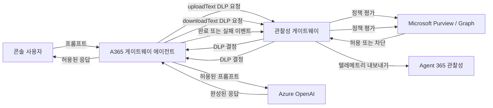

# A365 게이트웨이 에이전트

[English documentation](README.md)

`a365-gateway-agent`는 Azure OpenAI를 호출하는 동기식 Python 명령줄 채팅
애플리케이션입니다. 형제 프로젝트인 관찰성 게이트웨이를 정책 집행 및
텔레메트리 경계로 사용합니다. 사용자가 입력한 모든 비어 있지 않은 프롬프트는
Azure OpenAI에 전달되기 전에 Microsoft Purview DLP 평가를 받습니다. 모델이
생성한 응답도 사용자에게 표시되기 전에 다시 DLP 평가를 받습니다. 모델 호출의
성공 및 실패 결과는 Agent 365 텔레메트리 이벤트로 게이트웨이에 전송됩니다.

또한 Microsoft Purview 정책 동작을 반복해서 확인할 수 있도록 합성
SIT(Sensitive Information Type) 배치 실행 기능을 제공합니다.

## 이 프로젝트의 책임

에이전트가 담당하는 기능은 다음과 같습니다.

- `a365-gateway-agent/.env`에서 Azure OpenAI와 게이트웨이 설정 로드
- `DefaultAzureCredential`을 통한 Azure OpenAI 토큰 획득
- 메모리 기반 다중 턴 콘솔 대화 관리
- 추론 전에 프롬프트 DLP 집행
- 출력 표시 및 내보내기 전에 응답 DLP 집행
- 버전 `1.0` 텔레메트리 JSON 계약 생성
- DLP 전용 및 종단 간 합성 SIT 배치 실행
- 설정, 텔레메트리, 요청 오류를 안정적인 프로세스 종료 코드로 변환

에이전트가 직접 담당하지 않는 기능은 다음과 같습니다.

- Agent 365 SDK 초기화 또는 직접 사용
- Microsoft Graph 또는 Purview API 직접 호출
- 콘텐츠 민감도 판정 또는 정책 해석
- 대화 내용 영구 저장
- DLP 평가 전 모델 출력 스트리밍
- Azure bearer token 저장 또는 게이트웨이 전달

Agent 365 인증, Purview Graph 호출, 정책 해석, 실제 텔레메트리 내보내기는
`a365-gateway-prototype` 게이트웨이의 책임입니다.

## 전체 아키텍처



DLP 게이트웨이는 추론 경로 안에 있습니다. 텔레메트리는 모델 호출이 성공하거나
실패한 뒤에만 전송됩니다. 추론 전에 차단된 프롬프트는 모델 활동이 발생하지
않았으므로 텔레메트리 이벤트를 생성하지 않습니다.

## 한 번의 채팅 턴 처리 순서

대화형 모드는 다음 순서를 엄격히 따릅니다.

1. 콘솔 입력을 읽고 앞뒤 공백을 제거합니다.
2. 빈 입력을 무시하거나 로컬 명령을 처리합니다.
3. 현재 0 기반 시퀀스 번호를 할당하고 카운터를 증가시킵니다.
4. 프롬프트를 `activity: "uploadText"`로 게이트웨이에 전송합니다.
5. Purview가 프롬프트를 차단하면 해당 턴을 즉시 중단합니다.
6. 허용된 프롬프트를 로컬 메시지 기록에 추가합니다.
7. 시스템 프롬프트와 전체 로컬 대화 기록으로 Azure OpenAI를 호출합니다.
8. 모델의 전체 응답을 `activity: "downloadText"`로 평가합니다.
9. 응답이 차단되면 실패 텔레메트리를 기록하고, 방금 추가한 사용자 턴을 로컬
   기록에서 제거하며, 모델 응답을 표시하지 않습니다.
10. 응답이 허용되면 완료 텔레메트리를 기록하고, 응답을 로컬 기록에 추가한 뒤
    사용자에게 표시합니다.

이 순서가 보장하는 중요한 동작은 다음과 같습니다.

- 차단된 프롬프트는 Azure OpenAI에 절대 전달되지 않습니다.
- 차단된 프롬프트도 시퀀스 번호 하나를 소비합니다.
- 모델 출력은 전체가 메모리에 준비된 뒤 DLP 평가를 받으므로, 평가 전에 일부가
  사용자에게 노출되지 않습니다.
- 차단된 응답과 해당 사용자 프롬프트는 다음 턴의 대화 컨텍스트에 포함되지
  않습니다.
- 필수 텔레메트리는 정상 응답을 로컬 기록에 확정하거나 화면에 표시하기 전에
  전송됩니다.

## 프로젝트 구조

```text
a365-gateway-agent/
|-- .env                 로컬 설정 및 비밀 값, Git에서 제외
|-- .env.example         전체 설정 템플릿
|-- .gitignore           에이전트 생성 파일 제외 규칙
|-- README.md            영문 문서
|-- README-KR.md         한글 문서
|-- a365-agent.py        이전 실행 방식을 위한 호환 런처
|-- pyproject.toml       패키지 정보 및 콘솔 명령 정의
|-- sits.yaml            합성 Purview 테스트 샘플
|-- src/
|   `-- a365_agent/
|       |-- __init__.py
|       |-- __main__.py  `python -m a365_agent` 진입점
|       |-- azure_openai.py  Azure OpenAI 클라이언트 생성
|       |-- chat.py      대화형 채팅 및 DLP 집행 흐름
|       |-- cli.py       인자 해석, 모드 분기, 종료 코드
|       |-- config.py    .env 로드, 경로, 상수, 설정 모델
|       |-- gateway.py   DLP 및 텔레메트리 HTTP 클라이언트
|       |-- models.py    대화, 호출자, DLP, SIT 값 객체
|       `-- sit.py       SIT YAML 검증 및 배치 실행
`-- tests/
    |-- test_chat.py
    |-- test_cli.py
    |-- test_config.py
    |-- test_gateway.py
    |-- test_models.py
    `-- test_sit.py
```

저장소 루트가 공유 `.venv`와 `requirements.txt`를 소유합니다. 루트 요구 사항을
설치하면 에이전트 패키지가 editable 모드로 설치되므로, `src/a365_agent` 변경은
재설치 없이 즉시 반영됩니다.

## 사전 요구 사항

- Python 3.11 이상
- Azure OpenAI 리소스와 채팅 모델 배포
- `DefaultAzureCredential`이 지원하는 Microsoft Entra ID 자격 증명
- 해당 ID에 부여된 Azure OpenAI 호출 권한
- 완전한 소스와 설정을 갖춘 형제 관찰성 게이트웨이
- 에이전트에서 Azure OpenAI 및 게이트웨이로의 네트워크 연결

로컬 개발에서는 Azure CLI 로그인이 가장 간단합니다. 환경 자격 증명 또는
관리 ID처럼 `DefaultAzureCredential`이 지원하는 다른 인증 소스도 올바르게
설정하면 사용할 수 있습니다.

## Windows 빠른 시작

다음 명령은 `requirements.txt`, `a365-gateway-agent`,
`a365-gateway-prototype`가 있는 저장소 루트에서 실행합니다.

### 1. 공유 가상 환경 생성

```powershell
python -m venv .\.venv
.\.venv\Scripts\python.exe -m pip install --upgrade pip
.\.venv\Scripts\python.exe -m pip install -r .\requirements.txt
```

이 문서의 모든 명령은 공유 Python 실행 파일을 직접 사용하므로 가상 환경
활성화는 선택 사항입니다. PowerShell에서 활성화하려면 다음 명령을 사용합니다.

```powershell
.\.venv\Scripts\Activate.ps1
```

### 2. 에이전트 로컬 설정 생성

```powershell
if (-not (Test-Path .\a365-gateway-agent\.env)) {
    Copy-Item .\a365-gateway-agent\.env.example .\a365-gateway-agent\.env
}
```

`a365-gateway-agent/.env`에서 Azure OpenAI 플레이스홀더 값을 실제 값으로
교체합니다. 이 파일은 Git에 커밋하지 않습니다.

### 3. 로컬 Azure 인증

```powershell
az login
az account show
```

`az account show` 결과에서 의도한 구독과 로그인 사용자를 확인합니다. 이 ID는
Azure OpenAI 리소스를 호출할 권한이 있어야 합니다.

### 4. 게이트웨이 시작 및 확인

형제 게이트웨이 README에 따라 게이트웨이를 설정하고 시작한 뒤 상태를
확인합니다.

```powershell
Invoke-RestMethod http://127.0.0.1:4318/health
```

예상 응답 형태:

```json
{
  "status": "ok",
  "purview_dlp_enabled": true
}
```

현재 게이트웨이 런처는 설치 가능한 `obs_gateway` 패키지를 기대합니다. 다음 두
검사가 `False`를 반환한다면 라이브 에이전트 실행 전에 누락된 게이트웨이 패키지
파일을 복원해야 합니다.

```powershell
Test-Path .\a365-gateway-prototype\src\obs_gateway\__main__.py
Test-Path .\a365-gateway-prototype\src\obs_gateway\config.py
```

에이전트 오프라인 단위 테스트에는 게이트웨이가 필요하지 않습니다.

### 5. 대화형 채팅 실행

권장 설치 명령:

```powershell
.\.venv\Scripts\a365-gateway-agent.exe
```

동일한 모듈 명령:

```powershell
.\.venv\Scripts\python.exe -m a365_agent
```

기존 실행 방식과 호환되는 소스 명령:

```powershell
.\.venv\Scripts\python.exe .\a365-gateway-agent\a365-agent.py
```

## macOS 또는 Linux 빠른 시작

저장소 루트에서 실행합니다.

```bash
python3 -m venv .venv
.venv/bin/python -m pip install --upgrade pip
.venv/bin/python -m pip install -r requirements.txt
cp a365-gateway-agent/.env.example a365-gateway-agent/.env
az login
.venv/bin/python -m a365_agent
```

이미 정상 설정이 있는 `.env` 파일을 덮어쓰지 마십시오.

## 환경 설정

에이전트는 항상 `a365-gateway-agent/.env` 파일이 실제로 존재해야 시작할 수
있습니다. `python-dotenv`는 기존 프로세스 환경 변수를 덮어쓰지 않으므로 최종
우선순위는 다음과 같습니다.

1. 프로세스 환경 변수
2. `a365-gateway-agent/.env` 값

필수 값은 읽을 때 앞뒤 공백이 제거됩니다. 선택 문자열 값은 설정된 형태 그대로
사용됩니다.

### 필수 설정

| 변수 | 목적 | 일반적인 값 |
|---|---|---|
| `AZURE_OPENAI_ENDPOINT` | Azure OpenAI 리소스 엔드포인트 | `https://my-resource.openai.azure.com/` |
| `AZURE_OPENAI_DEPLOYMENT` | 기반 모델명이 아닌 채팅 배포 이름 | `gpt-4.1-mini` |
| `AZURE_OPENAI_API_VERSION` | OpenAI SDK에 전달할 REST API 버전 | `2024-12-01-preview` |
| `AZURE_OPENAI_SCOPE` | Microsoft Entra 토큰 범위 | `https://cognitiveservices.azure.com/.default` |
| `AZURE_OPENAI_SYSTEM_PROMPT` | 모든 대화와 SIT AI 호출의 첫 시스템 메시지 | `You are a helpful tourist assistant.` |
| `OBS_GATEWAY_URL` | 텔레메트리 POST 엔드포인트 | `http://127.0.0.1:4318/v1/telemetry` |

### 선택 설정

| 변수 | 기본값 | 동작 |
|---|---|---|
| `OBS_GATEWAY_DLP_URL` | `OBS_GATEWAY_URL`에서 파생 | DLP POST 엔드포인트를 재정의합니다. 기본 텔레메트리 URL에서는 `http://127.0.0.1:4318/v1/dlp/evaluate`가 됩니다. |
| `OBS_GATEWAY_TIMEOUT_SECONDS` | `10` | 모든 게이트웨이 요청에 개별 적용되는 0보다 큰 유한 부동소수점 제한 시간입니다. 잘못된 값, 0, 음수, `NaN`, 무한대는 호출자 인증 전에 실패합니다. 한 번의 DLP 평가가 여러 Graph 호출을 포함할 수 있어 예제 파일은 `60`을 사용합니다. |
| `OBS_GATEWAY_REQUIRED` | `true` | 텔레메트리 전달에만 적용됩니다. 대소문자와 관계없이 `1`, `true`, `yes`, `on`만 참입니다. 명시된 다른 값은 거짓입니다. 이 값과 관계없이 DLP 평가는 항상 필수입니다. |
| `TELEMETRY_CHANNEL` | `console` | 텔레메트리 이벤트에 기록할 채널입니다. |
| `OBS_GATEWAY_API_KEY` | 빈 값 | 비어 있지 않으면 두 게이트웨이 엔드포인트에 `Authorization: Bearer <value>`를 보냅니다. |
| `CALLER_USER_ID` | 토큰 `oid` claim | 호출자 ID를 명시적으로 지정합니다. 선택한 토큰에 `oid`가 없으면 필수입니다. |
| `CALLER_USER_EMAIL` | 토큰 `preferred_username`, 다음으로 `upn` | 호출자 이메일을 재정의합니다. |
| `CALLER_USER_NAME` | 토큰 `name` claim | 호출자 표시 이름을 재정의합니다. |
| `CALLER_CLIENT_IP` | `127.0.0.1` | DLP 및 텔레메트리 payload에 포함할 클라이언트 IP입니다. 정책이 네트워크 위치에 의존한다면 정확히 설정합니다. |

전체 예제:

```dotenv
AZURE_OPENAI_ENDPOINT=https://my-resource.openai.azure.com/
AZURE_OPENAI_DEPLOYMENT=my-chat-deployment
AZURE_OPENAI_API_VERSION=2024-12-01-preview
AZURE_OPENAI_SCOPE=https://cognitiveservices.azure.com/.default
AZURE_OPENAI_SYSTEM_PROMPT=You are a helpful tourist assistant.

OBS_GATEWAY_URL=http://127.0.0.1:4318/v1/telemetry
OBS_GATEWAY_DLP_URL=http://127.0.0.1:4318/v1/dlp/evaluate
OBS_GATEWAY_TIMEOUT_SECONDS=60
OBS_GATEWAY_REQUIRED=true
TELEMETRY_CHANNEL=console
OBS_GATEWAY_API_KEY=

CALLER_USER_ID=
CALLER_USER_EMAIL=
CALLER_USER_NAME=
CALLER_CLIENT_IP=127.0.0.1
```

## Azure 인증 및 호출자 ID

에이전트는 한 번의 실행마다 하나의 `DefaultAzureCredential`을 생성합니다. 설정된
Azure OpenAI scope는 두 위치에서 사용됩니다.

1. `get_bearer_token_provider`가 Azure OpenAI 클라이언트에 갱신 가능한
   Microsoft Entra 토큰을 제공합니다.
2. 시작 시 토큰 하나를 획득하고 로컬에서 ID claim을 해석하여 게이트웨이 호출자
   메타데이터를 만듭니다.

토큰은 자격 증명이 발급받은 뒤 설명용 메타데이터만 추출하기 때문에 signature와
audience 검증 없이 decode됩니다. 이 claim은 Azure OpenAI 또는 게이트웨이 권한
판정에 사용되지 않습니다. 실제 bearer token은 DLP 요청이나 텔레메트리 이벤트에
절대 포함되지 않습니다.

호출자 값 결정 순서:

| 필드 | 결정 순서 |
|---|---|
| ID | `CALLER_USER_ID`, 다음으로 토큰 `oid` |
| 이메일 | `CALLER_USER_EMAIL`, 토큰 `preferred_username`, 토큰 `upn` 순서 |
| 이름 | `CALLER_USER_NAME`, 다음으로 토큰 `name` |
| 클라이언트 IP | `CALLER_CLIENT_IP`, 다음으로 `127.0.0.1` |

`CALLER_USER_ID`와 토큰 `oid`가 모두 없으면 시작이 실패합니다.

## 대화형 명령

| 입력 | 결과 |
|---|---|
| 비어 있지 않은 일반 텍스트 | DLP로 보호되는 모델 턴을 시작합니다. |
| 빈 문자열 또는 공백만 있는 입력 | 무시합니다. |
| `/clear` | 기록을 시스템 프롬프트 하나로 교체하고, 새 세션 및 대화 UUID를 만들며, 시퀀스 번호를 0으로 초기화합니다. |
| `/exit` 또는 `/quit` | 정상 종료합니다. 대소문자를 구분하지 않습니다. |
| 입력 대기 중 `Ctrl+C` 또는 EOF | `Goodbye!`를 출력하고 정상 종료합니다. |

대화 기록은 프로세스 메모리에만 존재합니다. 프로그램을 다시 시작하면 사라집니다.
각 정상 모델 요청은 전체 로컬 기록을 Azure OpenAI에 보내지만, 게이트웨이
텔레메트리 이벤트에는 현재 프롬프트와 응답만 포함됩니다.

## 실제 Purview 차단 확인 방법

모델 응답 문구만으로 Purview가 프롬프트를 차단했다고 판단할 수 없습니다.
Assistant가 카드 번호를 공유하지 말라고 경고해도, Purview가 `allowed=true`를
반환하여 프롬프트가 모델에 전달된 뒤 생성된 일반 LLM 안전 응답일 수 있습니다.

에이전트 동작은 다음과 같이 명확히 구분됩니다.

- Purview가 프롬프트 차단: `Blocked by Microsoft Purview DLP policy.`를
  출력하고 Azure OpenAI를 호출하지 않습니다.
- Purview가 모델 응답 차단:
  `The model response was blocked by Microsoft Purview DLP policy.`를 출력하고
  생성된 응답을 표시하지 않습니다.
- Assistant가 자연어 경고를 출력: Purview가 프롬프트를 허용했고 경고는 모델이
  생성한 것입니다.

직접 검증하려면 DLP 전용 SIT 모드 또는 게이트웨이의
`/v1/dlp/evaluate` endpoint를 사용합니다. Graph/API 연동이 정상이라는 사실만으로
차단되지는 않습니다. Tenant에 현재 Agent ID application instance를 정확히
대상으로 하고 caller `user_id`를 포함하는 활성 Application-plane 정책이 있어야
합니다.

Tenant 정책 변경 후에는 전파를 기다리고 게이트웨이를 재시작하여 protection
scope cache를 지웁니다. `sits.yaml`의 Luhn-valid 합성 값을 사용하십시오. 임의의
숫자 문자열은 Credit Card Number SIT 조건을 만족하지 않을 수 있습니다. 실제
결제 정보는 테스트에 사용하지 마십시오.

## 합성 SIT 테스트

기본 `sits.yaml`에는 Purview 민감 정보 정책을 확인하기 위한 합성 값이 들어
있습니다. 실제 개인정보나 결제 정보를 넣지 마십시오.

### DLP 전용 모드

```powershell
.\.venv\Scripts\python.exe -m a365_agent --sit
```

각 샘플을 프롬프트 DLP에 보내고 반환된 동작을 예상 동작과 비교합니다. Azure
OpenAI를 호출하지 않으며 모델 텔레메트리 이벤트도 내보내지 않습니다. 하지만
다음 항목은 여전히 필요합니다.

- 모든 필수 Azure OpenAI 값을 포함한 유효한 `.env`
- 시작 시 호출자 메타데이터를 만들기 위한 Azure ID 토큰
- 접근 가능한 게이트웨이 및 정상 DLP 엔드포인트

### 종단 간 모드

```powershell
.\.venv\Scripts\python.exe -m a365_agent --sit --ai
```

각 샘플에 대해 다음 작업을 수행합니다.

1. 샘플을 `uploadText`로 평가합니다.
2. 실제 결과와 `expected_action`을 비교합니다.
3. 실제 DLP 결과가 allow인 경우에만 Azure OpenAI를 호출합니다.
4. 모델 응답을 `downloadText`로 평가합니다.
5. 응답이 허용되면 모델 완료 수를 증가시키고 완료 텔레메트리 내보내기를
  시도합니다.
6. 응답이 차단되면 실패 텔레메트리 내보내기를 시도하고 응답 차단 수를
  증가시킵니다.

허용된 각 샘플은 시스템 프롬프트와 해당 샘플만 포함하는 독립적인 2개 메시지
대화입니다. 샘플 사이에 모델 대화 기록을 공유하지 않습니다.

마지막 `AI results` 줄은 모델 호출 수, 모델 완료 수, 성공적으로 내보낸 완료
텔레메트리 이벤트 수, 응답 차단 수를 각각 출력합니다.
`OBS_GATEWAY_REQUIRED=false`에서 선택적 텔레메트리 전달이 실패하면
`Telemetry warning`을 출력하고 내보낸 이벤트 수는 증가하지 않습니다. 프롬프트
mismatch나 수집된 error가 없다면 배치는 여전히 `0`을 반환할 수 있습니다.

### 사용자 정의 SIT 파일

```powershell
.\.venv\Scripts\python.exe -m a365_agent --sit .\path\to\samples.yaml
```

지원 형식:

```yaml
expected_action: block
samples:
  - id: unique-sample-id
    type: descriptive-sensitive-information-type
    content: "Purview가 평가할 합성 텍스트"
    expected_action: allow  # 선택적인 샘플별 재정의
```

검증 규칙:

- 파일이 존재하고 올바른 YAML이어야 합니다.
- 최상위 값은 객체여야 합니다.
- `samples`는 비어 있지 않은 목록이어야 합니다.
- 각 샘플은 비어 있지 않은 `id`, `type`, `content`를 가진 객체여야 합니다.
- 한 파일 안에서 샘플 ID는 중복될 수 없습니다.
- 최종 예상 동작은 대소문자와 관계없이 `allow` 또는 `block`이어야 합니다.

최상위 `expected_action`의 기본값은 `block`입니다. 기본 파일의
`schema_version`, `description`, `generation_seed`, `synthetic_data_only`, 각
샘플의 `value`는 설명용 메타데이터이며 에이전트가 읽거나 검증하지 않습니다.

배치는 25개 샘플마다, 그리고 마지막에 진행 상황을 출력합니다.

| 카운터 | 의미 |
|---|---|
| `matched` | 프롬프트 DLP 결과와 예상 동작이 일치한 수 |
| `mismatched` | 프롬프트 DLP 결과와 예상 동작이 다른 수 |
| `errors` | 게이트웨이, 모델, 파싱, 텔레메트리 예외가 발생한 샘플 수 |
| `ai_calls` | 실제 프롬프트 DLP가 허용하여 Azure OpenAI에 도달한 수 |
| `ai_completions` | 텔레메트리 전달 결과와 관계없이 응답 DLP를 통과한 모델 완료 수 |
| `telemetry_exports` | 게이트웨이가 완료 텔레메트리 이벤트를 수락한 수 |
| `response_blocks` | 모델 호출은 성공했지만 응답 DLP가 차단한 수 |

프롬프트 결과가 예상과 일치하고 실패 이벤트 기록도 성공했다면 응답 차단만으로
배치가 실패하지는 않습니다. mismatch 또는 수집된 error가 하나라도 있으면 종료
코드 `1`을 반환합니다.

## 게이트웨이 HTTP 계약

에이전트는 Python 표준 `urllib.request`를 동기 방식으로 사용합니다. 두 POST
요청은 모두 `Content-Type: application/json`을 포함합니다.
`OBS_GATEWAY_API_KEY`가 비어 있지 않으면 다음 헤더도 포함합니다.

```http
Authorization: Bearer <OBS_GATEWAY_API_KEY>
```

클라이언트는 HTTP `200`과 `202`를 성공으로 처리합니다. 성공 응답 본문이 비어
있으면 빈 객체로 처리합니다. JSON 객체가 아닌 응답은 거부합니다. DLP 응답에는
추가로 boolean 형식의 `allowed`가 반드시 있어야 합니다.

재시도 또는 지수 backoff는 없습니다. 모든 요청은 각각
`OBS_GATEWAY_TIMEOUT_SECONDS` 제한을 적용받습니다.

### DLP 요청

`POST /v1/dlp/evaluate`

```json
{
  "user_id": "caller-object-id",
  "content": "평가할 텍스트",
  "activity": "uploadText",
  "conversation_id": "conversation-uuid",
  "sequence_number": 0,
  "client_ip": "127.0.0.1"
}
```

프롬프트의 `activity`는 `uploadText`, 모델 응답의 `activity`는
`downloadText`입니다. 에이전트는 응답에서 다음 두 필드만 읽습니다.

```json
{
  "allowed": true,
  "reason": "선택적인 설명"
}
```

`allowed`는 JSON boolean이어야 합니다. `reason`은 문자열일 때만 보존됩니다.
빈 콘텐츠는 HTTP 요청 없이 로컬에서 허용됩니다. 일반 채팅의 빈 프롬프트는
이미 무시되므로 이 단축 경로는 주로 모델이 빈 응답을 반환한 경우에 적용됩니다.

### 텔레메트리 요청

`POST /v1/telemetry`

정상 완료 예제:

```json
{
  "schema_version": "1.0",
  "event_id": "event-uuid",
  "session_id": "session-uuid",
  "conversation_id": "conversation-uuid",
  "channel": "console",
  "input": "현재 사용자 프롬프트",
  "output": "현재 모델 응답",
  "model": "azure-openai-deployment",
  "provider_name": "azure-openai",
  "inference_endpoint": {
    "hostname": "my-resource.openai.azure.com",
    "port": 443
  },
  "caller": {
    "id": "caller-object-id",
    "email": "user@example.com",
    "name": "Example User",
    "client_ip": "127.0.0.1"
  },
  "usage": {
    "input_tokens": 120,
    "output_tokens": 45
  },
  "finish_reason": "stop"
}
```

실패 이벤트는 빈 `output`, null usage, null finish reason을 사용하고 다음 값을
추가합니다.

```json
{
  "error": {
    "type": "RuntimeError",
    "message": "Model response blocked by Purview DLP policy"
  }
}
```

추론 hostname은 `AZURE_OPENAI_ENDPOINT`에서 파싱합니다. 포트가 명시되지 않으면
`443`을 사용합니다.

## 데이터 및 개인정보 경계

게이트웨이에 전달되는 데이터:

- DLP로 평가할 현재 콘텐츠
- 완료 텔레메트리의 현재 사용자 프롬프트와 허용된 모델 응답
- 실패 텔레메트리의 현재 프롬프트와 예외 정보
- 호출자 ID, 선택적인 이메일 및 이름, 클라이언트 IP
- Azure OpenAI 배포 및 엔드포인트 host 메타데이터
- 세션, 대화, 이벤트 UUID
- 사용 가능한 경우 토큰 수와 종료 이유

에이전트가 게이트웨이에 전달하지 않는 데이터:

- Azure OpenAI bearer token
- 시스템 프롬프트
- 현재 이벤트 이전의 대화 메시지
- Azure 토큰의 전체 claim 집합
- JSON 본문 내부의 게이트웨이 API 키

현재 프롬프트와 응답 전체는 여전히 민감 데이터입니다. 게이트웨이가 loopback 또는
신뢰할 수 있는 사설 경계 밖에 있다면 HTTPS와 게이트웨이 API 키를 사용하십시오.
일반 HTTP는 콘텐츠와 API 키를 암호화하지 않습니다.

## 실패 동작

| 실패 또는 정책 결정 | 동작 |
|---|---|
| `.env` 또는 필수 설정 누락 | `Operational error: ...`를 출력하고 `2` 반환 |
| 잘못된 `OBS_GATEWAY_TIMEOUT_SECONDS` | 호출자 인증 전에 `Operational error: ...`를 출력하고 `2` 반환 |
| Azure ID가 설정된 scope 토큰을 획득하지 못함 | 콘솔 프롬프트가 나오기 전에 시작 실패 |
| 토큰에 `oid`가 없고 `CALLER_USER_ID`도 없음 | `Operational error: ...`를 출력하고 `2` 반환 |
| 프롬프트 DLP 차단 | 차단 메시지를 출력하고 Azure OpenAI를 호출하지 않은 채 계속 실행 |
| 프롬프트 또는 응답 DLP 요청 실패 | 현재 모드를 중단합니다. 텔레메트리가 선택이어도 DLP는 fail-open하지 않습니다. |
| Azure OpenAI 호출 실패 | 실패 텔레메트리를 시도하고 사용자 턴을 롤백한 뒤 채팅 종료. SIT에서는 샘플 오류를 수집하고 다음 샘플 계속 실행 |
| 응답 DLP 차단 | 실패 텔레메트리를 기록하고 사용자 턴을 롤백하며 응답을 숨긴 뒤 계속 실행 |
| `OBS_GATEWAY_REQUIRED=true` 상태에서 완료 텔레메트리 실패 | 응답을 표시하거나 기록에 확정하기 전에 텔레메트리 오류 발생 |
| `OBS_GATEWAY_REQUIRED=false` 상태에서 텔레메트리 실패 | 표준 오류에 `Telemetry warning: ...`을 출력하고 계속 실행. SIT 완료 수와 내보내기 수는 별도로 유지 |
| 게이트웨이가 JSON 객체가 아닌 값 반환 | 응답 거부 |
| DLP 응답에 boolean `allowed`가 없음 | 정책 결정 거부 |
| 그 밖의 최상위 예외 | `Request or processing error (<ExceptionType>): ...`를 출력하고 `1` 반환 |

HTTP 오류는 로컬 예외 메시지에 게이트웨이 응답 본문을 포함합니다. 연결 실패는
`cannot reach gateway: ...` 형식으로 출력됩니다.

## 종료 코드

| 코드 | 의미 |
|---|---|
| `0` | 정상 채팅 종료 또는 mismatch/error가 없는 SIT 배치 |
| `1` | SIT mismatch/수집된 샘플 error 또는 최상위 요청/처리 예외 |
| `2` | 명령 인자 오류 또는 설정, DLP, 필수 텔레메트리 실패와 같은 예상된 최상위 운영 `RuntimeError` |

`--sit` 없이 `--ai`만 사용하면 명령 인자 오류이며 코드 `2`로 종료합니다.

## 테스트

저장소 루트에서 에이전트 오프라인 테스트를 실행합니다.

```powershell
.\.venv\Scripts\python.exe -m unittest discover -s .\a365-gateway-agent\tests -v
```

테스트는 Azure 자격 증명, Azure OpenAI, HTTP 호출을 모두 mock 처리하므로 실제
Azure 연결, 게이트웨이, `.env`가 필요하지 않습니다. 주요 검증 범위:

- 필수 설정, 환경 변수 우선순위, boolean 파싱
- 호출자 토큰 claim 및 환경 변수 재정의
- DLP payload, 인증 헤더, 제한 시간, 응답 검증
- 텔레메트리 schema 및 필수 전달 동작
- 프롬프트 및 응답 DLP 실행 순서
- 차단된 프롬프트의 Azure OpenAI 호출 방지
- 차단된 응답의 대화 기록 롤백
- SIT YAML 검증과 두 배치 모드
- CLI 분기 및 종료 코드 변환

추가 확인 명령:

```powershell
.\.venv\Scripts\python.exe -m compileall -q .\a365-gateway-agent\src\a365_agent
.\.venv\Scripts\python.exe -m pip check
.\.venv\Scripts\python.exe -m a365_agent --help
```

라이브 통합 테스트에는 유효한 Azure 설정, ID 권한, Purview 구성, 실행 중인
게이트웨이가 필요합니다. 기본 SIT 값은 합성이지만, `--sit --ai`는 현재 정책이
허용한 샘플에 대해 비용이 발생하는 Azure OpenAI 호출을 수행할 수 있습니다.

## 개발 가이드

### 진입점

- 소스 개발 중에는 `python -m a365_agent`를 권장합니다.
- editable 패키지를 설치한 뒤에는 `a365-gateway-agent` 명령을 사용할 수 있습니다.
- `a365-agent.py`는 호환 런처로만 유지합니다. 비즈니스 로직은
  `src/a365_agent` 아래에 둡니다.

### 모듈 소유권

- 환경 설정 추가 및 검증: `config.py`
- 모듈 간 불변 값 객체: `models.py`
- 게이트웨이 HTTP 및 텔레메트리 직렬화: `gateway.py`
- Azure OpenAI 클라이언트 생성: `azure_openai.py`
- 대화형 상태 전이: `chat.py`
- SIT 파싱 및 배치 동작: `sit.py`
- 명령 인자 및 프로세스 종료 코드: `cli.py`

### 게이트웨이 계약 변경

생성 코드와 계약 테스트를 함께 수정합니다. DLP 변경 시 정확한 요청 payload와
필수 `allowed` 응답을 검증합니다. 텔레메트리 변경 시 sibling 게이트웨이 validator와
schema version, 필수 필드, nullable usage, 실패 이벤트 형태를 함께 확인합니다.

### SIT 샘플 추가

고유 ID와 합성 콘텐츠만 사용합니다. 공통 동작은 최상위 expected action으로
설정하고 샘플별 재정의는 필요한 경우에만 사용합니다. 정책 결과는 실제 tenant
설정에 의존하므로 Purview 정책이 바뀌면 예상 동작도 조정해야 할 수 있습니다.

## 현재 제한 사항

- 콘솔 및 텍스트 전용 인터페이스
- Azure OpenAI 및 게이트웨이 동기 호출
- 스트리밍, 재시도, backoff, circuit breaker 없음
- 메모리 기반 대화 상태만 지원
- Azure OpenAI 첫 번째 choice만 사용
- `max_completion_tokens`가 `4096`으로 고정
- 텔레메트리 배치 또는 로컬 영구 큐 없음
- SIT 샘플 직렬 실행
- DLP reason을 파싱하지만 화면에는 표시하지 않음
- 에이전트 내부 자동 health preflight 없음
- DLP와 텔레메트리가 하나의 게이트웨이 timeout 설정 공유
- 모든 설정을 프로세스 환경에 넣어도 `.env` 파일 자체가 존재해야 함

이 제약은 범위가 명확한 프로토타입을 위한 의도적인 선택입니다. 동시성,
스트리밍, 재시도, fail-open을 추가하기 전에는 집행 경계의 변경을 회귀 테스트로
먼저 고정해야 합니다.

## 문제 해결

### `No module named 'a365_agent'`

저장소 루트에서 요구 사항을 설치합니다.

```powershell
.\.venv\Scripts\python.exe -m pip install -r .\requirements.txt
```

호환 런처는 로컬 `src`를 `sys.path`에 추가하므로 소스 체크아웃에서도 직접
실행할 수 있습니다.

### `Environment file not found`

`.env.example`을 사용해 `a365-gateway-agent/.env`를 만듭니다. 파일 위치는 현재
작업 디렉터리가 아니라 에이전트 프로젝트 디렉터리를 기준으로 계산됩니다.

### `Missing required environment variable`

메시지에 표시된 값이 없거나 비어 있습니다. 철자를 확인하고, 기존 프로세스
환경 변수가 `.env`보다 우선한다는 점을 확인합니다.

### Azure 자격 증명 오류

```powershell
az login
az account show
```

활성 tenant와 구독, Azure OpenAI 권한, 설정된 scope, 로컬 토큰 캐시를
확인합니다. 사용자 ID가 아닌 자격 증명은 토큰에 `oid`가 없을 경우
`CALLER_USER_ID`를 설정합니다.

### `cannot reach gateway`

게이트웨이 health, 두 URL, 포트 `4318`, proxy 설정, 로컬 방화벽, 실제 게이트웨이
프로세스의 listen 상태를 확인합니다.

### 게이트웨이 HTTP `401`

에이전트 `OBS_GATEWAY_API_KEY`와 게이트웨이의 대응 설정에 동일한 비어 있지 않은
값을 넣습니다. 환경 변수에는 `Bearer` 접두사를 포함하지 않습니다.

### 게이트웨이 HTTP `400`

게이트웨이가 계약 필드를 거부했습니다. 오프라인 테스트를 실행하고 에이전트의
schema version 및 payload를 sibling 게이트웨이 validator와 비교합니다.

### DLP 요청 timeout

`OBS_GATEWAY_TIMEOUT_SECONDS`를 늘립니다. DLP 요청 하나가 여러 Graph 작업을
포함할 수 있으므로 에이전트 timeout은 게이트웨이의 Graph 요청별 timeout보다
충분히 커야 합니다.

### 모든 SIT 샘플 mismatch

Purview DLP 활성화 여부, 호출 사용자의 보호 범위 포함 여부, 게이트웨이의 application
ID와 tenant, YAML 예상 동작이 현재 tenant 정책과 일치하는지 확인합니다.