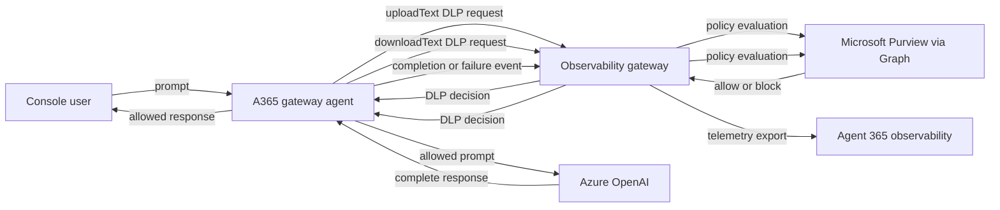

# A365 Gateway Agent

[한국어 문서](README-KR.md)

`a365-gateway-agent` is a synchronous Python command-line chat application that
calls Azure OpenAI while using the sibling observability gateway as the policy
and telemetry boundary. Every non-empty prompt is evaluated by Microsoft
Purview DLP before it can reach Azure OpenAI. Every model response is evaluated
again before it can be displayed. Successful and failed model calls are then
reported to the gateway as Agent 365 telemetry events.

The project also includes a synthetic sensitive-information type (SIT) batch
runner for testing the gateway's Purview policy behavior without manually
entering prompts.

## What This Project Owns

The agent is responsible for:

- loading Azure OpenAI and gateway settings from `a365-gateway-agent/.env`;
- obtaining Azure OpenAI tokens through `DefaultAzureCredential`;
- maintaining an in-memory, multi-turn console conversation;
- enforcing prompt DLP before inference;
- enforcing response DLP before display or export;
- building the version `1.0` telemetry JSON contract;
- running DLP-only and end-to-end synthetic SIT batches; and
- mapping configuration, telemetry, and request failures to stable exit codes.

The agent deliberately does **not**:

- import or initialize the Agent 365 SDK;
- call Microsoft Graph or Purview directly;
- decide whether content is sensitive;
- persist conversation history;
- stream model output before DLP evaluation; or
- store or forward Azure bearer tokens.

Agent 365 authentication, Purview Graph calls, policy interpretation, and
telemetry export are owned by the sibling `a365-gateway-prototype` service.

## Architecture



The DLP gateway is in the inference path. Telemetry is sent only after a model
call succeeds or fails. A prompt blocked before inference does not create a
telemetry event because no model activity occurred.

## One Chat Turn

The interactive workflow is intentionally ordered as follows:

1. Read and trim console input.
2. Ignore empty input or handle a local command.
3. Assign the current zero-based sequence number, then increment the counter.
4. Send the prompt to the gateway with `activity: "uploadText"`.
5. Stop the turn immediately if Purview blocks the prompt.
6. Append an allowed prompt to the local message history.
7. Call Azure OpenAI with the system prompt and complete conversation history.
8. Send the complete model answer to the gateway with
	 `activity: "downloadText"`.
9. If the response is blocked, record a failure event, remove the pending user
	 turn from local history, and do not display the answer.
10. If the response is allowed, record a completion event, append the answer to
		local history, and display it.

Important consequences of this ordering:

- A blocked prompt never reaches Azure OpenAI.
- A blocked prompt still consumes its sequence number.
- Model output is buffered in full and is never displayed before response DLP.
- A blocked response and its user prompt do not become conversation context for
	the next turn.
- Required telemetry delivery happens before a successful answer is committed
	to local history or displayed.

## Project Layout

```text
a365-gateway-agent/
|-- .env                 Local configuration and secrets; ignored by Git
|-- .env.example         Complete configuration template
|-- .gitignore           Agent-specific generated-file exclusions
|-- README.md            English documentation
|-- README-KR.md         Korean documentation
|-- a365-agent.py        Backward-compatible source-tree launcher
|-- pyproject.toml       Package metadata and console-script declaration
|-- sits.yaml            Bundled synthetic Purview test samples
|-- src/
|   `-- a365_agent/
|       |-- __init__.py
|       |-- __main__.py  `python -m a365_agent` entry point
|       |-- azure_openai.py  Azure OpenAI client construction
|       |-- chat.py      Interactive chat and enforcement workflow
|       |-- cli.py       Argument parsing, dispatch, and exit codes
|       |-- config.py    .env loading, paths, constants, and settings
|       |-- gateway.py   DLP and telemetry HTTP client
|       |-- models.py    Conversation, caller, DLP, and SIT value objects
|       `-- sit.py       SIT YAML validation and batch runner
`-- tests/
		|-- test_chat.py
		|-- test_cli.py
		|-- test_config.py
		|-- test_gateway.py
		|-- test_models.py
		`-- test_sit.py
```

The repository root owns the shared `.venv` and `requirements.txt`. Installing
the root requirements installs this package in editable mode, so changes under
`src/a365_agent` are visible immediately without reinstalling.

## Prerequisites

- Python 3.11 or newer
- An Azure OpenAI resource and chat model deployment
- An identity supported by `DefaultAzureCredential`
- Permission for that identity to invoke the Azure OpenAI deployment
- A complete and configured sibling observability gateway
- Network access from the agent to Azure OpenAI and the gateway

For local development, Azure CLI authentication is the simplest option. Other
`DefaultAzureCredential` sources, including environment credentials and managed
identity, can also be used when configured correctly.

## Quick Start on Windows

Run all commands from the repository root, the directory containing
`requirements.txt`, `a365-gateway-agent`, and `a365-gateway-prototype`.

### 1. Create the shared environment

```powershell
python -m venv .\.venv
.\.venv\Scripts\python.exe -m pip install --upgrade pip
.\.venv\Scripts\python.exe -m pip install -r .\requirements.txt
```

Activation is optional because every command in this guide invokes the shared
interpreter explicitly. To activate it in PowerShell:

```powershell
.\.venv\Scripts\Activate.ps1
```

### 2. Create local agent configuration

```powershell
if (-not (Test-Path .\a365-gateway-agent\.env)) {
		Copy-Item .\a365-gateway-agent\.env.example .\a365-gateway-agent\.env
}
```

Edit `a365-gateway-agent/.env` and replace the Azure OpenAI placeholders. Do not
commit this file.

### 3. Authenticate locally

```powershell
az login
az account show
```

`az account show` should return the intended subscription and signed-in user.
The Azure OpenAI resource must authorize this identity.

### 4. Start and verify the gateway

Configure and start the sibling gateway according to its README, then check its
health endpoint:

```powershell
Invoke-RestMethod http://127.0.0.1:4318/health
```

Expected shape:

```json
{
	"status": "ok",
	"purview_dlp_enabled": true
}
```

The current gateway launcher expects an installable `obs_gateway` package. If
the following checks return `False`, restore the missing gateway package files
before attempting a live agent run:

```powershell
Test-Path .\a365-gateway-prototype\src\obs_gateway\__main__.py
Test-Path .\a365-gateway-prototype\src\obs_gateway\config.py
```

Offline agent tests do not require the gateway.

### 5. Run interactive chat

Preferred installed command:

```powershell
.\.venv\Scripts\a365-gateway-agent.exe
```

Equivalent module command:

```powershell
.\.venv\Scripts\python.exe -m a365_agent
```

Backward-compatible source command:

```powershell
.\.venv\Scripts\python.exe .\a365-gateway-agent\a365-agent.py
```

## Quick Start on macOS or Linux

From the repository root:

```bash
python3 -m venv .venv
.venv/bin/python -m pip install --upgrade pip
.venv/bin/python -m pip install -r requirements.txt
cp a365-gateway-agent/.env.example a365-gateway-agent/.env
az login
.venv/bin/python -m a365_agent
```

Do not overwrite an existing `.env` that contains working local settings.

## Configuration

The agent always requires `a365-gateway-agent/.env` to exist. It loads that file
with `python-dotenv`, without overriding variables already present in the
process environment. Effective precedence is therefore:

1. process environment;
2. values from `a365-gateway-agent/.env`.

Values are trimmed only when read through the required-value helper. Optional
string values are used as supplied.

### Required settings

| Variable | Purpose | Typical value |
|---|---|---|
| `AZURE_OPENAI_ENDPOINT` | Azure OpenAI resource endpoint | `https://my-resource.openai.azure.com/` |
| `AZURE_OPENAI_DEPLOYMENT` | Chat deployment name, not the base model name | `gpt-4.1-mini` |
| `AZURE_OPENAI_API_VERSION` | REST API version passed to the OpenAI SDK | `2024-12-01-preview` |
| `AZURE_OPENAI_SCOPE` | Microsoft Entra token scope | `https://cognitiveservices.azure.com/.default` |
| `AZURE_OPENAI_SYSTEM_PROMPT` | First system message in every conversation or SIT AI call | `You are a helpful tourist assistant.` |
| `OBS_GATEWAY_URL` | Telemetry POST endpoint | `http://127.0.0.1:4318/v1/telemetry` |

### Optional settings

| Variable | Default | Behavior |
|---|---|---|
| `OBS_GATEWAY_DLP_URL` | Derived from `OBS_GATEWAY_URL` | Overrides the DLP POST endpoint. With the default telemetry URL, the derived value is `http://127.0.0.1:4318/v1/dlp/evaluate`. |
| `OBS_GATEWAY_TIMEOUT_SECONDS` | `10` | Floating-point timeout applied independently to every gateway request. The example file uses `60` because one DLP evaluation can involve multiple Graph calls. |
| `OBS_GATEWAY_REQUIRED` | `true` | Controls telemetry delivery only. True values are `1`, `true`, `yes`, and `on`, case-insensitively. Any other explicit value is false. DLP evaluation remains mandatory regardless of this setting. |
| `TELEMETRY_CHANNEL` | `console` | Channel written into telemetry events. |
| `OBS_GATEWAY_API_KEY` | Empty | Sends `Authorization: Bearer <value>` to both gateway endpoints when non-empty. |
| `CALLER_USER_ID` | Token `oid` claim | Explicit caller identifier. Required when the selected token has no `oid`. |
| `CALLER_USER_EMAIL` | Token `preferred_username`, then `upn` | Optional caller email override. |
| `CALLER_USER_NAME` | Token `name` claim | Optional caller display-name override. |
| `CALLER_CLIENT_IP` | `127.0.0.1` | Client IP sent in DLP and telemetry payloads. Set it accurately when policy depends on network location. |

Example:

```dotenv
AZURE_OPENAI_ENDPOINT=https://my-resource.openai.azure.com/
AZURE_OPENAI_DEPLOYMENT=my-chat-deployment
AZURE_OPENAI_API_VERSION=2024-12-01-preview
AZURE_OPENAI_SCOPE=https://cognitiveservices.azure.com/.default
AZURE_OPENAI_SYSTEM_PROMPT=You are a helpful tourist assistant.

OBS_GATEWAY_URL=http://127.0.0.1:4318/v1/telemetry
OBS_GATEWAY_DLP_URL=http://127.0.0.1:4318/v1/dlp/evaluate
OBS_GATEWAY_TIMEOUT_SECONDS=60
OBS_GATEWAY_REQUIRED=true
TELEMETRY_CHANNEL=console
OBS_GATEWAY_API_KEY=

CALLER_USER_ID=
CALLER_USER_EMAIL=
CALLER_USER_NAME=
CALLER_CLIENT_IP=127.0.0.1
```

## Authentication and Caller Identity

The agent creates one `DefaultAzureCredential` per run. It uses the configured
Azure OpenAI scope in two places:

1. `get_bearer_token_provider` supplies renewable Microsoft Entra tokens to the
	 Azure OpenAI client.
2. During startup, the agent obtains one token and decodes local identity claims
	 for the gateway's caller metadata.

The token is decoded without signature or audience verification because the
claims are used only as descriptive metadata after the credential has acquired
the token. They are not used to authorize Azure OpenAI or the gateway. The
actual bearer token is never included in a DLP request or telemetry event.

Caller resolution order:

| Caller field | Resolution order |
|---|---|
| ID | `CALLER_USER_ID`, then token `oid` |
| Email | `CALLER_USER_EMAIL`, token `preferred_username`, then token `upn` |
| Name | `CALLER_USER_NAME`, then token `name` |
| Client IP | `CALLER_CLIENT_IP`, then `127.0.0.1` |

Startup fails if neither `CALLER_USER_ID` nor an `oid` claim is available.

## Interactive Commands

| Input | Result |
|---|---|
| Any non-empty text | Starts a DLP-protected model turn. |
| Empty or whitespace-only input | Ignored. |
| `/clear` | Replaces history with the system prompt, creates new session and conversation UUIDs, and resets sequence numbering to zero. |
| `/exit` or `/quit` | Exits normally. Matching is case-insensitive. |
| `Ctrl+C` or end-of-file while waiting for input | Prints `Goodbye!` and exits normally. |

Conversation history exists only in process memory. Restarting the program loses
it. Each successful request sends the full local history to Azure OpenAI, while
the gateway telemetry event contains only the current prompt and answer.

## How to Confirm a Real Purview Block

The text of a model response is not evidence that Purview blocked the prompt.
If the assistant warns you not to share a card number, that can be ordinary LLM
safety behavior after Purview returned `allowed=true` and the prompt reached the
model.

The agent's behavior is unambiguous:

- Prompt blocked by Purview: prints `Blocked by Microsoft Purview DLP policy.`
	and does not call Azure OpenAI.
- Response blocked by Purview: prints
	`The model response was blocked by Microsoft Purview DLP policy.` and does not
	display the generated answer.
- Assistant gives a natural-language warning: Purview allowed the prompt and the
	warning came from the model.

For direct verification, use DLP-only SIT mode or call the gateway's
`/v1/dlp/evaluate` endpoint. A working Graph/API integration is not sufficient
for blocking: the tenant must have an enabled Application-plane policy targeting
this exact Agent ID application instance and including the caller's `user_id`.

After changing a tenant policy, wait for propagation and restart the gateway to
clear its protection-scope cache. Test with a Luhn-valid synthetic value from
`sits.yaml`; arbitrary digit strings may not satisfy the Credit Card Number
sensitive-information detector. Never test with real payment data.

## Synthetic SIT Testing

The bundled `sits.yaml` contains synthetic values intended to exercise Purview
sensitive-information policies. Never replace these with real personal or
payment data.

### DLP-only mode

```powershell
.\.venv\Scripts\python.exe -m a365_agent --sit
```

This mode sends every sample to prompt DLP and compares the returned action with
the expected action. It does not call Azure OpenAI and does not export a model
telemetry event. It still requires:

- a valid `.env` with all required Azure OpenAI settings;
- an Azure identity token, because caller metadata is initialized at startup;
- a reachable gateway and working DLP endpoint.

### End-to-end mode

```powershell
.\.venv\Scripts\python.exe -m a365_agent --sit --ai
```

For each sample:

1. evaluate the sample as `uploadText`;
2. compare the actual action with `expected_action`;
3. call Azure OpenAI only if the actual DLP result is allow;
4. evaluate the model answer as `downloadText`;
5. export a completion event if the answer is allowed; or
6. export a failure event and count a response block if the answer is blocked.

Each allowed sample is an independent two-message conversation containing only
the system prompt and that sample. Samples never share model history.

### Custom SIT file

```powershell
.\.venv\Scripts\python.exe -m a365_agent --sit .\path\to\samples.yaml
```

Supported schema:

```yaml
expected_action: block
samples:
	- id: unique-sample-id
		type: descriptive-sensitive-information-type
		content: "Synthetic text evaluated by Purview"
		expected_action: allow  # Optional per-sample override
```

Validation rules:

- the file must exist and contain valid YAML;
- the top-level value must be an object;
- `samples` must be a non-empty list;
- each sample must be an object with non-empty `id`, `type`, and `content`;
- sample IDs must be unique within the file; and
- each effective action must be `allow` or `block`, case-insensitively.

The top-level `expected_action` defaults to `block`. Fields such as
`schema_version`, `description`, `generation_seed`, `synthetic_data_only`, and
per-sample `value` are useful metadata in the bundled file but are not consumed
or validated by the agent.

The batch prints progress after every 25 samples and at the end. Its counters
mean:

| Counter | Meaning |
|---|---|
| `matched` | Prompt DLP action matched the expected action. |
| `mismatched` | Prompt DLP action differed from the expected action. |
| `errors` | The sample raised a gateway, model, parsing, or telemetry exception. |
| `ai_calls` | Actual prompt DLP result allowed the sample to reach Azure OpenAI. |
| `ai_completions` | Model answer passed response DLP and telemetry export completed or was optional. |
| `response_blocks` | Model call succeeded but response DLP blocked its answer. |

A response block alone does not make the batch fail if the prompt action matched
and recording the failure event succeeded. Mismatches or collected errors make
the batch return exit code `1`.

## Gateway HTTP Contract

The agent uses Python's standard `urllib.request` synchronously. Both POST
requests include `Content-Type: application/json`. When
`OBS_GATEWAY_API_KEY` is non-empty, both include:

```http
Authorization: Bearer <OBS_GATEWAY_API_KEY>
```

The client accepts HTTP `200` and `202`. An empty successful response is treated
as an empty object. A non-object JSON response is rejected. DLP additionally
requires an `allowed` boolean.

There is no retry or backoff logic. Each request uses
`OBS_GATEWAY_TIMEOUT_SECONDS` independently.

### DLP request

`POST /v1/dlp/evaluate`

```json
{
	"user_id": "caller-object-id",
	"content": "text being evaluated",
	"activity": "uploadText",
	"conversation_id": "conversation-uuid",
	"sequence_number": 0,
	"client_ip": "127.0.0.1"
}
```

`activity` is `uploadText` for prompts and `downloadText` for model answers. The
agent reads only these response fields:

```json
{
	"allowed": true,
	"reason": "optional explanation"
}
```

`allowed` must be a JSON boolean. `reason` is retained only when it is a string.
Empty content is allowed locally without making an HTTP request. In normal chat,
prompts cannot be empty because whitespace-only console input is ignored; this
shortcut mainly applies to an empty model answer.

### Telemetry request

`POST /v1/telemetry`

Successful completion example:

```json
{
	"schema_version": "1.0",
	"event_id": "event-uuid",
	"session_id": "session-uuid",
	"conversation_id": "conversation-uuid",
	"channel": "console",
	"input": "current user prompt",
	"output": "current model answer",
	"model": "azure-openai-deployment",
	"provider_name": "azure-openai",
	"inference_endpoint": {
		"hostname": "my-resource.openai.azure.com",
		"port": 443
	},
	"caller": {
		"id": "caller-object-id",
		"email": "user@example.com",
		"name": "Example User",
		"client_ip": "127.0.0.1"
	},
	"usage": {
		"input_tokens": 120,
		"output_tokens": 45
	},
	"finish_reason": "stop"
}
```

Failure events use an empty `output`, null usage values, a null finish reason,
and add:

```json
{
	"error": {
		"type": "RuntimeError",
		"message": "Model response blocked by Purview DLP policy"
	}
}
```

The inference hostname is parsed from `AZURE_OPENAI_ENDPOINT`. The port is the
explicit endpoint port or `443` when omitted.

## Data and Privacy Boundary

The gateway receives:

- content being evaluated by DLP;
- the current user prompt and allowed model answer in completion telemetry;
- the current prompt and exception details in failure telemetry;
- caller ID, optional email and name, and client IP;
- Azure OpenAI deployment and endpoint host metadata;
- session, conversation, and event UUIDs;
- token counts and finish reason when available.

The gateway does not receive from this agent:

- the Azure OpenAI bearer token;
- the system prompt;
- previous conversation messages in the current event;
- the complete Azure token claim set; or
- the gateway API key inside a JSON body.

The full current prompt and answer are nevertheless sensitive data. When the
gateway is not on loopback or another trusted private boundary, use HTTPS and a
gateway API key. Plain HTTP does not encrypt content or the API key.

## Failure Behavior

| Failure or decision | Behavior |
|---|---|
| Missing `.env` or required setting | Print a configuration error and return `2`. |
| Azure identity cannot obtain the configured scope | Startup fails before the console prompt. |
| Caller token has no `oid` and no `CALLER_USER_ID` | Print a configuration error and return `2`. |
| Prompt DLP blocks | Print a block message, do not call Azure OpenAI, and continue. |
| Prompt or response DLP request fails | Abort the current mode. DLP never fails open, even when telemetry is optional. |
| Azure OpenAI call fails | Attempt failure telemetry, roll back the pending user turn, then terminate chat. In SIT mode, collect the sample error and continue. |
| Response DLP blocks | Record failure telemetry, roll back the user turn, hide the response, and continue. |
| Completion telemetry fails and `OBS_GATEWAY_REQUIRED=true` | Raise a telemetry error before displaying or committing the answer. |
| Telemetry fails and `OBS_GATEWAY_REQUIRED=false` | Print a warning to standard error and continue. |
| Gateway returns non-object JSON | Reject the response. |
| DLP response omits a boolean `allowed` | Reject the decision. |

HTTP errors include the gateway response body in the local exception message.
Connection failures are reported as `cannot reach gateway: ...`.

## Exit Codes

| Code | Meaning |
|---|---|
| `0` | Normal chat exit, or SIT batch with no mismatches or errors. |
| `1` | SIT mismatch/error, or a non-`RuntimeError` request failure handled at the top level. |
| `2` | Argument parser error, configuration `RuntimeError`, required telemetry error, or another top-level `RuntimeError`. |

The command `--ai` without `--sit` is invalid and exits with parser code `2`.

## Testing

Run the agent's offline tests from the repository root:

```powershell
.\.venv\Scripts\python.exe -m unittest discover -s .\a365-gateway-agent\tests -v
```

The suite mocks Azure credentials, Azure OpenAI, and HTTP calls. It does not
require Azure access, a gateway, or a real `.env`. It covers:

- required configuration, environment precedence, and boolean parsing;
- caller identity claims and environment overrides;
- DLP payloads, authorization headers, timeouts, and response validation;
- telemetry schema and delivery-required behavior;
- prompt and response DLP ordering;
- blocked-prompt inference prevention;
- blocked-response conversation rollback;
- SIT YAML validation and both batch modes; and
- CLI dispatch and exit-code mapping.

Useful additional checks:

```powershell
.\.venv\Scripts\python.exe -m compileall -q .\a365-gateway-agent\src\a365_agent
.\.venv\Scripts\python.exe -m pip check
.\.venv\Scripts\python.exe -m a365_agent --help
```

Live integration testing requires valid Azure settings, identity permissions,
Purview configuration, and a running gateway. The bundled SIT values are
synthetic, but `--sit --ai` can make billable Azure OpenAI calls for samples
that the current policy allows.

## Development Guide

### Entry points

- Prefer `python -m a365_agent` during source development.
- Use `a365-gateway-agent` after the editable package is installed.
- Keep `a365-agent.py` as a compatibility launcher only. Business logic belongs
	under `src/a365_agent`.

### Module ownership

- Add or validate environment settings in `config.py`.
- Add immutable cross-module values in `models.py`.
- Keep raw gateway HTTP and telemetry serialization in `gateway.py`.
- Keep Azure OpenAI construction in `azure_openai.py`.
- Keep interactive state transitions in `chat.py`.
- Keep SIT parsing and batch behavior in `sit.py`.
- Keep command parsing and process exit mapping in `cli.py`.

### Changing a gateway contract

Update the producer and its contract test together. For DLP, verify the exact
payload and required `allowed` response. For telemetry, verify schema version,
required fields, nullable usage, and failure-event shape against the sibling
gateway's validator.

### Adding SIT samples

Use unique IDs and synthetic content only. Set the top-level expected action for
the common case and add per-sample overrides sparingly. A policy outcome depends
on the live tenant configuration, so expected actions may need adjustment when
Purview policy changes.

## Current Limitations

- Console-only, text-only interface
- Synchronous Azure OpenAI and gateway calls
- No streaming, retry, backoff, or circuit breaker
- In-memory conversation state only
- One Azure OpenAI choice is used
- `max_completion_tokens` is fixed at `4096`
- No telemetry batching or local durable queue
- SIT samples execute serially
- DLP reason text is parsed but not displayed
- No direct health preflight inside the agent
- One gateway timeout setting applies to DLP and telemetry
- The `.env` file must exist even when every setting is already supplied by the
	process environment

These constraints are intentional for a focused prototype. Changes to an
enforcement boundary should be accompanied by regression tests before adding
concurrency, streaming, retries, or fail-open behavior.

## Troubleshooting

### `No module named 'a365_agent'`

Install the root requirements from the repository root:

```powershell
.\.venv\Scripts\python.exe -m pip install -r .\requirements.txt
```

The compatibility launcher also works directly from a source checkout because
it adds the local `src` directory to `sys.path`.

### `Environment file not found`

Create `a365-gateway-agent/.env` from `.env.example`. The file location is based
on the agent project directory, not the current working directory.

### `Missing required environment variable`

The named value is absent or empty. Check spelling and remember that an existing
process variable takes precedence over `.env`.

### Azure credential errors

Run:

```powershell
az login
az account show
```

Confirm the active tenant/subscription, Azure OpenAI permission, configured
scope, and local token cache. For non-user credentials, set `CALLER_USER_ID` if
the access token does not contain `oid`.

### `cannot reach gateway`

Check gateway health, both configured URLs, port `4318`, proxy settings, local
firewall rules, and whether the gateway process is actually listening.

### Gateway HTTP `401`

Set the same non-empty API key in the agent's `OBS_GATEWAY_API_KEY` and the
gateway's corresponding configuration. Do not include the `Bearer` prefix in
the environment value.

### Gateway HTTP `400`

The gateway rejected a contract field. Run the offline tests and compare the
agent's schema version and payload with the sibling gateway validators.

### DLP requests time out

Increase `OBS_GATEWAY_TIMEOUT_SECONDS`. A single DLP request may require several
Graph operations. The agent timeout should be comfortably greater than the
gateway's per-Graph-request timeout.

### All SIT samples mismatch

Confirm that Purview DLP is enabled, the calling user is in protection scope,
the gateway uses the intended application ID and tenant, and the expected
actions in the YAML match the tenant's current policy.
