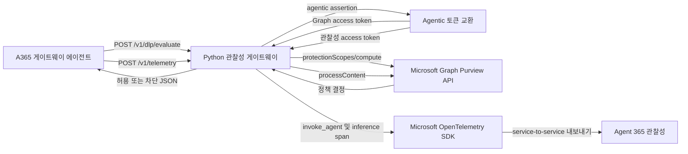

# Agent 365 관찰성 게이트웨이

[English documentation](README.md)

`a365-observability-gateway`는 로컬 Azure OpenAI 에이전트와 Microsoft 서비스
사이에서 동작하는 동기식 Python HTTP 서비스입니다. 두 가지 핵심 기능을
제공합니다.

1. 프롬프트와 모델 응답을 Microsoft Graph를 통해 Microsoft Purview DLP
   정책으로 평가합니다.
2. 완료되거나 실패한 모델 호출을 Agent 365 OpenTelemetry span으로 변환합니다.

게이트웨이는 Azure OpenAI를 직접 호출하지 않습니다. 형제 프로젝트인
`a365-gateway-agent`가 모델 추론을 담당하고 DLP 및 텔레메트리 JSON을 이
서비스로 전송합니다.

## 현재 등록 상태

이 로컬 환경은 non-M365, service-to-service 엔터프라이즈 에이전트로 Agent 365에
등록되어 있습니다. `.env`에는 생성된 service connection, agent blueprint,
Agent ID instance, 관찰성 메타데이터가 입력되어 있습니다. Blueprint에는 다음
최소 권한 application role이 있습니다.

- Microsoft Graph `ProtectionScopes.Compute.User`
- Microsoft Graph `Content.Process.User`
- Observability API `Agent365.Observability.OtelWrite`

실제 smoke test로 다음 항목을 확인했습니다.

- 두 Purview role이 포함된 Agent ID app-only Graph token 교환
- Agent ID 관찰성 token 교환
- `uploadText`와 `downloadText`의 Purview `processContent` 호출
- 게이트웨이 health endpoint
- 합성 Agent 365 텔레메트리 이벤트의 `202/exported` 응답

토큰 획득, span 내보내기, 포트 열기 없이 설정만 검증할 수 있습니다.

```powershell
.\.venv\Scripts\python.exe -m obs_gateway --check-config
```

이 등록은 `a365` CLI 1.1.214와 non-M365 `s2s` 인증을 사용했습니다. 다른
환경에서는 해당 환경의 현재 CLI help와 생성 설정을 기준으로 사용하고,
플레이스홀더를 실제 값처럼 넣지 마십시오.

## 차단 정책 상태

게이트웨이 코드와 인증은 정상 동작하지만, 현재 tenant에는 이 Agent ID instance를
대상으로 하는 Application-plane DLP 정책이 없습니다. 기존 enforce-mode 차단
rule은 이전 application ID를 대상으로 합니다. 따라서 게이트웨이가 Purview를
정상 호출해도 `restrictAccess` 없이 `allowed=true`를 받을 수 있습니다.

현재 코드에는 S2S가 올바른 인증 모드입니다. Graph token은 app-only이며
`user_id`는 OBO credential이 아니라 정책 컨텍스트입니다. `authmode=both`로
등록해도 정책 대상이 바뀌지 않으며, 에이전트가 실제 user token을 전달하고
게이트웨이가 OBO 교환을 구현하기 전에는 delegated grant를 사용하지 않습니다.

Microsoft는 Entra-registered app의 Application-plane 정책을 Security &
Compliance PowerShell로 만들도록 문서화합니다. 다음 예제는 테스트 사용자 한
명으로 범위를 제한합니다. 실행 전에 이름, 사용자 범위, SIT 조건, action을
검토하십시오. 이 cmdlet의 `WhatIf`는 신뢰할 수 있는 미리보기를 제공하지
않습니다.

```powershell
$generated = Get-Content .\a365.generated.config.json -Raw | ConvertFrom-Json
$agentAppId = $generated.agenticAppId
$testUserUpn = "user@contoso.com"

$locations = @(
  @{
    Workload = "Applications"
    Location = $agentAppId
    LocationDisplayName = "A365GatewayPrototype Identity"
    LocationSource = "Entra"
    LocationType = "Individual"
    Inclusions = @(
      @{ Type = "IndividualResource"; Identity = $testUserUpn }
    )
  }
) | ConvertTo-Json -Depth 10 -Compress

Connect-IPPSSession

New-DlpCompliancePolicy `
  -Name "A365GatewayPrototype Credit Card DLP" `
  -Mode Enable `
  -Locations $locations `
  -EnforcementPlanes @("Application")

New-DlpComplianceRule `
  -Name "A365GatewayPrototype Block Credit Cards in Prompts" `
  -Policy "A365GatewayPrototype Credit Card DLP" `
  -ContentContainsSensitiveInformation @(
    @{ Name = "Credit Card Number"; minCount = "1" }
  ) `
  -RestrictAccess @(
    @{ setting = "UploadText"; value = "Block" }
  ) `
  -RuleErrorAction RetryThenBlock

Disconnect-ExchangeOnline -Confirm:$false
```

Policy `Location`은 blueprint `AGENT_ID`가 아니라 Agent ID instance
(`agenticAppId` / `AGENT365OBSERVABILITY__AGENTID`)여야 합니다. DLP 요청의
사용자도 정책 범위에 포함되어야 합니다.

정책 변경 후 Purview 전파를 기다리고 게이트웨이를 재시작하여 기본 3600초의
사용자별 scope cache를 지웁니다. `/v1/dlp/evaluate` 또는 `--sit`를 사용하고 기본
SIT 파일의 Luhn-valid 합성 카드로 직접 테스트하십시오. 모델의 일반 경고는
Purview가 프롬프트를 허용했다는 뜻이며, 실제 프롬프트 차단은 모델 추론 전에
에이전트가 생성합니다.

## 게이트웨이의 책임

게이트웨이가 담당하는 기능:

- 타입이 지정된 `.env` 로드 및 시작 전 검증
- POST 엔드포인트의 선택적 bearer 인증
- JSON content type, 본문 크기, 공개 계약 검증
- Agent 365 agentic assertion 및 scope별 토큰 교환
- Purview API용 Microsoft Graph 전송
- 사용자별 protection scope 캐시와 동시 요청 중복 제거
- Purview fail-open 또는 fail-closed 동작
- Agent 365 `invoke_agent` 및 중첩 chat inference span 생성
- 요청 ID, 상태 코드, 안전한 오류 응답, 종료 시 리소스 정리

게이트웨이가 담당하지 않는 기능:

- Azure OpenAI 모델 호출
- 대화 기록 또는 프롬프트 구성
- Agent 365 또는 Entra 리소스 등록
- Purview tenant 정책 작성
- TLS 종료, reverse proxy, 운영 비밀 저장소
- 영구 큐, 재시도, 분산 캐시

## 전체 아키텍처



DLP 경로는 동기식이며 에이전트 추론 경로 안에 있습니다. 텔레메트리 경로는
exporter가 완료된 span을 수락하고 강제로 flush한 뒤에만 HTTP `202`를
반환합니다.

## 프로젝트 구조

```text
a365-gateway-prototype/
|-- .env                     로컬 설정 및 비밀 값, Git에서 제외
|-- .env.example             지원하는 모든 키가 있는 안전한 템플릿
|-- .gitignore               Python 생성 파일 및 비밀 제외 규칙
|-- README.md                영문 문서
|-- README-KR.md             한글 문서
|-- a365-gateway.py          이전 실행 방식을 위한 호환 런처
|-- pyproject.toml           패키지 정보 및 콘솔 명령
|-- src/
|   `-- obs_gateway/
|       |-- __init__.py
|       |-- __main__.py      `python -m obs_gateway` 진입점
|       |-- cli.py           CLI, 설정 검사, 종료 코드
|       |-- application.py   의존성 조립 및 런타임 수명 주기
|       |-- config.py        타입 설정 및 등록 필드 검증
|       |-- auth/
|       |   `-- token_provider.py  Agentic assertion 및 scope 토큰 교환
|       |-- http/
|       |   |-- request.py   인증과 JSON 본문 검증
|       |   |-- response.py  일관된 JSON 및 요청 ID 응답
|       |   `-- server.py    Threaded HTTP 라우팅과 오류 변환
|       |-- purview/
|       |   |-- types.py     검증된 DLP 요청, 결정, 캐시 값
|       |   |-- graph_client.py  인증된 Graph JSON 전송
|       |   `-- dlp_service.py  Scope 캐시와 정책 평가
|       |-- telemetry/
|       |   |-- event.py     버전이 지정된 에이전트 이벤트 검증
|       |   `-- exporter.py  Agent 365 span 생성 및 내보내기
|       `-- shared/
|           `-- errors.py    설정, 검증, Graph, DLP 오류
`-- tests/
    |-- test_application.py
    |-- test_cli.py
    |-- test_config.py
    |-- test_dlp_service.py
    |-- test_exporter.py
    |-- test_graph_client.py
    |-- test_http_server.py
    |-- test_purview_types.py
    |-- test_telemetry_event.py
    `-- test_token_provider.py
```

저장소 루트가 공유 `.venv`와 `requirements.txt`를 소유합니다. 루트 요구 사항을
설치하면 에이전트와 게이트웨이 패키지가 모두 editable 모드로 설치됩니다.

## 시작 시 의존성 조립

설정 검증이 성공하면 하나의 의존성 그래프를 만듭니다.

```text
GatewayConfig
  |
  +-- AgentConfig
  |     `-- MsalAgentTokenProvider
  |
  +-- PurviewConfig
  |     `-- PurviewGraphClient
  |           `-- DlpService
  |
  +-- ObservabilityConfig
  |     `-- Agent365TelemetryExporter
  |
  `-- ServerConfig
        `-- GatewayServer
              +-- DlpService
              `-- Agent365TelemetryExporter
```

Exporter 생성 후 서버 포트 바인딩이 실패하면 exporter를 종료합니다. 정상 종료
또는 `Ctrl+C` 시 HTTP 소켓을 닫고 텔레메트리를 flush한 뒤 exporter를
종료합니다.

## 사전 요구 사항

- Python 3.11 이상
- 필요한 Agent 365 기능이 있는 Microsoft 365 tenant
- 설치된 `a365` CLI가 생성한 Agent 365 등록 정보
- Purview 통합에 필요한 Microsoft Graph 애플리케이션 권한 및 관리자 동의
- 설정한 application location을 대상으로 하는 Purview 정책
- Microsoft Entra, Microsoft Graph, Agent 365 텔레메트리로의 네트워크 연결
- 이 게이트웨이를 호출하도록 설정한 형제 에이전트

오프라인 단위 테스트에는 위의 Microsoft 리소스가 필요하지 않습니다.

## 설치

저장소 루트에서 실행합니다.

```powershell
python -m venv .\.venv
.\.venv\Scripts\python.exe -m pip install --upgrade pip
.\.venv\Scripts\python.exe -m pip install -r .\requirements.txt
```

가상 환경 활성화는 선택 사항입니다.

```powershell
.\.venv\Scripts\Activate.ps1
```

루트 요구 사항은 다음 패키지를 editable 모드로 설치합니다.

- `a365-gateway-agent`
- `a365-observability-gateway`

## Agent 365 등록

등록은 외부 리소스를 프로비저닝하는 단계이며 이 프로젝트가 자동으로 수행하지
않습니다. 등록할 준비가 되면 다음 순서를 따릅니다.

1. 설치된 `a365` CLI의 현재 help를 확인합니다.
2. 해당 버전과 tenant에 맞는 방식으로 에이전트 애플리케이션을 등록 또는
   프로비저닝합니다.
3. 생성된 설정을 원본 그대로 보존합니다.
4. 생성된 값을 `a365-gateway-prototype/.env`에 복사합니다.
5. client secret과 기타 자격 증명을 Git에 커밋하지 않습니다.
6. `--check-config`를 실행합니다.
7. 게이트웨이를 시작하고 `/health`를 확인합니다.
8. 에이전트의 DLP 전용 SIT 배치를 실행합니다.
9. DLP 동작이 올바른 뒤에만 `--sit --ai`를 실행합니다.

등록 결과는 다음 그룹을 채워야 합니다.

- `AGENT_ID`
- `CONNECTIONS__SERVICE_CONNECTION__SETTINGS__*`
- `AGENTAPPLICATION__...AGENTIC...`
- `CONNECTIONSMAP__0__*`
- `AGENT365OBSERVABILITY__*` ID 및 메타데이터

템플릿에는 생성 설정과의 호환성을 위해
`AGENT365OBSERVABILITY__CLIENTID`와
`AGENT365OBSERVABILITY__CLIENTSECRET`도 포함합니다. 이 게이트웨이의
service-to-service exporter는 두 값을 직접 읽는 대신 agentic token provider를
사용해 토큰을 획득합니다.

## 설정 절차

실제 `.env`는 로컬에 이미 존재하므로 무조건 덮어쓰지 마십시오. 새로운
체크아웃에서는 다음과 같이 생성합니다.

```powershell
if (-not (Test-Path .\a365-gateway-prototype\.env)) {
    Copy-Item .\a365-gateway-prototype\.env.example `
        .\a365-gateway-prototype\.env
}
```

부작용 없이 설정만 검증합니다.

```powershell
.\.venv\Scripts\python.exe -m obs_gateway --check-config
```

다른 설정 파일을 검증하려면 다음 명령을 사용합니다.

```powershell
.\.venv\Scripts\python.exe -m obs_gateway `
    --check-config `
    --env-file .\path\to\gateway.env
```

설정 우선순위:

1. 기존 프로세스 환경 변수
2. 선택한 `.env` 파일 값

설정 로더는 기존 프로세스 환경 변수를 덮어쓰지 않습니다. 모든 필수 값은 앞뒤
공백을 제거한 뒤 비어 있지 않아야 합니다.

## 설정 변수

### HTTP 서버

| 변수 | 기본값 | 검증 및 목적 |
|---|---|---|
| `OBS_GATEWAY_HOST` | `127.0.0.1` | Listen 주소입니다. `localhost`, `127.0.0.0/8`, `::1`은 loopback입니다. 그 외 주소는 API 키가 필수입니다. |
| `OBS_GATEWAY_PORT` | `4318` | 1부터 65535 사이의 정수입니다. |
| `OBS_GATEWAY_MAX_REQUEST_BYTES` | `1048576` | 양수인 최대 JSON 본문 크기입니다. |
| `OBS_GATEWAY_API_KEY` | 빈 값 | Loopback이 아닌 주소에서는 필수입니다. 두 POST 경로가 `Authorization: Bearer <key>`를 요구합니다. `/health`는 인증하지 않습니다. |

현재 로컬 `.env`는 `127.0.0.1`에 바인딩됩니다. 같은 컴퓨터의 형제 에이전트와
사용하기에 적합합니다. 원격으로 노출하려면 신뢰할 수 있는 reverse proxy에서
HTTPS를 종료하고 두 프로젝트에 강한 동일 API 키를 설정하십시오.

### Microsoft Purview DLP

| 변수 | 기본값 | 검증 및 목적 |
|---|---|---|
| `PURVIEW_DLP_ENABLED` | `true` | Graph 정책 평가를 켭니다. 대소문자와 관계없이 정확히 `true` 또는 `false`여야 합니다. |
| `PURVIEW_DLP_FAIL_CLOSED` | `true` | 참이면 정책 평가 실패를 HTTP 502 차단으로 변환합니다. 거짓이면 실패 이유를 포함한 allow 결정을 반환합니다. |
| `PURVIEW_APPLICATION_ID` | Agent ID instance | Purview 정책이 대상으로 하는 application location입니다. 기본값은 `AGENT365OBSERVABILITY__AGENTID`이며 명시한 값이 있으면 재정의합니다. |
| `PURVIEW_APP_NAME` | `Agent 365 Observability Gateway` | Purview 요청 메타데이터의 이름입니다. |
| `PURVIEW_APP_VERSION` | `1.0` | Purview 요청 메타데이터의 버전입니다. |
| `PURVIEW_GRAPH_BASE_URL` | `https://graph.microsoft.com/v1.0` | Graph 기본 URL이며 마지막 `/`는 제거됩니다. |
| `PURVIEW_TIMEOUT_SECONDS` | `15` | 각 Graph 요청에 적용되는 양의 유한 제한 시간입니다. 한 평가는 여러 요청을 만들 수 있습니다. |
| `PURVIEW_SCOPE_CACHE_SECONDS` | `3600` | 사용자별 protection scope 캐시의 유한한 0 이상 수명입니다. `0`은 순차 평가마다 사실상 다시 계산합니다. |

### Agent 365 관찰성

| 변수 | 기본값 | 검증 및 목적 |
|---|---|---|
| `ENABLE_A365_OBSERVABILITY` | `true` | Agent 365 span 생성을 켭니다. |
| `ENABLE_A365_OBSERVABILITY_EXPORTER` | `true` | 원격 내보내기를 켭니다. 관찰성이 false일 때 true일 수 없습니다. |
| `A365_USE_S2S_ENDPOINT` | `true` | Agentic token 흐름과 함께 service-to-service endpoint를 선택합니다. |
| `A365_OBSERVABILITY_LOG_LEVEL` | `INFO` | `DEBUG`, `INFO`, `WARNING`, `ERROR`, `CRITICAL` 중 하나입니다. |
| `A365_OBSERVABILITY_CONSOLE` | `false` | Span을 로컬에 출력합니다. 출력에는 프롬프트와 응답이 포함될 수 있습니다. |
| `MICROSOFT_OTEL_SDKSTATS_DISABLED` | 템플릿에서 `true` | Microsoft OpenTelemetry SDK가 프로세스 환경에서 직접 읽습니다. |

### 생성된 Agent 365 ID 및 연결

게이트웨이는 다음 값이 비어 있지 않은지 검증하지만, 중첩 설정 해석은 Agent 365
SDK에 위임합니다.

```text
CONNECTIONS__SERVICE_CONNECTION__SETTINGS__CLIENTID
CONNECTIONS__SERVICE_CONNECTION__SETTINGS__CLIENTSECRET
CONNECTIONS__SERVICE_CONNECTION__SETTINGS__TENANTID
CONNECTIONS__SERVICE_CONNECTION__SETTINGS__SCOPES
AGENTAPPLICATION__USERAUTHORIZATION__HANDLERS__AGENTIC__SETTINGS__TYPE
AGENTAPPLICATION__USERAUTHORIZATION__HANDLERS__AGENTIC__SETTINGS__ALT_BLUEPRINT_NAME
AGENTAPPLICATION__USERAUTHORIZATION__HANDLERS__AGENTIC__SETTINGS__SCOPES
CONNECTIONSMAP__0__SERVICEURL
CONNECTIONSMAP__0__CONNECTION
```

CLI는 서로 다른 두 애플리케이션 ID를 기록합니다.

- `AGENT_ID`는 생성된 service connection이 사용하는 blueprint application
  ID입니다.
- `AGENT365OBSERVABILITY__AGENTID`는 Agent ID application instance입니다.
  게이트웨이는 이 값을 `agent_app_instance_id`/`fmi_path`와 두 번째 scope token
  교환의 client ID로 사용합니다.

Agent ID instance는 기본 `PURVIEW_APPLICATION_ID`이기도 합니다. Blueprint ID와
서로 바꾸어 사용하지 마십시오.

필수 span 메타데이터:

```text
AGENT365OBSERVABILITY__AGENTID
AGENT365OBSERVABILITY__AGENTNAME
AGENT365OBSERVABILITY__AGENTDESCRIPTION
AGENT365OBSERVABILITY__TENANTID
AGENT365OBSERVABILITY__AGENTBLUEPRINTID
```

## Agentic 토큰 흐름

동일한 `MsalAgentTokenProvider`가 Graph 토큰과 관찰성 토큰을 제공합니다.

각 scope 요청은 다음 순서로 처리됩니다.

1. `MsalConnectionManager`가 생성된 연결 설정에서 `SERVICE_CONNECTION`을
   선택합니다.
2. Blueprint 기반 connection이 `tenant_id`와
  `AGENT365OBSERVABILITY__AGENTID`의 Agent ID instance에 대한 일회성 agentic
  application assertion을 획득합니다.
3. `ConfidentialClientApplication`은 Agent ID instance를 client ID로, 일회성
  assertion을 client assertion으로 사용합니다.
4. MSAL이 다음 scope 중 하나를 요청합니다.
   - Microsoft Graph: `https://graph.microsoft.com/.default`
   - Agent 365 관찰성:
     `api://9b975845-388f-4429-889e-eab1ef63949c/.default`
5. 관찰성 access token은 SDK의 동기식 token resolver를 위해 캐시됩니다.

HTTP 서버는 worker thread를 사용하고 agentic assertion 교환은 하나의 단위로
처리되어야 하므로 토큰 획득은 프로세스 내부 lock으로 직렬화됩니다. Graph
요청은 각 요청에서 새로운 scope token을 획득합니다. 관찰성 token cache는 원격
텔레메트리 내보내기 전에 새로 고칩니다.

토큰과 assertion은 로그 또는 HTTP 응답에 포함되지 않습니다.

### 엔터프라이즈 애플리케이션 credential과 사용자 정책 컨텍스트

게이트웨이는 Purview에 delegated user credential을 사용하지 않습니다. Graph
`.default` token의 application role을 가진 Agent ID application credential을
사용합니다. DLP 요청의 `user_id`는 인증 credential이 아니라 해당 상호작용에
적용할 사용자의 Purview protection scope를 선택합니다.

Microsoft가 지원하는 동기식 엔터프라이즈 앱 흐름:

```text
Agent ID app-only credential
  -> POST /users/{userId}/dataSecurityAndGovernance/protectionScopes/compute
  -> POST /users/{userId}/dataSecurityAndGovernance/processContent
```

`ProtectionScopes.Compute.User`와 `Content.Process.User`의 `.User`는 credential
종류가 아니라 정책 범위를 뜻합니다. Tenant endpoint에는 비동기 batch
`processContentAsync`가 있지만 각 batch item에도 사용자 컨텍스트가 있으며,
이 게이트웨이에 필요한 동기식 allow/block 경계를 제공하지 않습니다.

## 실행

등록 값을 입력하고 `--check-config`가 성공한 뒤 설치된 명령으로 시작합니다.

```powershell
.\.venv\Scripts\a365-observability-gateway.exe
```

동일한 모듈 명령:

```powershell
.\.venv\Scripts\python.exe -m obs_gateway
```

기존 방식과 호환되는 소스 명령:

```powershell
.\.venv\Scripts\python.exe .\a365-gateway-prototype\a365-gateway.py
```

예상 시작 로그 형태:

```text
Agent 365 observability gateway listening on http://127.0.0.1:4318
Purview DLP enabled: True
DLP endpoint: POST /v1/dlp/evaluate
Telemetry endpoint: POST /v1/telemetry
```

상태 확인:

```powershell
Invoke-RestMethod http://127.0.0.1:4318/health
```

예상 응답:

```json
{
  "status": "ok",
  "purview_dlp_enabled": true
}
```

`/health`는 HTTP 서버가 실행 중인지 확인하고 DLP 활성화 여부를 표시합니다.
토큰을 요청하거나 Microsoft Graph 또는 Agent 365 연결을 검사하지는 않습니다.

`Ctrl+C`로 프로세스를 종료합니다.

## HTTP API

모든 JSON 응답은 다음 헤더를 포함합니다.

```http
Content-Type: application/json
Client-Request-Id: <호출자가 전달하거나 게이트웨이가 생성한 ID>
```

요청에 `Client-Request-Id`가 있으면 같은 값을 반환합니다. 없으면 UUID를
생성합니다. 완료 로그는 요청 ID, HTTP method, path, duration만 기록하고 프롬프트
본문이나 bearer token은 기록하지 않습니다.

### `GET /health`

인증: 없음

성공: HTTP `200`

```json
{
  "status": "ok",
  "purview_dlp_enabled": true
}
```

### `POST /v1/dlp/evaluate`

인증: 설정된 경우 게이트웨이 bearer key

```json
{
  "user_id": "caller-object-id",
  "content": "평가할 텍스트",
  "activity": "uploadText",
  "conversation_id": "conversation-uuid",
  "sequence_number": 0,
  "client_ip": "127.0.0.1"
}
```

검증 규칙:

- 본문은 비어 있지 않은 `application/json`이고 설정한 크기 제한 이하여야 합니다.
- `user_id`, `content`, `conversation_id`는 비어 있지 않은 문자열이어야 합니다.
- `activity`는 `uploadText` 또는 `downloadText`여야 합니다.
- `sequence_number`는 boolean이 아닌 0 이상의 정수여야 합니다.
- `client_ip`는 제공할 경우 문자열이어야 하며 기본값은 `127.0.0.1`입니다.

성공: HTTP `200`

```json
{
  "allowed": false,
  "blocked": true,
  "activity": "uploadText",
  "policy_actions": [
    {
      "action": "restrictAccess",
      "restrictionAction": "block"
    }
  ],
  "protection_scope_state": "notModified",
  "reason": "Purview policy requires blocking"
}
```

기타 상태 코드:

| 상태 | 의미 |
|---:|---|
| `400` | 잘못된 content type, 본문 크기, JSON 또는 DLP 계약 |
| `401` | API 키가 설정된 상태에서 키가 없거나 틀림 |
| `404` | 알 수 없는 경로 |
| `502` | Fail-closed 모드에서 Purview 평가 실패. 응답에 `blocked: true` 포함 |
| `500` | 예상하지 못한 내부 DLP 오류. 응답은 내부 정보를 숨기고 `blocked: true` 포함 |

### `POST /v1/telemetry`

인증: 설정된 경우 게이트웨이 bearer key

```json
{
  "schema_version": "1.0",
  "event_id": "event-uuid",
  "session_id": "session-uuid",
  "conversation_id": "conversation-uuid",
  "channel": "console",
  "input": "현재 사용자 프롬프트",
  "output": "현재 모델 응답",
  "model": "azure-openai-deployment",
  "provider_name": "azure-openai",
  "inference_endpoint": {
    "hostname": "resource.openai.azure.com",
    "port": 443
  },
  "caller": {
    "id": "caller-object-id",
    "email": "user@example.com",
    "name": "Example User",
    "client_ip": "127.0.0.1"
  },
  "usage": {
    "input_tokens": 120,
    "output_tokens": 45
  },
  "finish_reason": "stop"
}
```

주요 검증 규칙:

- `schema_version`은 정확히 `1.0`이어야 합니다.
- ID, `input`, `model`, `provider_name`, endpoint hostname, caller ID는 필수인
  비어 있지 않은 문자열입니다.
- endpoint port는 1부터 65535 사이의 정수입니다.
- token count는 0 이상의 정수 또는 null입니다.
- `output` 기본값은 빈 문자열입니다.
- `channel` 기본값은 `console`입니다.
- caller email, name, finish reason은 문자열 또는 null입니다.
- caller IP는 문자열이어야 하며 기본값은 `127.0.0.1`입니다.
- 실패 이벤트는 `error.type`을 포함할 수 있고 `error.message`는 필수입니다.

성공: span flush 뒤 HTTP `202`

```json
{
  "status": "exported",
  "event_id": "event-uuid"
}
```

예상하지 못한 exporter 예외는 일반화된 HTTP `500` 응답을 반환합니다. 전체
오류 정보는 요청 ID와 함께 서버 로그에만 남고 호출자에게 노출하지 않습니다.

## Purview DLP 처리 흐름

DLP가 활성화된 평가는 다음 순서로 처리됩니다.

1. 프로세스 내부 캐시에서 호출자의 protection scope를 찾습니다.
2. Cache miss이면 다음 Graph API를 호출합니다.
   `/users/{user}/dataSecurityAndGovernance/protectionScopes/compute`
3. Scope 자체의 policy action에 차단 `restrictAccess`가 있으면 콘텐츠를
   `processContent`로 보내지 않고 즉시 차단합니다.
4. Activity에 적용되는 scope가 없으면 허용합니다.
5. Scope 대상 activity이면 다음 API를 호출합니다.
   `/users/{user}/dataSecurityAndGovernance/processContent`
6. Scope ETag가 있으면 `If-None-Match`에 포함합니다.
7. 다음 action이 하나라도 있으면 차단합니다.

```json
{
  "action": "restrictAccess",
  "restrictionAction": "block"
}
```

문자열 비교는 대소문자를 구분하지 않습니다.

`processContent`가 `protectionScopeState: "modified"`를 반환하면 scope를 한 번
강제로 새로 계산하고 콘텐츠를 한 번 더 처리합니다. 무한 정책 갱신 반복은 하지
않습니다.

Inline 평가에서 Graph가 inline 결정 없이 상태 `202` 또는 `204`를 반환하면
오류로 처리합니다. 잘못된 scope collection, 잘못된 policy action collection,
JSON 객체가 아닌 응답, 2xx가 아닌 transport status, 잘못된 state type도 암묵적
허용이 아니라 오류로 처리합니다.

## Protection Scope 캐시와 동시성

Threaded HTTP 서버는 여러 요청을 동시에 평가할 수 있습니다.

- Cache key: `user_id`
- Cache 만료: `time.monotonic()` + `PURVIEW_SCOPE_CACHE_SECONDS`
- 진행 중 요청 중복 제거: 사용자 및 요청 모드별 하나의 `Future`
- 네트워크 I/O: 캐시 lock 밖에서 수행
- 서로 다른 사용자: 다른 사용자의 Graph I/O 때문에 직렬화되지 않음
- 정책 갱신: 별도의 강제 갱신 key 사용

같은 사용자의 여러 요청이 동시에 cache miss를 만나면 worker 하나만 Graph를
호출하고 나머지는 같은 future를 기다립니다. 모든 worker는 동일한 scope 결과
또는 동일한 예외를 받습니다.

캐시는 프로세스 내부에만 있습니다. 여러 게이트웨이 프로세스는 캐시를 공유하지
않습니다.

## Fail Closed와 Fail Open

`PURVIEW_DLP_FAIL_CLOSED=true`이면 token, network, timeout, Graph HTTP, 잘못된
응답, 예상하지 못한 평가 오류가 차단 HTTP `502` 응답으로 변환됩니다. 정책을
집행하는 환경에서는 이 설정을 권장합니다.

`PURVIEW_DLP_FAIL_CLOSED=false`이면 DLP service가 평가 실패를 설명하는 reason과
함께 allow 결정을 반환합니다. 장애 중 정책 우회가 명시적인 비즈니스 결정인
경우에만 사용하십시오.

`PURVIEW_DLP_ENABLED=false`이면 Graph를 호출하지 않고 즉시 허용합니다. 하지만
게이트웨이가 부분 설정 상태로 여러 모드로 동작하지 않도록 등록 설정 자체는 계속
필수입니다.

## Graph 전송

Graph client 동작:

- token provider에서 scope가 지정된 access token 획득
- `Authorization`, `Content-Type`, 생성된 `Client-Request-Id`로 JSON 전송
- `truststore.SSLContext`로 운영체제 trust store 및 조직 관리 root 인증서 사용
- 각 요청에 `PURVIEW_TIMEOUT_SECONDS` 적용
- timeout, HTTP, network, invalid response 오류 분류
- 모든 transport 결과에 2xx status와 JSON 객체 본문 요구

재시도 또는 지수 backoff는 없습니다. Fail-closed 모드에서는 일시적인 Graph
장애도 activity를 차단합니다. 에이전트가 이 경로를 동기식으로 기다리므로 재시도를
추가할 때는 지연 시간과 정책 의미를 신중히 설계해야 합니다.

## 텔레메트리 변환

검증된 각 이벤트는 다음 span 계층으로 변환됩니다.

```text
InvokeAgentScope
`-- InferenceScope (CHAT)
```

기록하는 값:

- 현재 입력 및 출력 메시지
- 모델, provider, inference endpoint
- 입력 및 출력 token 수
- finish reason
- 모델 또는 정책 차단 오류
- session, conversation, channel, caller, tenant, agent, blueprint 메타데이터

원격 내보내기 전에 관찰성 token cache를 새로 고칩니다. 두 span을 생성한 뒤
tracer provider의 `force_flush`를 최대 30초 제한으로 호출하고 HTTP `202`를
반환합니다.

이 프로세스는 OpenAI를 호출하지 않고 완료된 호출을 전달받으므로 OpenAI 자동
instrumentation은 비활성화됩니다.

## 보안 및 개인정보

- `.env`는 Git에서 제외하며 `.env.example`에는 자격 증명이 없습니다.
- Loopback이 아닌 listener는 설정 단계에서 `OBS_GATEWAY_API_KEY`가 필수입니다.
- API 키 비교는 `hmac.compare_digest`를 사용합니다.
- 요청 본문, bearer token, assertion, scope token을 로그에 남기지 않습니다.
- 예상하지 못한 HTTP `500` 응답은 내부 정보를 숨기며 자세한 내용은 서버
  로그에만 남습니다.
- 요청 본문은 `OBS_GATEWAY_MAX_REQUEST_BYTES`로 제한합니다.
- Graph TLS는 운영체제 trust store를 사용합니다.
- Console span에는 프롬프트, 응답, ID, endpoint 정보가 포함될 수 있어 기본값은
  비활성화입니다.
- `/health`는 인증하지 않지만 자격 증명이나 콘텐츠를 반환하지 않습니다.

내장 서버는 HTTP만 지원합니다. 로컬 개발에서는 loopback으로 유지하십시오.
원격 사용 시 신뢰할 수 있는 reverse proxy에서 HTTPS를 종료하고, 강한 API 키와
네트워크 접근 제한을 사용하며, 평문 `.env` 대신 운영 secret store를
사용하십시오.

## 테스트

저장소 루트에서 전체 오프라인 게이트웨이 테스트를 실행합니다.

```powershell
.\.venv\Scripts\python.exe -B -m unittest discover `
    -s .\a365-gateway-prototype\tests `
    -v
```

테스트는 가짜 Graph transport, token manager, telemetry exporter, loopback HTTP
서버를 사용합니다. 등록 정보, 자격 증명, Azure, Graph, Purview, Agent 365 접근이
필요하지 않습니다.

검증 범위:

- 타입 기본값, 필수 등록 필드, 잘못된 설정 값
- Listener/API 키 보안 및 관찰성 설정 일관성
- 애플리케이션 의존성 조립과 리소스 정리
- CLI 설정 검사와 종료 코드
- Agentic assertion 및 두 scope 토큰 교환
- Graph TLS context, timeout, status, JSON 분류
- Scope 차단, cache 재사용, 동시 중복 제거, 정책 갱신
- Fail-open, fail-closed, 잘못된 정책 응답
- HTTP 인증, routing, 요청 ID, 상태 코드, 오류 정보 숨김
- 텔레메트리 및 DLP 계약 검증
- 원격 exporter token 준비와 오류 변환

추가 확인:

```powershell
.\.venv\Scripts\python.exe -m pip check
.\.venv\Scripts\python.exe -B -m obs_gateway --help
.\.venv\Scripts\a365-observability-gateway.exe --version
```

## 등록 후 종단 간 검증

다음 순서를 따릅니다.

1. 게이트웨이 설정 검증:

   ```powershell
   .\.venv\Scripts\python.exe -m obs_gateway --check-config
   ```

2. 게이트웨이 시작
3. `/health` 확인
4. 에이전트 DLP 전용 SIT 실행:

   ```powershell
   .\.venv\Scripts\python.exe -m a365_agent --sit
   ```

5. 모든 DLP mismatch 및 Graph 오류 해결
6. 모델 호출과 비용을 사용할 준비가 되었을 때 전체 AI 모드 실행:

   ```powershell
   .\.venv\Scripts\python.exe -m a365_agent --sit --ai
   ```

7. Agent 365 관찰성에서 성공 및 실패 activity 확인

기본 SIT 샘플은 합성 값입니다. 예상 action은 tenant의 현재 Purview application
location, 규칙, confidence level, minimum count 조건에 따라 달라집니다.

## 종료 코드

| 코드 | 의미 |
|---:|---|
| `0` | 설정 검사 성공 또는 서버 정상 종료 |
| `1` | Token 초기화, exporter 설정, 포트 바인딩과 같은 런타임 시작 실패 |
| `2` | 등록 전 필드를 포함한 잘못되거나 불완전한 설정 |

명령 인자 오류도 코드 `2`를 사용합니다.

## 현재 제한 사항

- 동기식 표준 라이브러리 HTTP 서버
- 프로세스 내부 protection scope 캐시 하나
- Graph 재시도 또는 backoff 없음
- 실제 Graph 또는 Agent 365 연결 readiness probe 없음
- 프로세스 내부 TLS 종료 없음
- Rate limiting 없음
- 두 POST 경로가 하나의 전역 본문 크기 제한 공유
- 전체 평가가 아니라 각 Graph 요청에 하나의 timeout 적용
- 모든 `202` 전에 텔레메트리를 force flush하므로 요청 지연 증가
- 원격 내보내기 실패 시 영구 텔레메트리 큐 없음
- 사용자가 `a365` CLI 등록을 완료하기 전까지 실제 등록 및 tenant 통합은 검증되지
  않음

## 문제 해결

### `Configuration error: Missing required environment variables`

게이트웨이에 등록 결과가 모두 입력되지 않았거나 생성된 값이 비어 있습니다.
현재 `a365` CLI 등록 절차를 실행하고 생성된 설정을 정확히 복사한 뒤
`--check-config`를 다시 실행하십시오.

### `OBS_GATEWAY_API_KEY is required when OBS_GATEWAY_HOST is not a loopback address`

같은 컴퓨터에서 개발할 때는 `127.0.0.1`을 사용하십시오. 의도적으로 원격
listen할 때는 게이트웨이와 에이전트에 강한 동일 API 키를 설정하십시오.

### `ENABLE_A365_OBSERVABILITY_EXPORTER cannot be true ...`

원격 내보내기에는 관찰성 span 생성이 필요합니다. 두 설정을 모두 활성화하거나
exporter를 비활성화하십시오.

### `Gateway startup failed: ... address already in use`

다른 프로세스가 포트 4318을 사용 중입니다. 다른 게이트웨이를 종료하거나 포트를
변경하고 에이전트의 두 게이트웨이 URL도 함께 수정하십시오.

### HTTP `401`

에이전트와 게이트웨이 API 키가 다르거나 환경 변수 값에 `Bearer` 접두사를 직접
넣었습니다. 환경 변수에는 secret 값만 저장합니다.

### HTTP `400`

호출자가 잘못된 JSON을 보내거나 필드가 엄격한 타입 검증에 실패했습니다. 반환된
오류와 `Client-Request-Id`를 사용해 요청을 찾습니다.

### HTTP `502` 및 `blocked: true`

Fail-closed가 정상 동작한 것입니다. 게이트웨이 로그에서 request ID를 찾아 token,
권한, timeout, network, Graph response 오류를 확인하십시오. HTTP 본문은 내부
정보를 의도적으로 숨깁니다.

### DLP 전용 SIT도 ID를 요구함

에이전트가 Azure OpenAI를 건너뛰더라도 게이트웨이는 등록된 Agent 365
애플리케이션을 사용해 Graph를 호출합니다. 에이전트도 Azure credential에서 caller
메타데이터를 만듭니다. DLP 전용은 모델 추론이 없다는 뜻이지 인증이 없다는 뜻이
아닙니다.

### 텔레메트리 HTTP `500`

요청 ID로 게이트웨이 로그를 확인하십시오. 일반적인 원인은 불완전한 등록, token
교환 실패, Agent 365 exporter 초기화, force flush 실패입니다. 클라이언트 응답은
의도적으로 내부 정보를 숨깁니다.

### SIT action이 예상과 다름

설정한 Purview application ID, tenant, 사용자 protection scope, policy location,
SIT 규칙, minimum count, confidence level을 확인하십시오. 게이트웨이는 로컬 정규식
매칭을 하지 않고 실제 Graph 결정을 집행합니다.