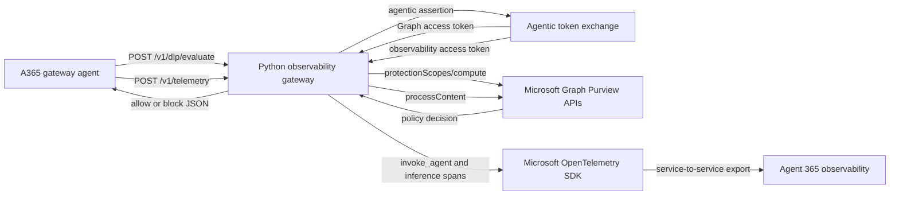

# Agent 365 Observability Gateway

[한국어 문서](README-KR.md)

`a365-observability-gateway` is a synchronous Python HTTP service that sits
between the local Azure OpenAI agent and Microsoft services. It provides two
security and observability functions:

1. evaluate prompts and model responses against Microsoft Purview DLP through
   Microsoft Graph; and
2. convert completed or failed model calls into Agent 365 OpenTelemetry spans.

The gateway does not call Azure OpenAI. The sibling `a365-gateway-agent` owns
model inference and sends DLP and telemetry JSON to this service.

## Current Registration State

This local environment is registered with Agent 365 as a non-M365,
service-to-service enterprise agent. The generated service connection, agent
blueprint, Agent ID instance, and observability metadata are present in `.env`.
The blueprint has these least-privileged application roles:

- Microsoft Graph `ProtectionScopes.Compute.User`
- Microsoft Graph `Content.Process.User`
- Observability API `Agent365.Observability.OtelWrite`

Live smoke tests have verified:

- Agent ID app-only Graph token exchange with both Purview roles;
- Agent ID observability token exchange;
- `uploadText` and `downloadText` calls reaching Purview `processContent`;
- the gateway health endpoint; and
- a synthetic Agent 365 telemetry event returning `202/exported`.

Validate configuration without acquiring tokens, exporting spans, or opening a
network listener:

```powershell
.\.venv\Scripts\python.exe -m obs_gateway --check-config
```

The registration used `a365` CLI 1.1.214 with non-M365 `s2s` authentication.
For another environment, use that environment's current CLI help and generated
configuration as the source of truth; do not substitute placeholder values.

## Blocking Policy Status

The gateway implementation and authentication are working, but this tenant does
not currently have an Application-plane DLP policy targeting this Agent ID
instance. Existing enforce-mode block rules target older application IDs. As a
result, the gateway can call Purview successfully and still receive
`allowed=true` with no `restrictAccess` action.

S2S is the correct authentication mode for the current code. The Graph token is
app-only; `user_id` is policy context, not an OBO credential. Registering with
`authmode=both` does not fix policy targeting and has no effect until the agent
forwards a real user token and the gateway implements an OBO exchange.

Microsoft documents Application-plane policies for Entra-registered apps through
Security & Compliance PowerShell. The following example is intentionally scoped
to one test user. Review names, user scope, sensitive-information conditions,
and actions before running it. These cmdlets do not provide a reliable `WhatIf`
preview.

```powershell
$generated = Get-Content .\a365.generated.config.json -Raw | ConvertFrom-Json
$agentAppId = $generated.agenticAppId
$testUserUpn = "user@contoso.com"

$locations = @(
  @{
    Workload = "Applications"
    Location = $agentAppId
    LocationDisplayName = "A365GatewayPrototype Identity"
    LocationSource = "Entra"
    LocationType = "Individual"
    Inclusions = @(
      @{ Type = "IndividualResource"; Identity = $testUserUpn }
    )
  }
) | ConvertTo-Json -Depth 10 -Compress

Connect-IPPSSession

New-DlpCompliancePolicy `
  -Name "A365GatewayPrototype Credit Card DLP" `
  -Mode Enable `
  -Locations $locations `
  -EnforcementPlanes @("Application")

New-DlpComplianceRule `
  -Name "A365GatewayPrototype Block Credit Cards in Prompts" `
  -Policy "A365GatewayPrototype Credit Card DLP" `
  -ContentContainsSensitiveInformation @(
    @{ Name = "Credit Card Number"; minCount = "1" }
  ) `
  -RestrictAccess @(
    @{ setting = "UploadText"; value = "Block" }
  ) `
  -RuleErrorAction RetryThenBlock

Disconnect-ExchangeOnline -Confirm:$false
```

The policy `Location` must be the Agent ID instance (`agenticAppId` /
`AGENT365OBSERVABILITY__AGENTID`), not the blueprint `AGENT_ID`. The user sent in
the DLP request must also be included by the policy.

After a policy change, wait for Purview propagation and restart the gateway to
clear its per-user scope cache (default lifetime: 3600 seconds). Test directly
with `/v1/dlp/evaluate` or `--sit` and a Luhn-valid synthetic card from the
bundled SIT file. A generic model warning means Purview allowed the prompt; a
real prompt block is generated by the agent before model inference.

## Responsibilities

The gateway owns:

- typed `.env` loading and startup validation;
- optional bearer authentication for POST endpoints;
- JSON content-type, body-size, and public contract validation;
- Agent 365 agentic assertion and scoped token exchange;
- Microsoft Graph transport for Purview APIs;
- per-user protection-scope caching and concurrent request deduplication;
- Purview fail-open or fail-closed behavior;
- Agent 365 `invoke_agent` and nested chat inference spans;
- request IDs, status codes, safe error responses, and lifecycle cleanup.

The gateway does not own:

- Azure OpenAI model invocation;
- chat history or prompt construction;
- Agent 365 or Entra resource registration;
- Purview tenant policy authoring;
- TLS termination, reverse proxying, or production secret storage;
- durable queues, retries, or distributed caching.

## Architecture



The DLP route is synchronous and lies in the agent's inference path. The
telemetry route returns `202` only after the exporter has accepted and force
flushed the completed spans.

## Project Layout

```text
a365-gateway-prototype/
|-- .env                     Local configuration and secrets; ignored by Git
|-- .env.example             Safe template with every supported key
|-- .gitignore               Standalone Python artifact and secret rules
|-- README.md                English documentation
|-- README-KR.md             Korean documentation
|-- a365-gateway.py          Backward-compatible source-tree launcher
|-- pyproject.toml           Package metadata and console command
|-- src/
|   `-- obs_gateway/
|       |-- __init__.py
|       |-- __main__.py      `python -m obs_gateway` entry point
|       |-- cli.py           CLI, config-check mode, and exit-code mapping
|       |-- application.py   Dependency assembly and runtime lifecycle
|       |-- config.py        Typed settings and registration validation
|       |-- auth/
|       |   `-- token_provider.py  Agentic assertion and scoped token exchange
|       |-- http/
|       |   |-- request.py   Authentication and JSON body validation
|       |   |-- response.py  Consistent JSON and request-ID responses
|       |   `-- server.py    Threaded HTTP routes and error mapping
|       |-- purview/
|       |   |-- types.py     Validated DLP requests, decisions, cache values
|       |   |-- graph_client.py  Authenticated Graph JSON transport
|       |   `-- dlp_service.py  Scope cache and policy evaluation
|       |-- telemetry/
|       |   |-- event.py     Versioned agent-to-gateway event validation
|       |   `-- exporter.py  Agent 365 span construction and export
|       `-- shared/
|           `-- errors.py    Configuration, validation, Graph, and DLP errors
`-- tests/
    |-- test_application.py
    |-- test_cli.py
    |-- test_config.py
    |-- test_dlp_service.py
    |-- test_exporter.py
    |-- test_graph_client.py
    |-- test_http_server.py
    |-- test_purview_types.py
    |-- test_telemetry_event.py
    `-- test_token_provider.py
```

The repository root owns the shared `.venv` and `requirements.txt`. Installing
the root requirements installs both the agent and gateway in editable mode.

## Startup Composition

After configuration succeeds, the gateway builds one dependency graph:

```text
GatewayConfig
  |
  +-- AgentConfig
  |     `-- MsalAgentTokenProvider
  |
  +-- PurviewConfig
  |     `-- PurviewGraphClient
  |           `-- DlpService
  |
  +-- ObservabilityConfig
  |     `-- Agent365TelemetryExporter
  |
  `-- ServerConfig
        `-- GatewayServer
              +-- DlpService
              `-- Agent365TelemetryExporter
```

If server binding fails after the exporter is created, the exporter is shut
down. On normal shutdown or `Ctrl+C`, the HTTP socket is closed and telemetry is
flushed and shut down.

## Prerequisites

- Python 3.11 or newer
- A Microsoft 365 tenant with the required Agent 365 capabilities
- An Agent 365 registration produced by your installed `a365` CLI
- Microsoft Graph application permissions and admin consent required by your
  Purview integration
- Purview policy targeting the configured application location
- Network access to Microsoft Entra, Microsoft Graph, and Agent 365 telemetry
- The sibling agent configured to call this gateway

Offline unit tests require none of the live Microsoft resources above.

## Install

From the repository root:

```powershell
python -m venv .\.venv
.\.venv\Scripts\python.exe -m pip install --upgrade pip
.\.venv\Scripts\python.exe -m pip install -r .\requirements.txt
```

Activation is optional. To activate in PowerShell:

```powershell
.\.venv\Scripts\Activate.ps1
```

The root requirements install these editable packages:

- `a365-gateway-agent`
- `a365-observability-gateway`

## Register with Agent 365

Registration is an external provisioning step and is deliberately not performed
by this project. When you are ready:

1. Inspect the current help for your installed `a365` CLI.
2. Register or provision the agent application using the workflow appropriate
   to that version and tenant.
3. Preserve the generated configuration exactly.
4. Copy the generated values into `a365-gateway-prototype/.env`.
5. Keep client secrets and other credentials out of Git.
6. Run `--check-config`.
7. Start the gateway and test `/health`.
8. Run the agent's DLP-only SIT batch.
9. Run `--sit --ai` only after DLP behavior is correct.

Registration must supply values for:

- `AGENT_ID`;
- the `CONNECTIONS__SERVICE_CONNECTION__SETTINGS__*` group;
- the `AGENTAPPLICATION__...AGENTIC...` group;
- the `CONNECTIONSMAP__0__*` mapping;
- the `AGENT365OBSERVABILITY__*` identity and metadata group.

The template includes `AGENT365OBSERVABILITY__CLIENTID` and
`AGENT365OBSERVABILITY__CLIENTSECRET` for compatibility with generated
configuration. This gateway's service-to-service export path obtains tokens
through the agentic token provider rather than reading those two fields
directly.

## Configuration Workflow

The real `.env` already exists locally. Do not overwrite it blindly. For a new
checkout:

```powershell
if (-not (Test-Path .\a365-gateway-prototype\.env)) {
    Copy-Item .\a365-gateway-prototype\.env.example `
        .\a365-gateway-prototype\.env
}
```

Validate without side effects:

```powershell
.\.venv\Scripts\python.exe -m obs_gateway --check-config
```

Validate another file:

```powershell
.\.venv\Scripts\python.exe -m obs_gateway `
    --check-config `
    --env-file .\path\to\gateway.env
```

Configuration precedence is:

1. existing process environment variables;
2. values loaded from the selected `.env` file.

The loader never overwrites an existing process variable. All required values
must be non-empty after trimming.

## Configuration Reference

### HTTP server

| Variable | Default | Validation and purpose |
|---|---|---|
| `OBS_GATEWAY_HOST` | `127.0.0.1` | Listener address. `localhost`, `127.0.0.0/8`, and `::1` are loopback. Any other address requires an API key. |
| `OBS_GATEWAY_PORT` | `4318` | Integer from 1 through 65535. |
| `OBS_GATEWAY_MAX_REQUEST_BYTES` | `1048576` | Positive maximum JSON body size. |
| `OBS_GATEWAY_API_KEY` | Empty | Required for non-loopback listeners. Both POST routes expect `Authorization: Bearer <key>`. `/health` remains unauthenticated. |

The current local `.env` binds to `127.0.0.1`. This is appropriate for the
sibling agent on the same machine. To expose the gateway remotely, use HTTPS at
a trusted reverse proxy and configure a strong API key in both projects.

### Microsoft Purview DLP

| Variable | Default | Validation and purpose |
|---|---|---|
| `PURVIEW_DLP_ENABLED` | `true` | Enables Graph policy evaluation. Must be exactly `true` or `false`, case-insensitively. |
| `PURVIEW_DLP_FAIL_CLOSED` | `true` | When true, policy-evaluation failures block with HTTP 502. When false, failures return an allow decision with a failure reason. |
| `PURVIEW_APPLICATION_ID` | Agent ID instance | Application location targeted by Purview policy. The default is `AGENT365OBSERVABILITY__AGENTID`; an explicit value overrides it. |
| `PURVIEW_APP_NAME` | `Agent 365 Observability Gateway` | Name in Purview request metadata. |
| `PURVIEW_APP_VERSION` | `1.0` | Version in Purview request metadata. |
| `PURVIEW_GRAPH_BASE_URL` | `https://graph.microsoft.com/v1.0` | Graph root; trailing slash is removed. |
| `PURVIEW_TIMEOUT_SECONDS` | `15` | Positive finite timeout for each Graph request. One evaluation may make multiple requests. |
| `PURVIEW_SCOPE_CACHE_SECONDS` | `3600` | Non-negative finite per-user scope-cache lifetime. `0` effectively recomputes on each sequential evaluation. |

### Agent 365 observability

| Variable | Default | Validation and purpose |
|---|---|---|
| `ENABLE_A365_OBSERVABILITY` | `true` | Enables Agent 365 span creation. |
| `ENABLE_A365_OBSERVABILITY_EXPORTER` | `true` | Enables remote export. Cannot be true when observability itself is false. |
| `A365_USE_S2S_ENDPOINT` | `true` | Selects the service-to-service endpoint used with the agentic token flow. |
| `A365_OBSERVABILITY_LOG_LEVEL` | `INFO` | One of `DEBUG`, `INFO`, `WARNING`, `ERROR`, or `CRITICAL`. |
| `A365_OBSERVABILITY_CONSOLE` | `false` | Prints spans locally. These spans can contain prompt and response content. |
| `MICROSOFT_OTEL_SDKSTATS_DISABLED` | `true` in the template | Consumed by the Microsoft OpenTelemetry SDK from the process environment. |

### Generated Agent 365 identity

The gateway validates these values but delegates their nested interpretation to
the Agent 365 SDK:

```text
CONNECTIONS__SERVICE_CONNECTION__SETTINGS__CLIENTID
CONNECTIONS__SERVICE_CONNECTION__SETTINGS__CLIENTSECRET
CONNECTIONS__SERVICE_CONNECTION__SETTINGS__TENANTID
CONNECTIONS__SERVICE_CONNECTION__SETTINGS__SCOPES
AGENTAPPLICATION__USERAUTHORIZATION__HANDLERS__AGENTIC__SETTINGS__TYPE
AGENTAPPLICATION__USERAUTHORIZATION__HANDLERS__AGENTIC__SETTINGS__ALT_BLUEPRINT_NAME
AGENTAPPLICATION__USERAUTHORIZATION__HANDLERS__AGENTIC__SETTINGS__SCOPES
CONNECTIONSMAP__0__SERVICEURL
CONNECTIONSMAP__0__CONNECTION
```

The CLI stamps two distinct application IDs:

- `AGENT_ID` is the blueprint application ID used by the generated service
  connection.
- `AGENT365OBSERVABILITY__AGENTID` is the Agent ID application instance. The
  gateway passes this value as `agent_app_instance_id`/`fmi_path` and uses it as
  the client ID for the second scoped-token exchange.

The Agent ID instance is also the default `PURVIEW_APPLICATION_ID`. Do not
interchange it with the blueprint ID.

Required span metadata:

```text
AGENT365OBSERVABILITY__AGENTID
AGENT365OBSERVABILITY__AGENTNAME
AGENT365OBSERVABILITY__AGENTDESCRIPTION
AGENT365OBSERVABILITY__TENANTID
AGENT365OBSERVABILITY__AGENTBLUEPRINTID
```

## Agentic Token Flow

The same `MsalAgentTokenProvider` supplies Graph and observability tokens.

For each requested scope:

1. `MsalConnectionManager` selects `SERVICE_CONNECTION` from the generated
   connection configuration.
2. The blueprint-backed connection obtains a one-time agentic application
  assertion for `tenant_id` and the Agent ID instance from
  `AGENT365OBSERVABILITY__AGENTID`.
3. `ConfidentialClientApplication` uses the Agent ID instance as its client ID
  and the one-time assertion as its client assertion.
4. MSAL requests one of two scopes:
   - Microsoft Graph: `https://graph.microsoft.com/.default`
   - Agent 365 observability:
     `api://9b975845-388f-4429-889e-eab1ef63949c/.default`
5. The resulting observability token is cached for the SDK's synchronous token
   resolver.

Token acquisition is serialized with a process-local lock because the HTTP
server uses worker threads and an agentic assertion is exchanged as a unit.
Graph calls acquire a fresh scoped token for each request. The observability
token cache is refreshed before each remote telemetry export.

Tokens and assertions are never logged or included in HTTP responses.

### Enterprise application credential versus user policy context

The gateway does **not** use a delegated user credential for Purview. It uses an
Agent ID application credential and application roles from the Graph `.default`
token. The `user_id` in a DLP request has a different purpose: it selects the
known user's Purview protection scope for the interaction.

Microsoft's supported inline enterprise-app flow is:

```text
Agent ID app-only credential
  -> POST /users/{userId}/dataSecurityAndGovernance/protectionScopes/compute
  -> POST /users/{userId}/dataSecurityAndGovernance/processContent
```

The `.User` suffix in `ProtectionScopes.Compute.User` and
`Content.Process.User` describes the policy scope, not the credential type.
The tenant endpoint offers asynchronous batch `processContentAsync`, but each
batch item still carries user context and it cannot provide the synchronous
allow/block boundary required by this gateway.

## Run

After registration values pass `--check-config`, start with the installed
command:

```powershell
.\.venv\Scripts\a365-observability-gateway.exe
```

Equivalent module command:

```powershell
.\.venv\Scripts\python.exe -m obs_gateway
```

Backward-compatible source command:

```powershell
.\.venv\Scripts\python.exe .\a365-gateway-prototype\a365-gateway.py
```

Expected startup log shape:

```text
Agent 365 observability gateway listening on http://127.0.0.1:4318
Purview DLP enabled: True
DLP endpoint: POST /v1/dlp/evaluate
Telemetry endpoint: POST /v1/telemetry
```

Health check:

```powershell
Invoke-RestMethod http://127.0.0.1:4318/health
```

Expected response:

```json
{
  "status": "ok",
  "purview_dlp_enabled": true
}
```

`/health` confirms that the HTTP server is running and reports whether DLP is
enabled. It does not acquire a token or probe Microsoft Graph or Agent 365.

Stop the process with `Ctrl+C`.

## HTTP API

Every JSON response includes:

```http
Content-Type: application/json
Client-Request-Id: <caller-provided-or-generated-id>
```

If a request supplies `Client-Request-Id`, the gateway returns it. Otherwise it
generates a UUID. Completion logs contain request ID, HTTP method, path, and
duration, but not prompt content or bearer tokens.

### `GET /health`

Authentication: none.

Success: HTTP `200`.

```json
{
  "status": "ok",
  "purview_dlp_enabled": true
}
```

### `POST /v1/dlp/evaluate`

Authentication: gateway bearer key when configured.

```json
{
  "user_id": "caller-object-id",
  "content": "text to evaluate",
  "activity": "uploadText",
  "conversation_id": "conversation-uuid",
  "sequence_number": 0,
  "client_ip": "127.0.0.1"
}
```

Validation:

- body must be non-empty `application/json` within the configured size limit;
- `user_id`, `content`, and `conversation_id` must be non-empty strings;
- `activity` must be `uploadText` or `downloadText`;
- `sequence_number` must be a non-negative integer, not a boolean;
- `client_ip` must be a string when supplied and defaults to `127.0.0.1`.

Success: HTTP `200`.

```json
{
  "allowed": false,
  "blocked": true,
  "activity": "uploadText",
  "policy_actions": [
    {
      "action": "restrictAccess",
      "restrictionAction": "block"
    }
  ],
  "protection_scope_state": "notModified",
  "reason": "Purview policy requires blocking"
}
```

Other status codes:

| Status | Meaning |
|---:|---|
| `400` | Invalid content type, body size, JSON, or DLP contract. |
| `401` | Missing or incorrect API key when configured. |
| `404` | Unknown route. |
| `502` | Purview evaluation failed in fail-closed mode. Response includes `blocked: true`. |
| `500` | Unexpected internal DLP failure. The response is redacted and includes `blocked: true`. |

### `POST /v1/telemetry`

Authentication: gateway bearer key when configured.

```json
{
  "schema_version": "1.0",
  "event_id": "event-uuid",
  "session_id": "session-uuid",
  "conversation_id": "conversation-uuid",
  "channel": "console",
  "input": "current user prompt",
  "output": "current model answer",
  "model": "azure-openai-deployment",
  "provider_name": "azure-openai",
  "inference_endpoint": {
    "hostname": "resource.openai.azure.com",
    "port": 443
  },
  "caller": {
    "id": "caller-object-id",
    "email": "user@example.com",
    "name": "Example User",
    "client_ip": "127.0.0.1"
  },
  "usage": {
    "input_tokens": 120,
    "output_tokens": 45
  },
  "finish_reason": "stop"
}
```

Validation highlights:

- `schema_version` must be exactly `1.0`;
- IDs, `input`, `model`, `provider_name`, endpoint hostname, and caller ID are
  required non-empty strings;
- endpoint port must be an integer from 1 through 65535;
- token counts must be non-negative integers or null;
- `output` defaults to an empty string;
- `channel` defaults to `console`;
- caller email, name, and finish reason can be strings or null;
- caller IP must be a string and defaults to `127.0.0.1`;
- a failure event may include `error.type` and requires `error.message`.

Success: HTTP `202` after span flush.

```json
{
  "status": "exported",
  "event_id": "event-uuid"
}
```

Unexpected exporter exceptions return a generic HTTP `500` response. Full
details remain in server logs under the request ID and are not echoed to the
caller.

## Purview DLP Flow

For an enabled evaluation:

1. Look up the caller's protection scopes in the process-local cache.
2. On a miss, call:
   `/users/{user}/dataSecurityAndGovernance/protectionScopes/compute`.
3. If scope-level policy already contains a blocking `restrictAccess` action,
   return block without sending content to `processContent`.
4. If the activity has no applicable scope, return allow.
5. For an in-scope activity, call:
   `/users/{user}/dataSecurityAndGovernance/processContent`.
6. Attach the scope ETag as `If-None-Match` when present.
7. Block if any policy action has:

```json
{
  "action": "restrictAccess",
  "restrictionAction": "block"
}
```

Comparison is case-insensitive.

If `processContent` returns `protectionScopeState: "modified"`, the gateway
forces one protection-scope refresh and processes the content once more. It does
not enter an unlimited policy-refresh loop.

For an inline evaluation, Graph status `202` or `204` without an inline decision
is treated as an error. Malformed scope collections, malformed policy-action
collections, non-object JSON, non-2xx transport status, and invalid state types
are also errors rather than implicit allow decisions.

## Protection-Scope Cache and Concurrency

The threaded HTTP server can evaluate several requests concurrently.

- Cache key: `user_id`
- Cache expiry: `time.monotonic()` plus
  `PURVIEW_SCOPE_CACHE_SECONDS`
- In-flight deduplication: one `Future` per user and request mode
- Network I/O: performed outside the cache lock
- Different users: not serialized behind Graph I/O for another user
- Policy refresh: uses a separate forced-refresh in-flight key

When several requests for the same user miss simultaneously, one worker calls
Graph and the others wait on the same future. All receive the same scope result
or exception.

The cache is process-local. Multiple gateway processes do not share it.

## Fail Closed and Fail Open

With `PURVIEW_DLP_FAIL_CLOSED=true`, token, network, timeout, Graph HTTP,
malformed response, and unexpected evaluation errors become a blocked HTTP `502`
response. This is the recommended enforcement setting.

With `PURVIEW_DLP_FAIL_CLOSED=false`, the DLP service returns an allowed decision
whose reason states that evaluation failed open. Use this only when bypassing
policy during failure is an explicit business decision.

If `PURVIEW_DLP_ENABLED=false`, the DLP service returns allow immediately and
does not call Graph. Registration configuration is still required so the
gateway has one consistent operational configuration rather than separate
partially configured modes.

## Graph Transport

The Graph client:

- requests a scoped access token from the token provider;
- sends JSON with `Authorization`, `Content-Type`, and a generated
  `Client-Request-Id`;
- uses `truststore.SSLContext` so certificate verification follows the OS trust
  store, including managed corporate roots;
- applies `PURVIEW_TIMEOUT_SECONDS` to each request;
- classifies timeout, HTTP, network, and invalid-response failures; and
- requires every transport result to have a 2xx status and JSON-object body.

There is no retry or exponential backoff. In fail-closed mode, a transient Graph
failure blocks the activity. Add retries only with careful latency and policy
semantics because the agent waits synchronously for this route.

## Telemetry Mapping

Each validated event becomes this span hierarchy:

```text
InvokeAgentScope
`-- InferenceScope (CHAT)
```

The gateway records:

- current input and output messages;
- model, provider, and inference endpoint;
- input and output token counts;
- finish reasons;
- model or policy-block errors;
- session, conversation, channel, caller, tenant, agent, and blueprint metadata.

Before remote export, the gateway refreshes the observability token cache. It
then constructs both spans and calls the tracer provider's `force_flush` with a
30-second timeout before returning HTTP `202`.

Automatic OpenAI instrumentation is disabled because this process receives a
completed model call and does not invoke OpenAI itself.

## Security and Privacy

- `.env` is ignored by Git; `.env.example` contains no credentials.
- Non-loopback listeners require `OBS_GATEWAY_API_KEY` at configuration time.
- API-key comparison uses `hmac.compare_digest`.
- The gateway does not log request bodies, bearer tokens, assertions, or scoped
  tokens.
- Unexpected HTTP `500` responses are redacted; details stay in server logs.
- Request bodies are bounded by `OBS_GATEWAY_MAX_REQUEST_BYTES`.
- Graph TLS uses the operating-system trust store.
- Console span export is disabled by default because spans can contain prompt,
  response, identity, and endpoint data.
- `/health` is unauthenticated and reports no credentials or content.

The built-in server is HTTP-only. Keep it on loopback for local development. For
remote use, terminate HTTPS at a trusted reverse proxy, configure a strong API
key, restrict network access, and use a production secret store rather than a
plain `.env` file.

## Tests

Run the complete offline gateway suite from the repository root:

```powershell
.\.venv\Scripts\python.exe -B -m unittest discover `
    -s .\a365-gateway-prototype\tests `
    -v
```

The tests use fake Graph transports, token managers, telemetry exporters, and a
loopback HTTP server. They do not require registration, credentials, Azure,
Graph, Purview, or Agent 365 access.

Coverage includes:

- typed defaults, required registration fields, and invalid values;
- listener/API-key security and observability setting consistency;
- application composition and cleanup;
- CLI config check and exit codes;
- agentic assertion and both scoped token exchanges;
- Graph TLS context, timeout, status, and JSON classification;
- scope blocks, cache reuse, concurrent deduplication, and policy refresh;
- fail-open, fail-closed, and malformed-policy behavior;
- HTTP auth, routing, request IDs, status codes, and error redaction;
- telemetry and DLP contract validation;
- remote exporter token priming and error mapping.

Additional checks:

```powershell
.\.venv\Scripts\python.exe -m pip check
.\.venv\Scripts\python.exe -B -m obs_gateway --help
.\.venv\Scripts\a365-observability-gateway.exe --version
```

## End-to-End Validation After Registration

Perform these steps in order:

1. Validate gateway configuration:

   ```powershell
   .\.venv\Scripts\python.exe -m obs_gateway --check-config
   ```

2. Start the gateway.
3. Verify `/health`.
4. Run the agent's DLP-only SIT mode:

   ```powershell
   .\.venv\Scripts\python.exe -m a365_agent --sit
   ```

5. Resolve all DLP mismatches and Graph errors.
6. Run full AI mode only when ready for model calls and cost:

   ```powershell
   .\.venv\Scripts\python.exe -m a365_agent --sit --ai
   ```

7. Confirm successful and failed activities in Agent 365 observability.

The bundled SIT samples are synthetic. Their expected actions still depend on
your tenant's current Purview application location, rules, confidence levels,
and minimum-count conditions.

## Exit Codes

| Code | Meaning |
|---:|---|
| `0` | Config check succeeded or the server shut down normally. |
| `1` | Runtime startup failure, such as token initialization, exporter setup, or port binding. |
| `2` | Invalid or incomplete configuration, including pre-registration fields. |

Argument parsing errors also use code `2`.

## Current Limitations

- Synchronous standard-library HTTP server
- One process-local scope cache
- No Graph retry or backoff
- No readiness probe for live Graph or Agent 365 access
- No TLS termination in the process
- No rate limiting
- One global body-size limit for both POST routes
- One Graph timeout applied per request, not per full evaluation
- Telemetry export force-flushes before every `202`, increasing request latency
- No durable telemetry queue if remote export fails
- Exact live registration and tenant integration remain unverified until the
  user completes `a365` CLI registration

## Troubleshooting

### `Configuration error: Missing required environment variables`

The gateway has not received complete registration output, or a generated value
is empty. Run your current `a365` CLI registration workflow, copy the generated
settings exactly, and rerun `--check-config`.

### `OBS_GATEWAY_API_KEY is required when OBS_GATEWAY_HOST is not a loopback address`

Use `127.0.0.1` for same-machine development, or configure a strong identical
API key in both gateway and agent when intentionally listening remotely.

### `ENABLE_A365_OBSERVABILITY_EXPORTER cannot be true ...`

Remote export requires observability span construction. Enable both settings or
disable the exporter.

### `Gateway startup failed: ... address already in use`

Another process is using port 4318. Stop the other gateway or select another
port and update both agent gateway URLs.

### HTTP `401`

The agent and gateway API-key values differ, or one side includes the literal
`Bearer` prefix in the environment variable. Store only the secret value.

### HTTP `400`

The caller sent invalid JSON or a field failed strict type validation. Use the
returned error and `Client-Request-Id` to locate the request.

### HTTP `502` with `blocked: true`

Fail-closed behavior is working. Use the request ID in gateway logs to inspect
the token, permission, timeout, network, or Graph response error. The HTTP body
intentionally omits internal details.

### DLP-only SIT mode still asks for identity

The gateway calls Graph on behalf of a registered Agent 365 application even
when the agent skips Azure OpenAI. The agent also derives caller metadata from
its Azure credential. DLP-only means no model inference, not no authentication.

### Telemetry HTTP `500`

Inspect the gateway log by request ID. Common causes are incomplete
registration, token exchange failure, Agent 365 exporter initialization, or
force-flush failure. The client response is deliberately redacted.

### SIT actions do not match expectations

Verify the configured Purview application ID, tenant, user protection scope,
policy location, SIT rule, minimum count, and confidence level. The gateway does
not perform local pattern matching; it enforces the live Graph decision.